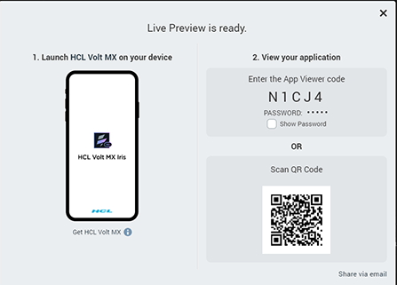
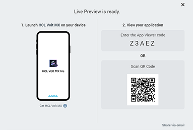
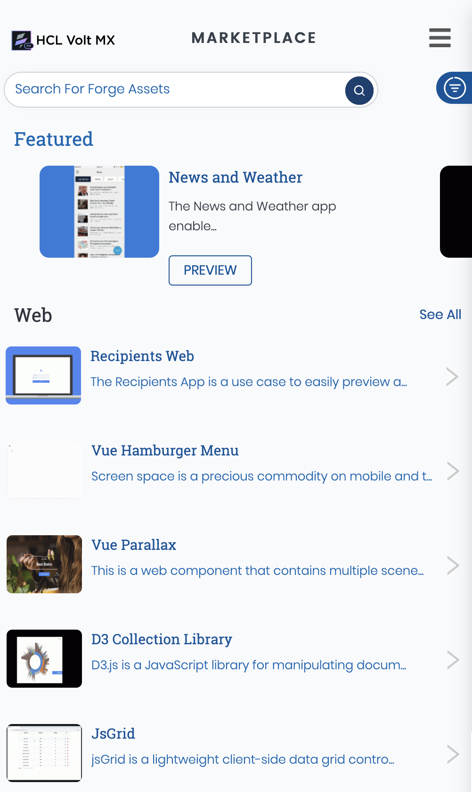

# Preview a Volt MX Iris App on a Device

Using the Volt MX App, you can view the front-end prototype of a project on a device. You can run any action attached to a form or widget such as navigating from one form to another, executing events of the forms, and applying a skin to a widget.

You can make changes to your project and then incrementally preview those changes, you can see those changes reflected in a local preview of the app on your device. For the [incremental preview](#Incremental_Preview), you must set the Volt MX App on your device to do so, as described later in this topic.

> **_Note:_** The Volt MX App is available for the iOS and Android platforms. It is not available for SPA and Desktop Web.  
> From Volt MX Iris V9.2 onwards, you can preview apps built for the SPA and Desktop Web channels by using the **Live Preview** option.

> **_Important:_** Incremental preview is supported only for local preview of projects. For previews published to the cloud, the project must do a full **Preview > Publish**; incremental previewing is currently not available for the cloud.

This section provides the following documentation on Previewing an App:

- [Prerequisites](#prerequisites)

After the prerequisites have been met, you are ready to generate a preview of the app and then view it on a device.

- [Generate a Preview of the App](#generate-a-preview-of-the-app)

Once you have generated the preview, you can view it on your device via the cloud or locally. For more information, click the option you want:

- [Preview an App Locally](#preview-an-app-locally): Runs the Volt MX App for a prototype by using the device on which you have Volt MX Iris installed, to act as the host for displaying the app on your device. You can connect your device either by using a wireless connection or via a USB connection.
  - [Preview an App by using a USB connection](#preview-an-app-by-using-a-usb-connection)
  - [Preview an App by using a Wi-Fi connection](#preview-an-app-by-using-a-wi-fi-connection)
- [Preview an App on the Cloud](#preview-an-app-on-the-cloud): Runs the Volt MX App for a prototype that is published to the cloud.
- [Access Marketplace](#view-hcl-forge-components-or-applications): Runs the HCL Forge in a browser to access components available. You or those you invite to access the preview on the cloud can preview the HCL Forge components.

## Prerequisites

To preview an app, you must meet the following prerequisites:

- [Create a Volt MX account.](#create-a-volt-mx-account)
- [Install the Volt MX App on Your Device](#install-the-volt-mx-app-on-your-device)

### Create a Volt MX Account

You must have a Volt MX account to use the App Viewer feature of the Volt MX App. If you do not have a Volt MX account, you can create one by using one of the following methods:

- [Self-Registration](#self-registration): Go to the Volt MX website and create a new account.
- [Receive an Invitation](#receive-an-invitation): You receive an invitation to register with Volt MX from an existing Volt MX user.

#### Self-Registration

To self-register:

1.  Navigate to the [VoltMX Cloud registration site](https://manage.hclvoltmx.com/registration).

    The **Create your Volt MX Cloud Account** page appears.

2.  Provide the required details, and then click **Create your account**.

    A message appears confirming that your request for registration is accepted.

3.  You will receive an email from the **VoltMX Accounts** with an activation link. Click **Activate My Volt MX Account**.

    The **Activate Your Account** page appears.

4.  Provide the required details, and then click **Create Cloud**.

    Your account is activated, and the Volt MX Cloud dashboard appears.

#### Receive an invitation

When the owner (or a member) of a Volt MX account who has the necessary permissions to invite a user sends an invitation from [manage.hclvoltmx.com](http://manage.hclvoltmx.com/). The invitee receives an email asking them to register for Volt MX cloud.

When the owner of a Volt MX account sends an invite to allow you access to the cloud, you receive an email with a Volt MX account registration link.

To create a Volt MX account after receiving an invitation:

1.  In the invitation mail, click **Accept Invitation**.

    The **Accept Invitation** page appears.

2.  Provide the required details, and then click **Accept invitation**.

    Your account is activated, and the Volt MX Cloud dashboard appears.

### Install the Volt MX App on Your Device

The Volt MX App allows you to view the complete prototype designed on Volt MX Iris on your mobile or tablet device.

You can download theVoltMX App on your

- [Android](#android) devices from the Google Play Store.
- [iOS](#iphone-or-ipad) devices from the Apple App Store.

#### Android

To install the Volt MX App:

1.  Tap **Applications**, and then tap **Google Play**. Google Play Store opens.
2.  Search for HCL **VoltMX**.
3.  From the search results, tap **HCL VoltMX**.
4.  Tap **Install**.  
    Type your login credentials, if requested.
5.  Tap the **Applications** folder, and then tap **VoltMX** to open it.

    > **_Note:_** Follow the same process for installing the **VoltMXTablet** app on your Android tablet. The Reports and Analytics feature that is present in the **VoltMX** app is not available in the **VoltMXTablet** app.

    > **_Note:_** On Android, the Volt MX App Viewer has been upgraded with additional enhancements and has been renamed as Volt MX App.

#### iPhone or iPad

To install the Volt MX App:

1.  On your Apple device, tap **App Store**.
2.  Search for **HCL **VoltMX\*\*\*\*.
3.  From the search results, tap **HCL **VoltMX\*\*\*\*.
4.  Tap **Install**. Type your login credentials, if requested.

    The app is downloaded and installed on your device.

5.  Locate **VoltMX** on your home screen and tap it.
6.  Log in to your account by entering your username and password. If you want to bypass entering your log in credentials the next time you run the app, select **Remember me**. Then tap **Sign In**.

> **_Note:_** Volt MX App supports Face ID unlock for iOS 11.

> **_Note:_** Follow the same process to install the Volt MX App on your iPad. The Reports and Analytics feature that is present in the **VoltMX** app is not available in the **VoltMXTablet** app.

## Generate a Preview of the App

You must have Volt MX Foundry configured for Volt MX Iris. This procedure assumes that you already have created and published a Volt MX Foundry app, and have bound your client app to it. These details are covered in [Publish a Project to Volt MX Foundry](../../../Iris/iris_user_guide/Content/PublishVoltMXFoundryServicesApp.md).

From V9 SP4 onwards, to create a prototype viewable on the Volt MX App:

1.  If you are not currently logged in to your Volt MX account, do so now by clicking **Login** in the top right corner of the Volt MX Iris window. The Volt MX Account sign-in window opens.
2.  Enter your email and password credentials for your Volt MX account, and then click **Continue**. Once you are signed in, your account name displays in the top right corner of the Volt MX Iris window.
3.  Do one of the following, depending on whether you want to preview the app via the cloud, or locally by establishing a connection between the device and the computer hosting the app.

- **Local.** On the **Build** menu, click **Run Live Preview**.
  1.  The **Live Preview Settings** windows appears. Select the **platforms** (the operating system of a given device. iOS and Android are examples of platforms.) and **channels** (device types available within a given platform. These include mobile (i.e. phone), tablet, and desktop) that you want the Volt MX App to support.
  2.  Click **Save & Run**. Volt MX Iris builds the local preview. To view it, see [Preview an App Locally](#preview-an-app-locally).
- **Cloud.** On the **Build** menu, click **Publish Live Preview**. The Publish Live Preview window appears.

1.  Select the Select the **platforms** (the operating system of a given device. iOS and Android are examples of platforms.) and **channels** (device types available within a given platform. These include mobile (i.e. phone), tablet, and desktop) that you want to publish.
2.  If the project has an existing preview with a publish code, the Publish Live Preview window displays a **Preview** option.

Toggle the Preview switch to **Create New** option to publish the app to a new cloud account. If you have access to the app's account, **Replace Existing** is selected by default, so that the preview you are publishing replaces the existing preview, under that same publish code.

 

> **_Important:_** Make sure you select the Volt MX Foundry environment you want to use.

6.  If you want to password-protect the preview, toggle the **Permission** to **Private**.
7.  Enter a password, and then re-enter it in the **Confirm Password** text box.
8.  You can change the Preview Mode to **Debug**, to be able to debug the app. **Run** mode is selected by default.
9.  Click **Publish**.  
    Volt MX Iris proceeds to publish the app, as indicated by the progress bar. Depending on the size of your application and the speed of your internet connection, uploading an application may take some time. Once the application is uploaded to your Volt MX account, a publish code is generated as shown here. Also, if you selected the Permission to **Private**, the password you entered is displayed as well.

    

    > **_Note:_** The publish code is essential for viewing the preview of the application, and can contain numbers and uppercase letters.

10. You can easily share the publish code and password by clicking **Share Via Email**. A **New Message** window from your default mail client (for example, Outlook) appears. The code, along with the steps for viewing the preview of the app, is auto-generated in the body of your new email message. Add the email address of all the stakeholders to whom you want to give access to the preview of the application, and then send the email.

Once you have generated a preview of the app, the publish code appears in the status bar located over the Properties Editor.

<!-- To create a prototype viewable on the Volt MX App for versions released prior to V8 SP4, follow these steps:

1.  If you are not currently logged in to your Volt MX account, do so now by clicking **Login** in the top right corner of the Volt MX Iris window. The Volt MX Account sign-in window opens.
2.  Enter your email and password credentials for your Volt MX account, and then click **Continue**. Once you are signed in, your account name displays in the top right corner of the Volt MX Iris window.
3.  On the **Edit** menu, click **Preferences**.

4.  In the left pane of the Iris Preferences dialog box, click **Functional Preview**.
5.  Select the [platformsThe operating system of a given device. iOS and Android are examples of platforms.](<javascript:void(0);>) and [channelsDevice types available within a given platform. These include mobile (i.e. phone), tablet, and desktop.](<javascript:void(0);>) that you want the Volt MX App to support, and then click **Apply**.

6.  Do one of the following, depending on whether you want to preview the app via the cloud, or locally by establishing a connection between the device and the computer hosting the app.

- **Local.** On the **Run** menu, click **Run**. Volt MX Iris builds the preview. To view it, see [Preview an App Locally](#preview-an-app-locally).
- **Cloud.** On the **Publish** menu, click App Viewer. The Publish App dialog box displays.

1.  Select the channels to which you want to publish, and then click **OK**.
2.  If prompted, sign in to your Volt MX account.

The Publish App dialog box displays. If the project does not have an existing preview with a publish code, the dialog box displays only a **Create New** option.

If the project does have an existing preview with a publish code, the dialog box displays both a **Create New** option and a **Replace Existing** option. If you have access to the app's account, **Replace Existing** is selected by default, so that the preview you are publishing replaces the existing preview, under that same publish code, as illustrated in the example. If you do not have access to the app's account, you can only use the **Create New** option; the **Replace Existing** option is grayed out.

 

6.  Under **Create New**, the default Volt MX cloud account name and the Iris project name populate the **Account** and **Name** fields automatically. From the **Account** drop-down list, select the account you want to use.

> **_Important:_** Make sure the account you select has the Volt MX Foundry environment you want to use.

If you want to change the name of the preview to something other than the Iris project name, change the value in the **Name** text box. If you want, enter a description of the app you are previewing in the **Description** text box.

9.  If you want to password-protect the preview, enter a password, and then re-enter it in the **Confirm Password** text box.
10. Click **Apply**.
    Volt MX Iris proceeds to publish the app, as indicated by the progress bar. Depending on the size of your application and the speed of your internet connection, uploading an application may take some time. Once the application is uploaded to your Volt MX account, a publish code is generated as show here. Also, if you selected the Access Settings to **Protected**, the password you entered is displayed as well.
    From Volt MX Iris V8 SP3 onwards, a QR code is displayed along with the Publish code. This QR code helps in auto-populating the required data in your device for ease of viewing your application.

    

    > **_Note:_** The publish code is essential for viewing the preview of the application, and can contain numbers and uppercase letters.

11. You can easily share the publish code and password by clicking **Share Via Email**. A **New Message** window from your default mail client (for example, Outlook) appears. The code, along with the steps for viewing the preview of the app, is auto-generated in the body of your new email message. Add the email address of all the stakeholders to whom you want to give access to the preview of the application, and then send the email.

Once you have generated a preview of the app, the publish code appears in the status bar located over the Properties Editor.

 -->

## Preview an App Locally

Runs the Volt MX App for a prototype by using the device on which you have Volt MX Iris installed, to act as the host for displaying the app on your device. You can connect your device by either using a wireless connection or via a USB connection.

A French version of the Volt MX App is available. To view the Volt MX App in French, set your device's language to French (and for Apple devices, also set the region to France), and then restart the Volt MX App.

- [Preview an App by using a USB Connection](#preview-an-app-by-using-a-usb-connection)
- [Preview an App by using a Wi-Fi Connection](#preview-an-app-by-using-a-wi-fi-connection)

### Preview an App by using a USB connection

When you preview an app locally, use your Volt MX Iris computer to act as the host for displaying the app on your device by using a USB connection. This procedure assumes that you have already generated a preview on Volt MX Iris and that both your computer and your mobile device have a USB connection. For more information, see [Generate a Preview of the App](#generate-a-preview-of-the-app).

> **_Note:_** To connect to an Android device via a USB connection, the device must be running Android version 5.0 or greater.

> **_Note:_** To connect to an iOS device via a USB connection, the device must be running iOS version 10 or greater.

> **_Important:_** **USB Tethering for iOS devices on Windows Machine**:  
> **Prerequisites** - Ensure that the latest version of iTunes is installed on the Windows machine. Before you start viewing the app on your iOS device by using the USB feature on the Volt MX App, open iTunes on your Windows machine.

To view the preview of your application locally, follow these steps:

1.  Establish a USB connection between the computer that generated the preview (Workstation), and the device.
2.  Tap the **VoltMX App** on your device. The application launches.
3.  If necessary, provide your Volt MX account credentials on the sign-in page, and then tap **Sign In**.
4.  Tap the **USB** tab on the Volt MX App tray to display the USB Preview page.
5.  The Volt MX App automatically connects to Volt MX Iris on the computer, and previews the application currently loaded on Volt MX Iris.

    After you select a Volt MX Iris workstation, the Volt MX App displays a list of previews, listing the most recent preview first.

6.  
If you want the incremental build changes that take place on Volt MX Iris to be automatically reflected in the preview on the device, enable **Real Time Updates**. Additionally, when you enable **Real Time Updates**, you can opt to enable **Silent Updates**.  
    When enabled, **Silent Updates** refreshes the preview any time you select **Run** on Volt MX Iris, so that the preview reflects the incremental changes made during the last build. If **Silent Update** is disabled but **Real Time Updates** is enabled, when you select **Run** on Volt MX Iris to initiate an incremental build to incorporate your latest project changes, the Volt MX App shows a dialog box. In the dialog box, the Volt MX App prompts you indicating that an update is available and asks if you want to refresh the preview. Selecting **No** keeps the current preview, while selecting **Yes** refreshes the Volt MX App, loading the latest build.

    > **_Important:_** You can enable or disable the **Real Time Updates** and **Silent Updates** options in the **Settings** page on the Volt MX App.

    

7.  Tap the preview project name that you want to see. This name is identical to the name of the project on Volt MX Iris.

Alternately, you can tap the **History** icon at the bottom of the screen to see a list of previews previously viewed on the device. If you have signed in by using your Volt MX credentials, previous preview can be stored on the cloud and can be accessed on any device by using the same cloud credentials.  
If the preview is cached locally on the device so that it can be viewed without a wireless or USB connection, the preview's listing includes a **Cached** status. If the preview has an update available for download, its listing includes an **Update** status.

> **_Note:_** To email information about the preview to a recipient, click the email icon . Included in the email is the App Viewer ID, and for each platform, the preview's name, short notes, and timestamp.

12. Tap the App Viewer ID of the preview that you want to see.
13. To cache the preview locally on the device so that you can viewed it without a wireless connection, activate the **Caching** slider.
14. Tap one of the following two options:

- If an update of the preview is available and you want to view it, tap **Update and Launch**.
- If you want to view the version of the preview that the device is currently synced to, tap **Launch**.

  > **_Note:_** If the Volt MX Iris version that you are using, is less than V9 SP3, then you are prompted to enter the App name field.

  

You can cancel the download at anytime.

1.  The preview build is downloaded to your device. You can view the prototype of the project, and execute any actions attached to the prototype.
2.  When you are ready to close the preview and return to the home screen of the Volt MX App, swipe the device screen with two fingers from left to right.

### Preview an App by using a Wi-Fi connection

When you preview an app locally, use your Volt MX Iris computer to act as the host for displaying the app on your device via a wireless connection. This procedure assumes that you have already generated a preview on Volt MX Iris. For more information, see [Generate a Preview of the App](#generate-a-preview-of-the-app).

> **_Important:_** Your computer and your mobile device must be connected to the same wireless network.

To view the preview of your prototype locally:

1.  Tap the **VoltMX App** on your device. The application launches.
2.  If necessary, provide your Volt MX account credentials on the sign-in page, and then tap **Sign In**. The Volt MX App displays its home screen.
3.  Tap **Wi-Fi** on the Volt MX App tray to display the WiFi preview page.

    

From the list of available Iris workstations, tap the computer hosting the app that you want to preview.

Or, tap **Scan QR Code** and scan the QR code displayed on Volt MX Iris after generating a preview.  

> **_Note:_** The default port used for the Volt MX Iris app is port `9989`. If you choose to change the port, it is written to the install location in the file `globalPreferences.json`.

After you select a Iris workstation, the Volt MX App displays a list of previews, listing the most recent preview first.

8.  If you want the incremental build changes that takes place on Volt MX Iris to be automatically reflected on the preview on the device, enable **Real Time Updates**. Additionally, when you enable **Real Time Updates**, you can opt to enable **Silent Updates**.  
    When enabled, **Silent Updates** refreshes the preview any time you select **Run** on Volt MX Iris, so that the preview reflects the incremental changes made during the last build. If **Silent Update** is disabled but **Real Time Updates** is enabled, when you select **Run** on Volt MX Iris to initiate an incremental build to incorporate your latest project changes, the Volt MX App shows a dialog box. In the dialog box, the Volt MX App prompts you indicating that an update is available and asks if you want to refresh the preview. Selecting **No** keeps the current preview, while selecting **Yes** refreshes the Volt MX App, loading the latest build.

    > **_Important:_** You can enable or disable the **Real Time Updates** and **Silent Updates** options in the **Settings** page on the Volt MX App.

    

9.  Tap the preview project name that you want to see. This name is identical to the name of the project on Volt MX Iris.

Alternately, you can tap the **History** icon at the bottom of the screen to see a list of previews previously viewed on the device. If you have signed in by using your Volt MX credentials, previous preview can be stored on the cloud and can be accessed on any device by using the same cloud credentials. If the preview is cached locally on the device so that it can be viewed without a wireless connection, the preview's listing includes a **Cached** status. If the preview has an update available for download, its listing includes an **Update** status.

> **_Note:_** To email information about the preview to a recipient, click the email icon . Included in the email is the App Viewer ID, and for each platform, the preview's name, short notes, and timestamp.

13. Tap the App Viewer ID of the preview that you want to see.
14. To cache the preview locally on the device so that you can viewed it without a wireless connection, activate the **Caching** slider.
15. Tap one of the following two options:

- If an update of the preview is available and you want to view it, tap **Update and Launch**.
- If you want to view the version of the preview that the device is currently synced to, tap **Launch**.

  > **_Note:_** If the Volt MX Iris version that you are using, is less than V9 SP3, then you are prompted to enter the App name field.

  

You can cancel the download at anytime.

1.  The preview build is downloaded to your device. You can view the prototype of the project, and execute any actions attached to the prototype.
2.  When you are ready to close the preview and return to the home screen of the Volt MX App, swipe the device screen with two fingers from left to right.

## Preview an App on the Cloud

This procedure assumes that you have already generated a preview on Volt MX Iris. For more information, see [Generate a Preview of the App](#generate-a-preview-of-the-app).

A French version of the Volt MX App is available. To view the Volt MX App in French, set your device's language to French (and for Apple devices, also set the region to France), and then restart the Volt MX App.

From Volt MX Iris V9 SP2 FP7, you can login to the Volt MX App by using HCL cloud credentials. Existing developers using the Volt MX cloud as well as new developers using the HCL cloud can preview apps on the Volt MX App.

To view the preview of your app prototype on the cloud:

1.  Tap the **VoltMX App** on your device. The application launches.
2.  Tap **Sign In**.  
    

3.  If your company's Volt MX account uses standard authentication, enter your Volt MX credentials, and then tap **Sign In**.  
    
4.  Select the **Log in with HCL Account** check box.  
    

    > **_Note:_** If you Sign-in via the HCL cloud, the previous history accessed on the Volt MX cloud does not appear.

5.  If the Cloud Preview screen is not currently displaying, tap the Cloud icon at the bottom of the screen.  
    
6.  The Volt MX Iris Cloud Preview displays, from which you can launch a preview in two ways, by either launching by using the **App Viewer ID**, or opening a previous preview from the **History** screen:

- **Launch by using the App Viewer ID.** If it is not already highlighted, tap the Cloud icon at the bottom of the screen. Next, tap the **Enter Code** field, type the publish code for the preview you just published, and then tap the **Launch** button. Or, you can just tap the **Scan QR Code** button to auto-populate the required details and preview the app.  
  While generating the preview of the app on Volt MX Iris, if you selected the Access Settings to **Protected** and set up a password, when you tap the Launch button, you are prompted to enter the app password.

  

- **Open a previous preview.** Tap the **History** icon at the bottom of the screen to see a list of previews previously viewed on the device. A previous preview can be stored on the cloud and can be accessed on any device by using the same cloud credentials. If the preview is cached locally on the device it can be viewed without a wireless connection, the Volt MX App's listing includes a Cached status. If the application preview has an update available for download, its listing includes an Update status.  
  When you open the **History** page, it initially shows the app previews stored on your cloud account. You can pull to refresh the screen and load the latest app previews stored in your cloud account.  
  Tap the App Viewer ID of the Project Name that you want to preview.

8.  The preview gets downloaded to your device and is displayed. You can now move around on the Volt MX Appand run any actions attached to it.  
    You can execute different life cycle events of the app. For more information, refer to [Execute App Life cycle Events](ExecuteChildAppEvents.md).

    

9.  At any time, to create or view notes for a particular form, hold two fingers on the device screen for about two seconds or shake the device. The Volt MX App menu displays. Tap either **Create Note** or **View Notes**, which displays the Form Notes pane. To dismiss the Form Notes pane, tap **X**, located near the right edge of the Form Notes title bar. For more information, see [Create a Note](Notes.md#create-a-note), [View Notes](Notes.md#view-notes), and [Edit or Delete a Note](Notes.md#edit-or-delete-a-note).
10. When you are ready to close the preview and return to the home screen of the Volt MX App, swipe the device screen with two fingers from left to right.

### View HCL Forge Components or Applications

Once you launch the Volt MX App on your device, you can access Volt MX HCL Forge and view components and applications available in it. You can browse and launch HCL Forge applications that interest you on the Volt MX App.

> **_Important:_** When you access an application from HCL Forge through an internet browser on a device, if the Volt MX App is installed on the device, the application will open on the Volt MX App.

To view HCL Forge applications on the Volt MX App:

1.  In the Volt MX App, click **HCL Forge** . The HCL Forge page appears with components and applications.
2.  Browse through the components and applications.  
    You can search for a specific component by typing its name or by applying related filters in the search option.  
    
3.  Tap **Preview** to view the details of the component. The **Preview** button does not appear for components that do not have their preview available. You can tap the play icon to play the video of the component.
4.  To view an application, tap the application. The application page is displayed.
5.  Tap **Preview**. The application opens, and you can verify the application functionality.

    > **_Note:_** You may need to sign in to Volt MX HCL Forge with your credentials to access the app. For more information, see the corresponding documentation for the app you are using in HCL Forge .

6.  When you are ready to close the preview and return to the home screen of the Volt MX App, swipe the device screen with two fingers from left to right.
