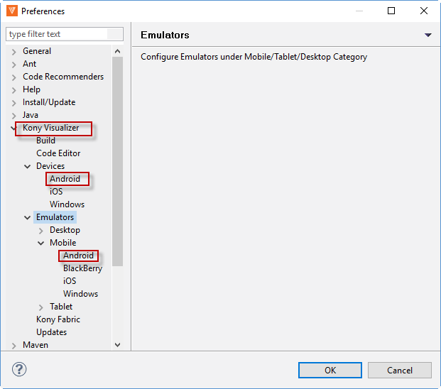
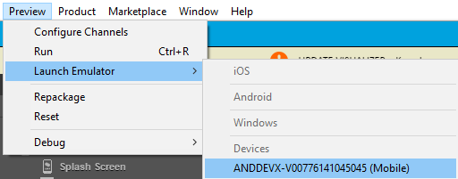
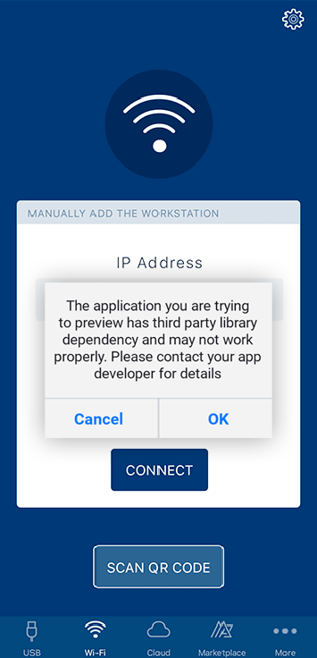

                          

Previewing Apps with NFIs/FFIs in the Volt MX App
=================================================

In general, you cannot use NFIs/FFIs based apps in native store (Google Play or AppStore) applications. However, you can run NFI/FFI based apps using the **Preview** feature of Volt MX Iris Enterprise.

**To run NFI/FFI based apps in the Volt MX App, do the following**:

1.  If you are not currently logged in to your Volt MX account, do so now by clicking **Login** in the top right corner of the Enterprisewindow. The Volt MX Account sign-in window opens.
2.  Enter your email and password credentials for your Volt MX account, and then click **Continue**. Once you are signed in, your account name displays in the top right corner of the Enterprise window.
3.  On the **Preview** menu, click **Configure Channels**.
4.  Select the platforms that you want the Volt MX App to support.
5.  Click **OK**.
6.  On the Product menu, click **Emulators & Devices Configuration**. The **Preferences** window opens.
7.  Navigate to **VoltMX Iris** > **Devices** and select a device.  
    
8.  Click **OK**.
9.  Navigate to **Preview**\> **Launch Emulator** > Select your emulator or device.  
    
10.  The Build Process starts. Once the process is successful, the app is installed on the selected device or emulator.
    
    > **_Note:_** Your app is installed on the device/emulator with the Volt MX App icon.
    

App installed through this flow will only support local preview. You will not be able to view cloud preview/login.

From V8 SP4 onwards, **Cloud Preview** is supported for this type of preview. For more information on cloud preview, refer to [Preview an App on the Cloud on Enterprise](FunctionalPreviewEnterprise.md#preview-an-app-on-the-cloud). You can login and access the **History** page. The app cache option is also enabled.

> **_Note:_** For iOS devices, you will not have the **Create Account** feature for this preview.

> **_Note:_** You will not have the QR code scanner for this preview.

When your app has a third party library dependency, it may not work properly. Volt MX Iris recognizes the usage of a third party library and displays an alert dialog in the Volt MX App. You can either click **OK** to proceed and preview the app or click **Cancel** to dismiss the preview.

