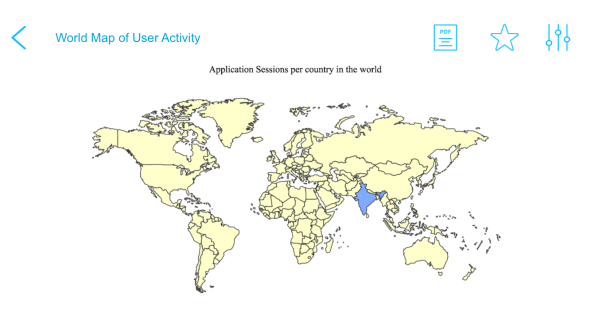
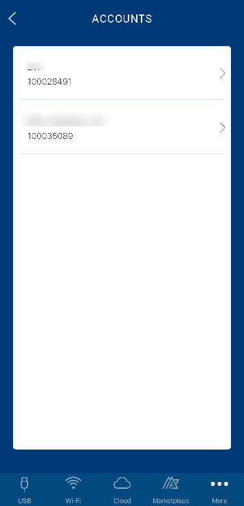

You are here: Reports and Analytics

# Reports and Analytics

Using the Volt MX App, you can access reports and manage your Volt MX Foundry accounts. The following features can be accessed by tapping the **More** tab at the bottom-right of the app.

- **Standard Reports** – lists a set of standard metrics and pre-built reports for the users. The reports include application activity, user activity, geolocation, server requests, and performance.

- **Custom Reports** – contains the custom reports created by using the custom data from an application.
- **Favorite Reports** – it shows the reports saved as favorites.
- **Manage Users** – it contains your user account and those invited by you.
- **Accounts** – it shows the accounts associated with your user ID.

## Standard Reports

The Volt MX App provides all the standard metrics and built-in reports for Volt MX Foundry. For information about Standard Reports, refer to [Standard Reports and Analytics Guide](../../../Foundry/standard_metrics_reports_guide/Content/standard_metrics_reports_guide.md).

The Standard Reports contain 24 reports. The number of reports available for you depends on whether you are a first-time user or an existing one. Per screen, about five reports are shown. The figure below shows a list of Standard Reports.

To view a report, select a report. The filter criteria pop-up appears.

Select the filter criteria for the report and click **Generate**.

Volt MX App generates and opens the report shown in the figure below. The report is available in the Landscape mode only.

Click Favorites (**star**icon) to save the report as a favorite.

Saving a report as a favorite saves the filter criteria that Volt MX App uses to generate the report.

## Custom Reports

The **Custom Reports** tab contains the customized reports created by you on the Volt MX Foundry account. For information about capturing custom metrics from the application and building reports, refer to [Custom Metrics and Reports Guide](../../../Foundry/custom_metrics_and_reports/Content/Custom_Metrics_and_Reports_Guide.md).

The Custom Reports are grouped into **Shared** and **Private**. As the names suggest, you can choose to share a report or use it for your personal consumption. Based on how the reports are labeled, they will appear in the respective category as illustrated in the following figures.

<table style="width: 699px;border-left-style: none;border-left-width: 1.5pt;border-left-color: #cccccc;border-right-style: none;border-right-width: 1.5pt;border-right-color: #cccccc;border-top-style: none;border-top-width: 1.5pt;border-top-color: #cccccc;border-bottom-style: none;border-bottom-width: 1.5pt;border-bottom-color: #cccccc;"><colgroup><col> <col></colgroup><tbody><tr><td></td><td></td></tr></tbody></table>

You can view the reports in the Landscape mode only.

## Favorites Reports

The Favorite Reports tab contains the reports saved as favorites. This feature is useful when you want to save the often-used filter criteria as favorites and avoid having to set filter criteria each time you use the report. You can save any standard or custom report as a favorite once it is rendered. Tap on the Favorite (**star** icon) and save the report by providing a name.

The figure below shows a list of reports saved as favorites.

## Manage Users

The **Manage Users** tab contains a list of users having access to the Volt MX Foundry account and the role of each user. Only users with Admin and Owner as account role can access the **Manage Users** tab. You can change a user’s level of access to the cloud environments or invite users to the Volt MX Foundry cloud using this tab. For more information about the user management, refer to [User Management](../../../Foundry/voltmx_foundry_user_guide/Content/Settings_Cloud.md#ManageUsersCloud).

To invite a user, select the plus **(+**) icon on the top-right of the screen. The **INVITE USER** screen appears. Provide an email address and select an **Account Role** from the drop-down menu. You are required to define the access level to Volt MX Iris and Volt MX Foundry environments before sending the invite.

As an Admin or Owner to an account, you can modify a user account from the list. However, you can only modify a user’s access level to HCL Volt MX Iris and Volt MX Foundry environments. Select the account you want to modify and provide the access level by choosing between **Full Access** and **No Access** from the drop-down menus.

## Accounts

If you have multiple Volt MX Foundry cloud accounts, you can access any one of them from the **Accounts** tab. The name of your cloud account, which you are presently using, is shown next to **Accounts**. To choose a different account, select the **Accounts** tab. Choose an account from the list in the following page illustrated in the figure below.

