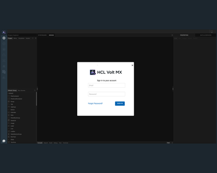
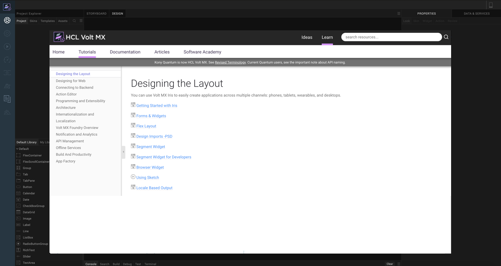
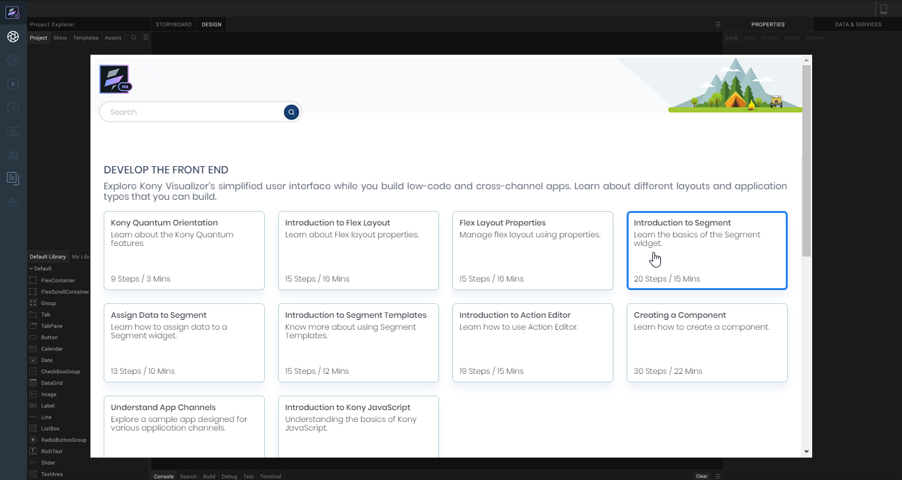
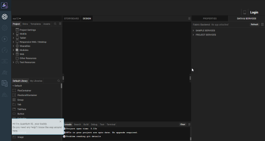
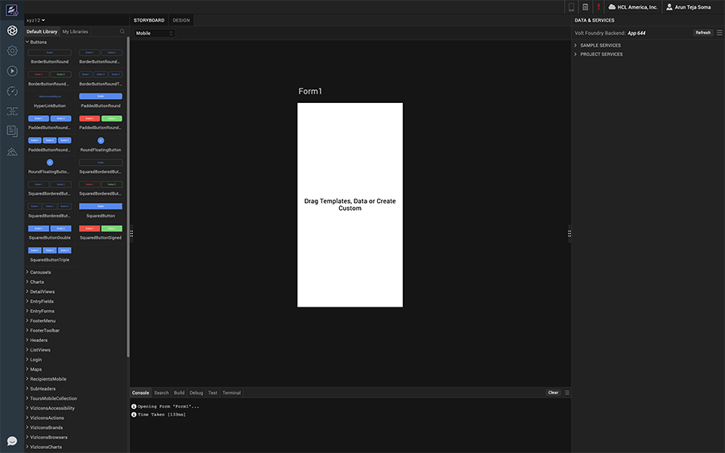

<!-- 

*   [Prerequisites](Prerequisites.md#prerequisites)
    *   [System Requirements](Prerequisites.md#system-requirements)
    *   [Download Volt MX Iris](Prerequisites.md#download)
*   [Install Volt MX Iris](Installing VoltMX Iris.md#installing)
    *   [Configuring Volt MX Iris to use a Proxy server](Installing VoltMX Iris.md#configuring-to-use-a-proxy-server)
        *   [Basic Proxy](Installing VoltMX Iris.md#basic-proxy)
        *   [NTLM Proxy](Installing VoltMX Iris.md#ntlm-proxy)
        *   [Custom NTLM Proxy](Installing VoltMX Iris.md#custom-ntlm-proxy)
        *   [White-list Essential Domains](Installing VoltMX Iris.md#white-list-essential-domains)
*   [Post Installation Tasks](Launching VoltMX Iris.md#post-installation-tasks)
    *   [Launching Volt MX Iris](Launching VoltMX Iris.md#launching)
*   [Update Volt MX Iris](Upgrade.md)
*   [FAQs](StudioInstallation_FAQs.md#appendix-frequently-asked-questions-faqs)

*   All Files

You are here: [Post Installation Tasks](#post-installation-tasks) > Launching Volt MX Iris -->

# Post Installation tasks

## Launching Volt MX Iris

To launch Iris, follow these steps:

1.  Double-click the Volt MX Iris shortcut icon on the
    desktop to open the login screen of Iris.

    > **_Note:_** You can also navigate to the folder where Iris is installed, and double-click **Iris** to launch it.

2.  On launching Iris, the **VoltMX Cloud Login** screen
    appears for license validation.

    

3.  Enter your Volt MX Cloud credentials, and then click
    **Login**.

    Iris validates the license associated with your Cloud account.

4.  The Hikes screen appears. The Hikes screen displays links
    to different Hikes available in Volt MX Iris. You can go through these hikes to understand various features of Volt MX.

    

    <!--  -->

5.  Close the Hikes screen. The Volt MX IQ bot gets activated.

    Use the bot to guide you in the process of developing applications in Volt MX Iris.

    

6.  After the Volt MX IQ bot disappears, a sample form loads
    in the application canvas.

    

7.  Click **Project** > **New Project** to create a new Iris
    project

    For details on how to uninstall the Iris application from your system, refer [Uninstall Volt MX Iris](Uninstalling VoltMX Iris.md).

<!-- - [Prerequisites](Prerequisites.md#prerequisites)
  - [System Requirements](Prerequisites.md#system-requirements)
  - [Download Volt MX Iris](Prerequisites.md#download)
- [Install Volt MX Iris](Installing VoltMX Iris.md#installing)
  - [Configuring Volt MX Iris to use a Proxy server](Installing VoltMX Iris.md#configuring-to-use-a-proxy-server)
- [Post Installation Tasks](#post-installation-tasks)
  - [Launching Volt MX Iris](#launching)
- [Update Volt MX Iris](Upgrade.md)
- [FAQs](StudioInstallation_FAQs.md#appendix-frequently-asked-questions-faqs) -->
