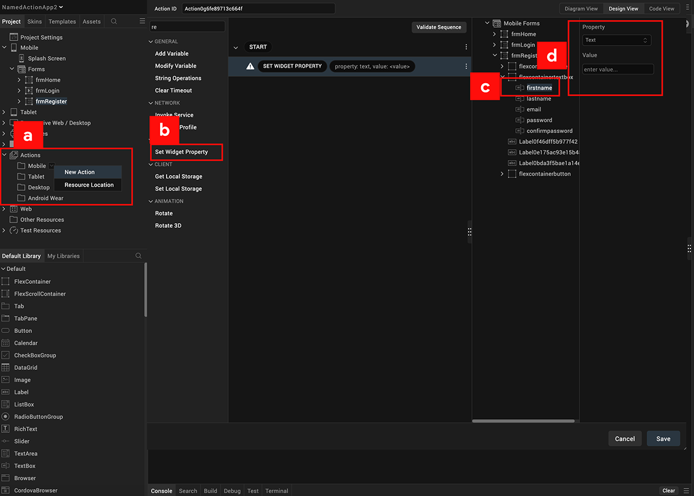
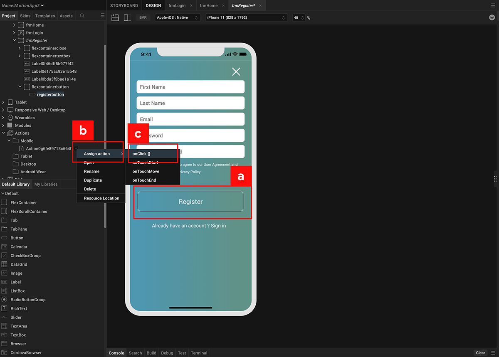
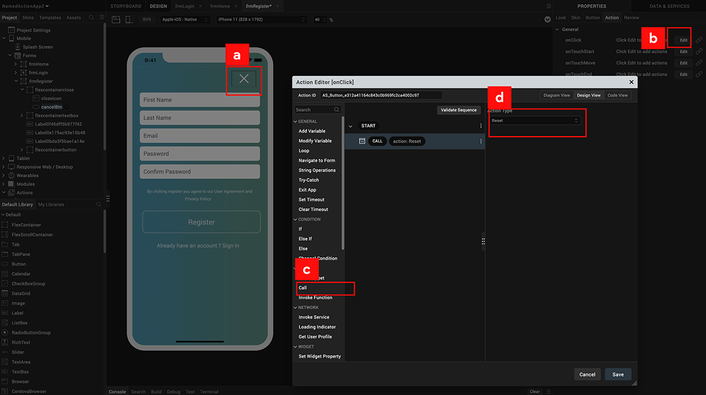

                             

Volt MX  Iris Tutorials

Working with named actions
--------------------------

<iframe src="https://www.youtube.com/embed/S1nhgzvzW00" allowfullscreen=""></iframe>

  
  

1\. creating named actions
--------------------------

1.  Named Action Creation
    
    Create a new named action for the desired channel.
    
2.  Action Selection
    
    Select **Set Widget Property** from the action library to build the named action sequence.
    
3.  UX Field Selection
    
    Select the desired text box fields that need to be reset.
    
4.  Action Configuration
    
    Reset the selected text box fields by configuring the text property to a null value.
    

2\. Assigning Named Actions
---------------------------

1.  Widget Selection
    
    Select the button widget which is to be associated with the Named Action.
    
2.  Named Action Selection
    
    Right Click on the Named Action which is to be assigned to button widget.
    
3.  Assignment
    
    Assign the Named Action to the **On Click** event of the button.
    

3\. Calling Named Actions
-------------------------

1.  Widget Selection
    
    Select the button widget which is to be associated with the Named Action.
    
2.  Event Selection
    
    Select the **On-Click** event of the button from the Action tab.
    
3.  Action Selection
    
    Select **Call Action** from the action library to build the desired action sequence for the **On-Click** event.
    
4.  Named Action Association
    
    Configure the **Call Action** sequence by selecting the desired Named Action.
    

