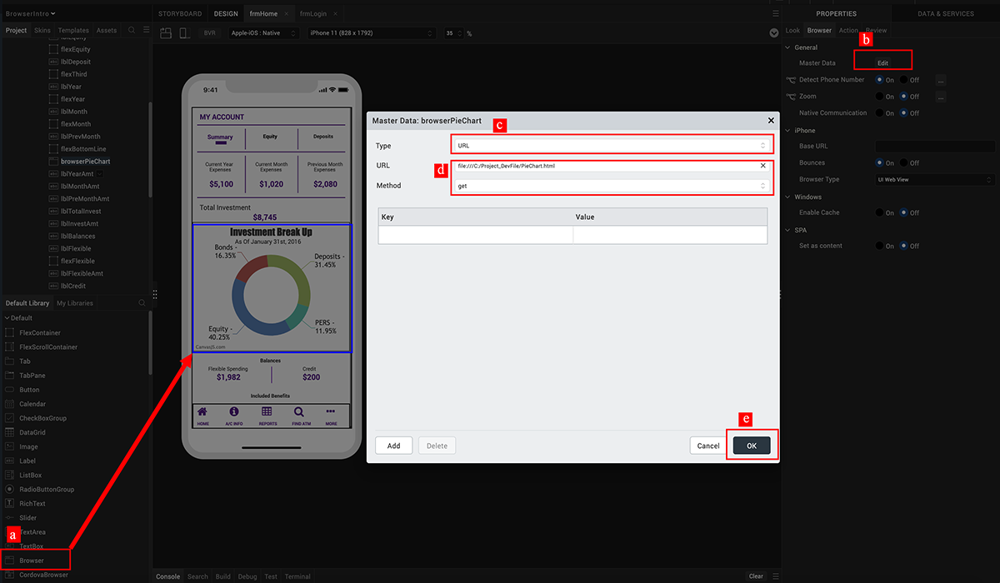
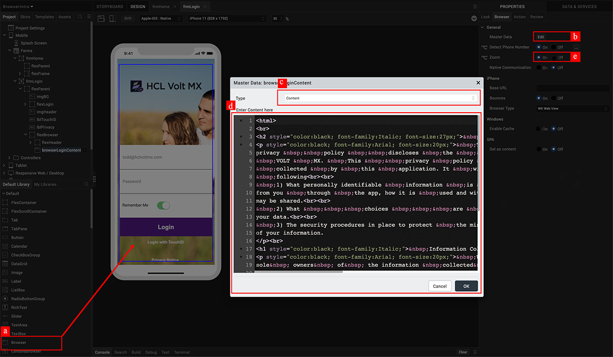
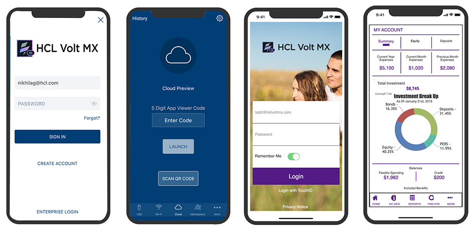

                             

Volt MX  Iris Tutorials

Working with the browser widget
-------------------------------

<iframe src="https://www.youtube.com/embed/qI1gkD2GUvY" allowfullscreen=""></iframe>

  

1\. Setup the browser widget to link a web URL
----------------------------------------------

1.  Widget Selection
    
    Drag the browser widget onto the design canvas.
    
2.  Widget Properties
    
    Navigate to the master data properties.
    
3.  HTML Content Selection
    
    Select the “URL” option to render remotely hosted web content.
    
4.  Widget Configuration
    
    Provide the URL of the web page and select the “get” method to retrieve information.
    
5.  Save Configurations
    
    Submit the configuration and save the design settings.
    

  

2\. Setup the browser widget to embed static HTML content in rich text
----------------------------------------------------------------------

1.  Widget Selection
    
    Drag the browser widget onto the design canvas.
    
2.  Widget Properties
    
    Navigate to the master data properties.
    
3.  HTML Content Selection
    
    Select the “Content” option to embed static HTML content
    
4.  Widget Configuration
    
    Provide the HTML content into the rich text area and submit.
    
5.  Additional Configurations
    
    Enable the ‘Zoom in/out’ option in the browser and save all configurations.
    

3\. View prototype on iris application preview
----------------------------------------------------

1.  Log in into Iris App Preview
    
2.  Enter the short code of the published app
    
3.  View working prototype of the application
    

