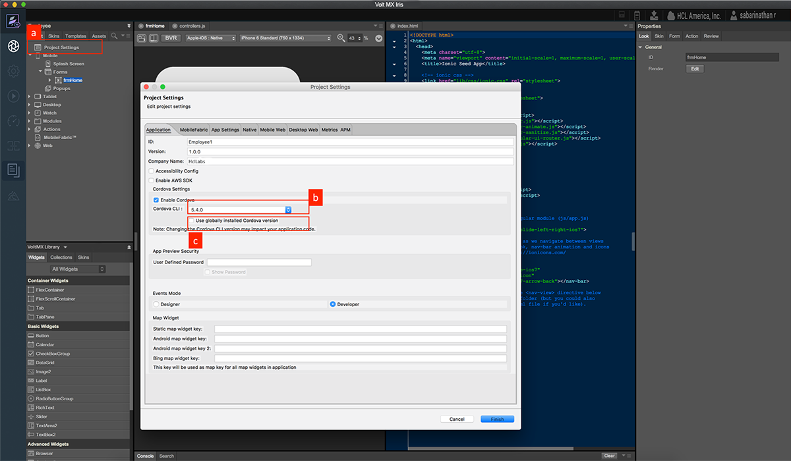
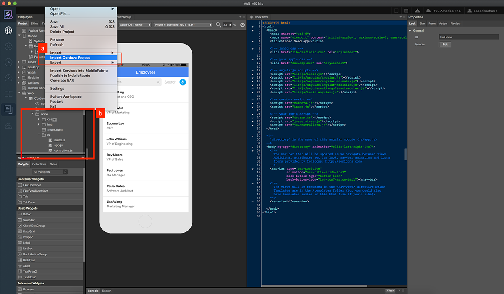
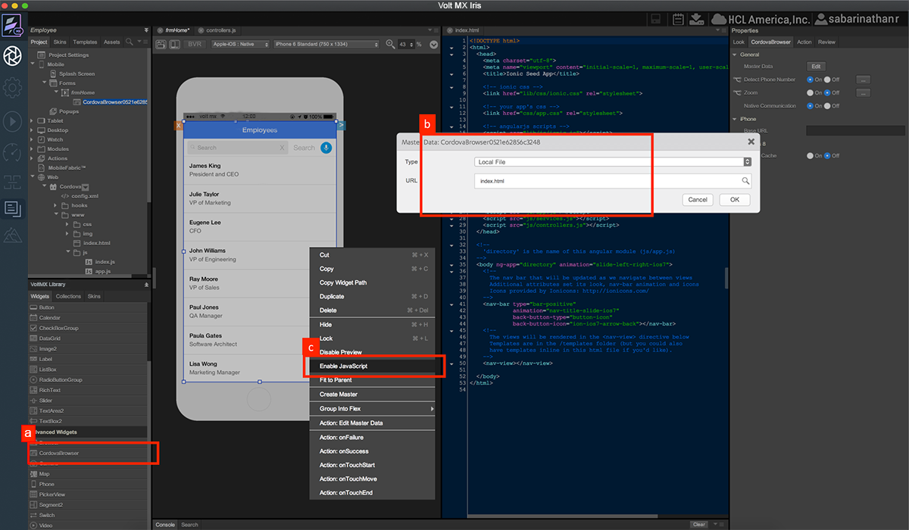
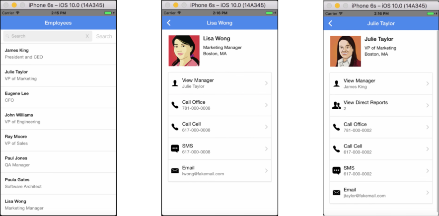

                             

Volt MX  Iris Tutorials

Import an existing cordova application
--------------------------------------

<iframe src="https://www.youtube.com/embed/GXSmiWnkDxo" allowfullscreen=""></iframe>

1\. enable cordova development
------------------------------

1.  Navigate to Project Settings Check the Enable Cordova checkbox.
    
2.  Choose the specific version of Cordova to be used for this project.
    
3.  In case Cordova is installed globally check the Use globally installed Cordova version checkbox.
    

2\. import cordova assets
-------------------------

1.  Select File -> Import Cordova Project and select the project to be imported.
    
2.  Once the project is imported it is available under Cordova node underneath Web in Project Explorer.
    

3\. assign the cordova source to a cordova browser widget
---------------------------------------------------------

1.  Drag and Drop a Cordova Browser widget on the form.
    
2.  Double click on the Cordova Browser widget, in the Master Data popup assign index.html to URL.
    
3.  Right click on the Cordova Browser widget and enable javascript on the browser widget to see a live rendering on canvas.
    

4\. test on a simulator
-----------------------

1.  Run the application on a simulator.
2.  Cordova application is embedded inside a Volt MX application and runs on a simulator.

