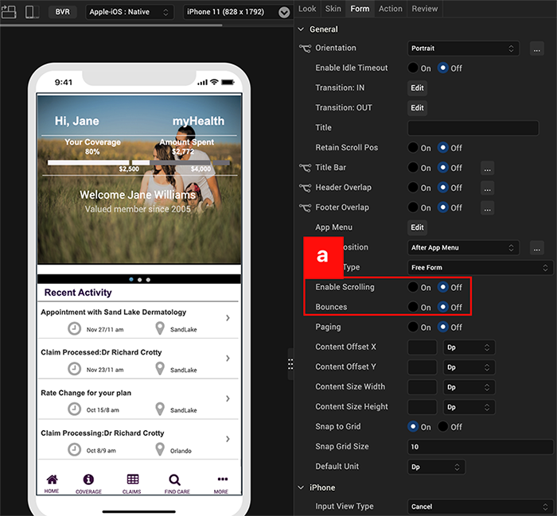

                             

Volt MX  Iris Tutorials

Introduction to flex layout
---------------------------

<iframe src="https://www.youtube.com/embed/vMbWyCZkHsQ" allowfullscreen=""></iframe>

  

1\. Understanding Flex Container Layouts
----------------------------------------

  

1.  Free Form
    
    This is the default container layout. In this layout widgets are positioned in absolute space relative to the parent container or form.
    
2.  Flow Vertical
    
    In this layout the vertical positioning of a widget is relative to its sibling widget in the container, whereas the horizontal positioning is absolute (relative to the parent container).
    
3.  Flow Horizontal
    
    In this layout the horizontal positioning of a widget is relative to its sibling widget in the container, whereas the vertical positioning is absolute (relative to the parent container).
    

  

2\. Understanding Flex Properties and Rules
-------------------------------------------

  

1.  Widget Positioning
    
    Position a widget at the bottom of the flex container by configuring the bottom value to **0**.
    
2.  Flex Rule Override
    
    Override the flex rule of - prioritizing and looking at the top position value, by deleting any entries in the top position. Now the bottom position entry will be respected and will override the top position.
    
3.  Relative Widget Height
    
    Set the top and bottom position of the widget to a value in order to configure a widget to span across the height of a flex container.
    
4.  Flex Rule Override
    
    Override the flex rule of - prioritizing and looking at the Height value of a widget, by deleting any entries in this field. Now the height of the widget will be defined by the top and bottom position of the widget.
    

3\. Switching Off Form Scroll
-----------------------------

  

1.  Set **Enable Scrolling** and **Bounces** to **OFF**, in order to disable form scrolling and avoid interference with child scrolling containers.
    

4\. Configuring the Vertical Flex Scrolling Container
-----------------------------------------------------

   

1.  Configure the dimensions of the flex scrolling container to span vertically by setting the top and bottom parameters.
    
2.  Enable scrolling parameter for the flex scroll container and set the value of scrolling direct to Vertical.
    

5\. Configuring Horizontal Flex Scrolling Container with Pagination
-------------------------------------------------------------------

  
  

1.  Configure the flex scroll container by setting the scroll direction to ‘Horizontal’ and switching the Paging parameter to ON.
    

