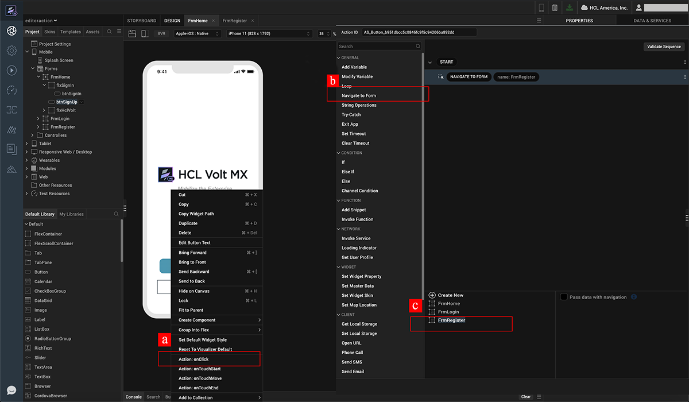
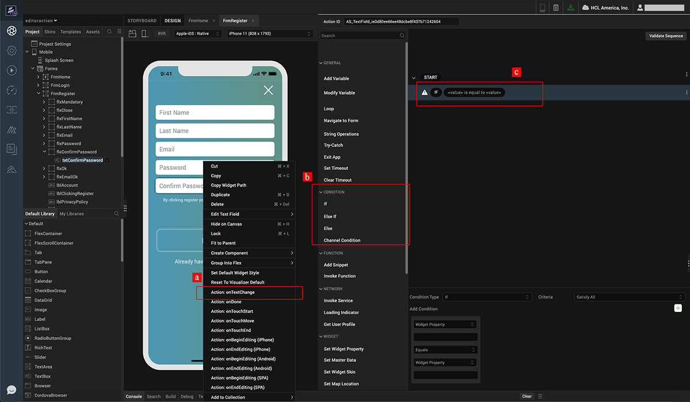
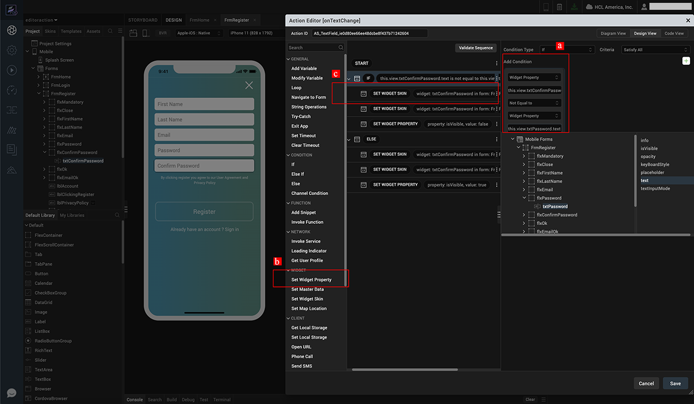
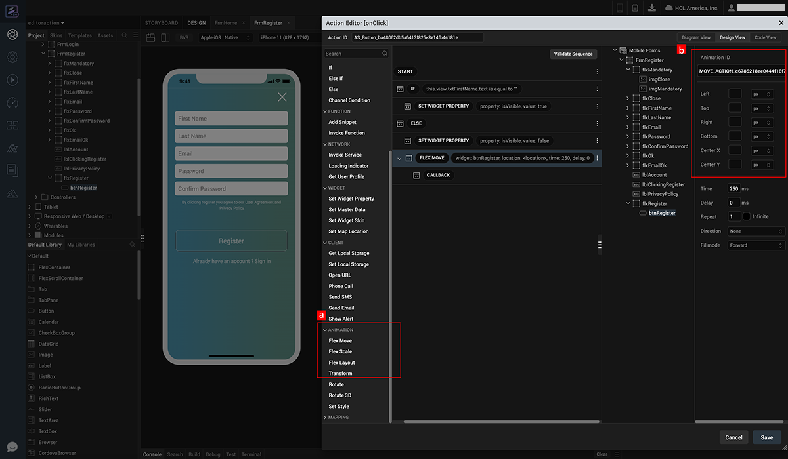
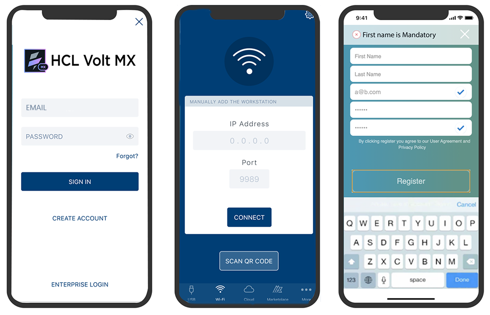

                             

Volt MX  Iris Tutorials

action editor - BRINGING INTERACTIVITY TO THE APPLICATION
---------------------------------------------------------

1\. Navigation Actions
----------------------

1.  Right click on the button and associate an action to the onClick event.
    
2.  In the Action Editor that opens up, click on Navigate to Form Action.
    
3.  All the configurable properties for the selected action are shown in the bottom pane, choose the required form to Navigate to. Select the “URL” option to render remotely hosted web content.
    

2\. Conditional Operations
--------------------------

1.  Associate an action to the onTextChange event of Confirm Password text box.
    
2.  In the Action Editor that opens up, click on If Condition listed under the Conditions group.  
    
3.  An If condition is added to the action sequence.
    

3\. Expression Editor
---------------------

1.  Configure the expression for the If condition. If the Widget Property confirmpasswordtxt.text is Not Equal to passwordtxt.text.
    
2.  In the Action Editor that opens up, click on If Condition listed under the Conditions group.  
      
    
3.  An If condition is added to the action sequence.
    

4\. Animations
--------------

1.  Click on Flex Move Animation Action and associate to the Action Sequence.
    
2.  Configure the Animation by providing the positional properties and the timing of the animation
    

5\. App Preview
---------------

1.  Log in into App Preview
    
2.  Key in machine information and click on Launch App.
    
3.  Notice all the validations being performed and Animation being triggered
    

