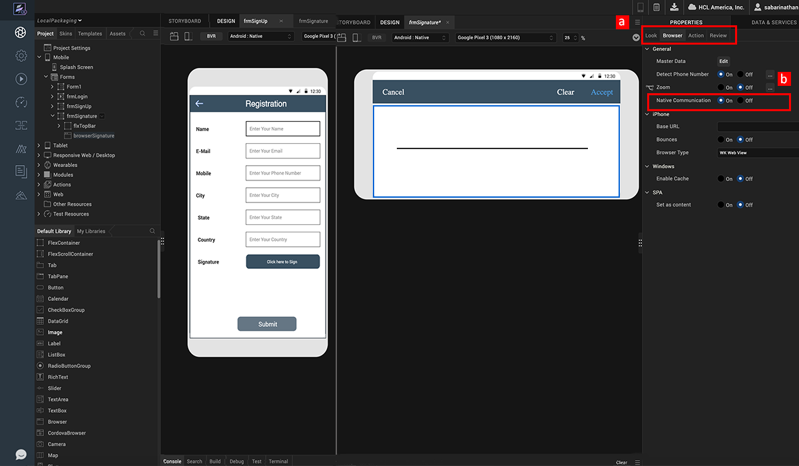
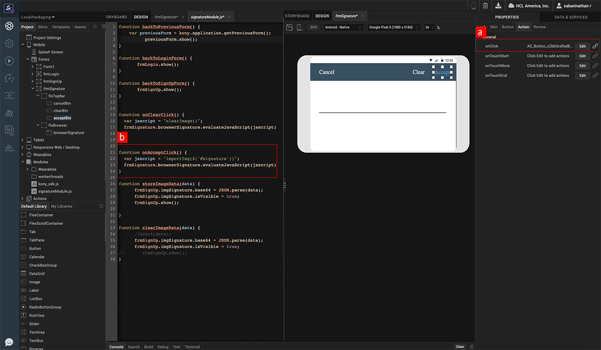
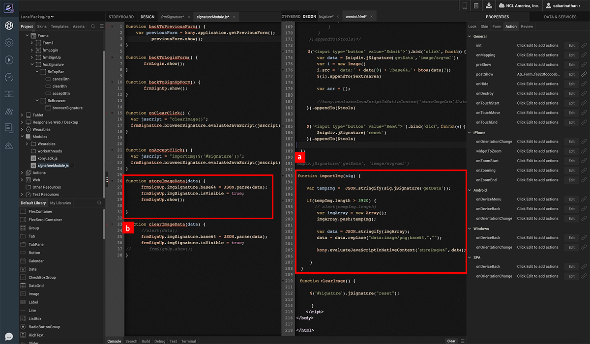
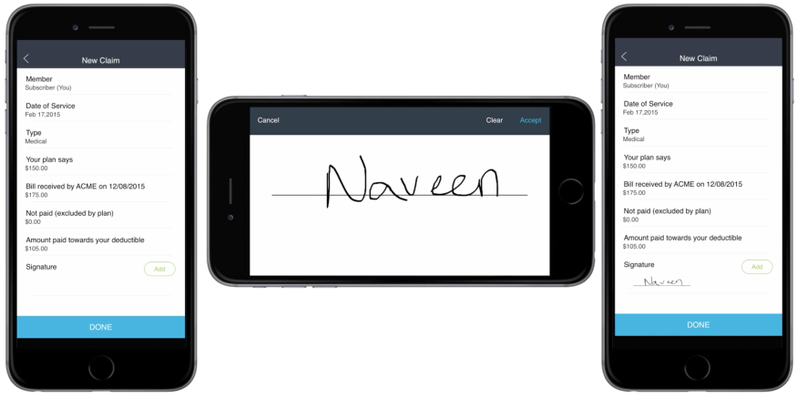

                             

Volt MX  Iris Tutorials

native hybrid communication
---------------------------

<iframe src="https://www.youtube.com/embed/Z_-pLUheO3c" allowfullscreen=""></iframe>

1\. enable native communication
-------------------------------

1.  Select the browser widget. Navigate to the Browser tab in Properties sheet.
    
2.  Set the Native Communication property to ON.
    

2\. execute javascript in hybrid context
----------------------------------------

1.  Assign an onClick function to the Native button in frmSignature form.
    
2.  In the onClick function, construct the javascript function to be called in the hybrid context.
    
3.  Invoke ExecuteJavaScript on the browser widget passing the javascript string to evaluate.
    

3\. pass context and data to native context
-------------------------------------------

1.  In the Local HTML file, after capturing the required data, invoke ExecuteInNativeContext to pass data and control back to the native context.
    
2.  Receive the data in the Volt MX Native context, and assign it to the image widget.
    

4\. App Preview
---------------

1.  On clicking Add in the New Claims form we are taken to the Signature Capture form.
    
2.  After capturing the signature, on click of Accept we are taken back to the New claim form.
    
3.  Notice the signature being captured and assigned to the Image Widget.
    

