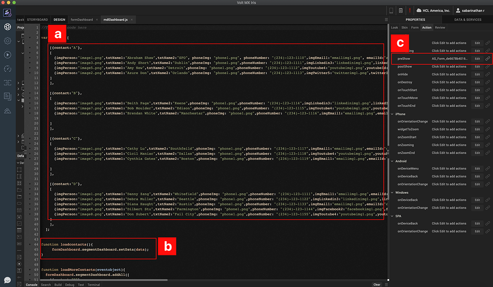
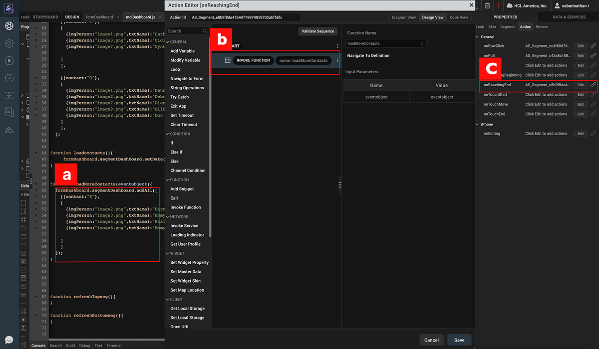
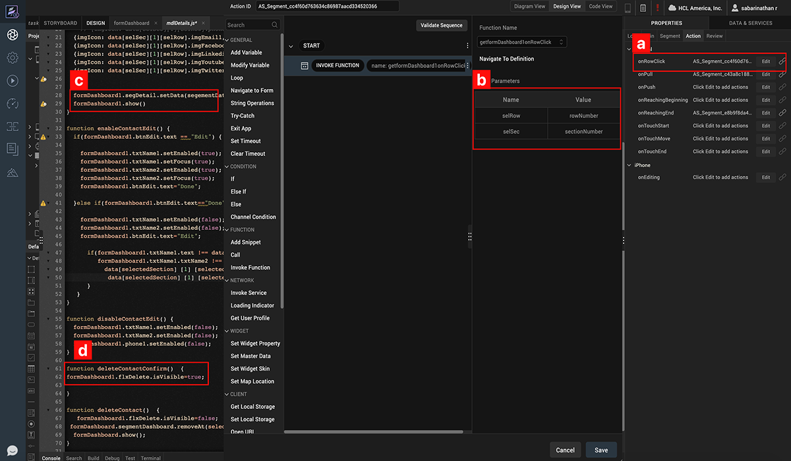
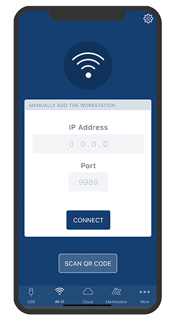

                             

Volt MX  Iris Tutorials

segment widget - Advanced
-------------------------

  
  
<iframe src="https://www.youtube.com/embed/b1Pe5lK5Vmc" allowfullscreen=""></iframe>

1\. Assign Data To Segment Through JS API
-----------------------------------------

1.  Create a JSON array with data for each row item and the template a row will use to render itself.
    
2.  Use the setData API to set the JSON data to the segment.
    
3.  Invoke this function on the form preshow lifecycle event.
    

  

2\. Add Interactivity To The Segment
------------------------------------

1.  Use addAll API to add append rows to existing segment data.
    
2.  Add interactivity to the segment by using the **onReachingEnd** scrolling event.
    
3.  On the callback of this event, map the function to append the data.
    

3\. Read, Updated And Delete Data from Segment
----------------------------------------------

1.  Define onRowClick event of the segment widget and pass row and section index to callback.
    
2.  Use data property with selected row index to fetch the selected row data.
    
3.  Use setDataAt API to update the data at a particular index of the segment data.
    
4.  Use removeAt API to remove the data at a particular index of the segment data.
    

4\. Run The App On Functional Preview
-------------------------------------

 

