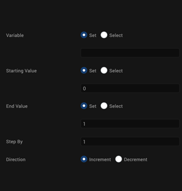
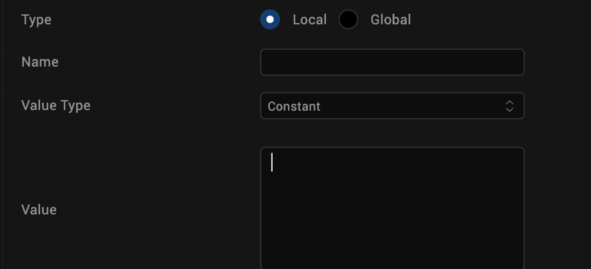
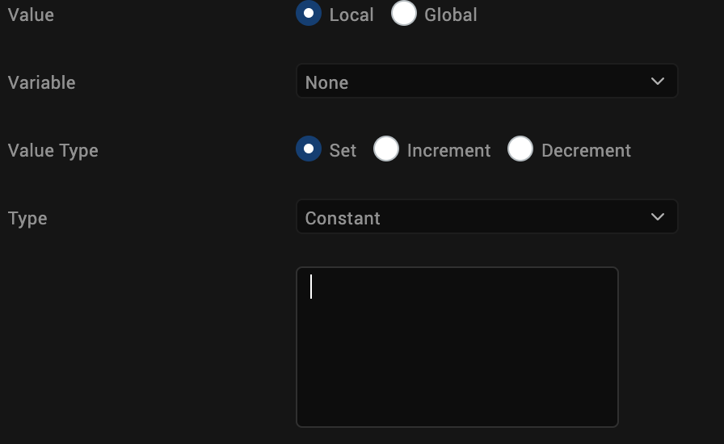
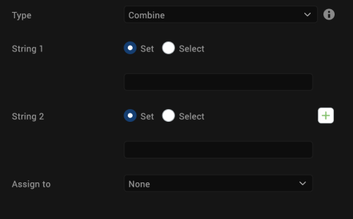
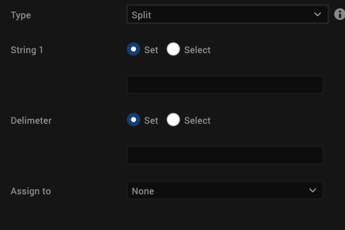
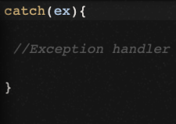
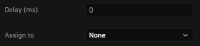

<h2>General Actions</h2>

The general actions that you can use in an action sequence are as follows:

<table>
  <tr>
    <th>Action</th>
    <th>Property</th>
  </tr>
  <tbody>
    <tr>
      <td>
        <a href="#la">Loop Action</a>
      </td>
      <td>Repeat a set of nested statements for the specified number of times.</td>
    </tr>
    <tr>
      <td>
        <a href="#av">Add Variable</a>
      </td>
      <td>Adds a variable that is available within a function. Local variable can be of type Constant or Expression and take the following data type: String, Number, Boolean and or Collection.</td>
    </tr>
    <tr>
      <td>
        <a href="#mv">Modify Variable</a>
      </td>
      <td>Modify an existing variable.</td>
    </tr>
    <tr>
      <td>
        <a href="#nv">Navigate to Form</a>
      </td>
      <td>Navigates from one form to another.</td>
    </tr>
    <tr>
      <td>
        <a href="#so">String Operation</a>
      </td>
      <td>Perform operations (such as combine or split) on strings.</td>
    </tr>
    <tr>
      <td>
        <a href="#tc">Try-Catch</a>
      </td>
      <td>Marks a block of statements to try, and specifies a response, should an exception be thrown.</td>
    </tr>
    <tr>
      <td>
        <a href="#nv">Exit App</a>
      </td>
      <td>Closes the application.</td>
    </tr>
    <tr>
      <td>
        <a href="#st">Set Timeout</a>
      </td>
      <td>Set a timeout variable.</td>
    </tr>
    <tr>
      <td>
        <a href="#ct">Clear Timeout</a>
      </td>
      <td>Clear the timeout.</td>
    </tr>
  </tbody>
</table>
<h3 id="la">Loop Action</h3>

To define an action sequence for executing a loop action, do the following:

<ol>
  <li>From the <strong>Project</strong> tab of the Project Explorer, select the widget you want to apply the action to. The widget is highlighted on the Iris Canvas.</li>
  <li>Right-click the widget and then select one of the actions for example, onTouchStart. The Action Editor window opens and an action sequence is created.</li>
  <li>From the <strong>General</strong> section along the left column of the Action Editor, click <strong>Loop Action</strong>. The action is added to the action sequence and is the current action of focus.</li>
  <li>
    
In the properties pane of the Action Editor, configure the following

    <ol>
      <li>In the <strong>Variable</strong> field, you can either select set and enter a name for the variable or select choose and select a variable from a list of existing variables.</li>
      <li>In the <strong>Starting Value</strong> field, you can either select set and enter a starting value for the variable or select choose and select a value from the list.</li>
      <li>In the <strong>End Value</strong> field, you can either select set and enter an ending value for the variable or select choose and select a value from the list.</li>
      <li>In the <strong>Step By</strong> field, enter the value for the step.</li>
      <li>
        
Select the direction of the count, either Increment or Decrement.

        

      </li>
    </ol>
  </li>
  <li>
    
Click <strong>Save</strong> to save the action sequence, and then close the Action Editor window.

  </li>
</ol>
<h3 id="av">Add Variable</h3>

To define an action sequence to add a local variable, do the following:

<ol>
  <li>From the <strong>Project</strong> tab of the Project Explorer, select the widget you want to apply the action to. The widget is highlighted on the Iris Canvas.</li>
  <li>Right-click the widget and then select one of the actions for example, onTouchStart. The Action Editor window opens and an action sequence is created.</li>
  <li>From the <strong>General</strong> section along the left column of the Action Editor, click <strong>Add Variable</strong>. The action is added to the action sequence and is the current action of focus.</li>
  <li>In the properties pane of the Action Editor, in the <strong>Name</strong> text box, enter a name for the variable.</li>
  <li>From the <strong>Value Type</strong> list, select a value type, either <strong>Constant</strong> or <strong>Expression</strong>.</li>
  <li>
    
In the <strong>Value</strong> field, enter the value of the local variable.

    

  </li>
  <li>
    
Click <strong>Save</strong> to save the action sequence, and then close the Action Editor window.

  </li>
</ol>

<strong>Note:</strong> For variable type Global also the same steps from #4 to #6 above are applicable

<h3 id="mv">Modify Variable</h3>

To define an action sequence to modify an existing variable, do the following:

<ol>
  <li>From the <strong>Project</strong> tab of the Project Explorer, select the widget you want to apply the action to. The widget is highlighted on the Iris Canvas.</li>
  <li>Right-click the widget and then select one of the actions for example, onTouchStart. The Action Editor window opens and an action sequence is created.</li>
  <li>From the <strong>General</strong> section along the left column of the Action Editor, click <strong>Modify Variable</strong>. The action is added to the action sequence and is the current action of focus.</li>
  <li>In the properties pane of the Action Editor, in the <strong>Variable</strong> field, select a variable from a list of existing variables.</li>
  <li>In the <strong>Value</strong> field, you can choose to either set a value for the variable or Increment or Decrement the value of the variable.</li>
</ol>

If you choose to set a value for the variable, select a value type from the <strong>Type</strong> list, either <strong>Constant</strong> or <strong>Expression</strong>, and then enter the value of the variable in the text box provided below.

Click <strong>Save</strong> to save the action sequence, and then close the Action Editor window.

<h3 id="so">String Operation</h3>

To define an action sequence to execute a String operation, do the following:

<ol>
  <li>From the <strong>Project</strong> tab of the Project Explorer, select the widget you want to apply the action to. The widget is highlighted on the Iris Canvas.</li>
  <li>Right-click the widget and then select one of the actions for example, onTouchStart. The Action Editor window opens and an action sequence is created.</li>
  <li>From the <strong>General</strong> section along the left column of the Action Editor, click <strong>String Operation</strong>. The action is added to the action sequence and is the current action of focus.</li>
  <li>In the properties pane of the Action Editor, in the <strong>Type</strong> field, select the type of String operation, either <strong>Combine</strong> or <strong>Split</strong>.</li>
  <li>In the <strong>String 1</strong> field, you can choose to either set a value for the string or select choose and select a string from a list of existing strings.</li>
  <li>
    
The second field varies depending on the type of String operation you select.

    <ul>
      <li>
        
If you select the <strong>Combine</strong> option, in the <strong>String 2</strong> field, you can choose to either set a value for the string or select choose and select a string from a list of existing strings. To add additional strings, click the green + icon. To delete a string, click its corresponding red x icon.

        

      </li>
      <li>
        
If you select the <strong>Split</strong> option, in the <strong>Delimiter</strong> field, you can choose to either set a delimiter for the string or select choose and select a string from a list of existing strings.

        

      </li>
    </ul>
  </li>
  <li>
    
In the <strong>Assign To</strong> list, select the variable to which you want to assign the resulting String.

  </li>
  <li>Click <strong>Save</strong> to save the action sequence, and then close the Action Editor window.</li>
</ol>
<h3 id="tc">Try-Catch</h3>

To define an action sequence to execute a try-catch block of code, do the following:

<ol>
  <li>From the <strong>Project</strong> tab of the Project Explorer, select the widget you want to apply the action to. The widget is highlighted on the Iris Canvas.</li>
  <li>Right-click the widget and then select one of the actions for example, onTouchStart. The Action Editor window opens and an action sequence is created.</li>
  <li>From the <strong>General</strong> section along the left column of the Action Editor, click <strong>Try-Catch</strong>. The action is added to the action sequence and is the current action of focus.</li>
  <li>
    
In the properties pane of the Action Editor, in the code editor, enter the code that you want to execute or paste it in from another source by pressing <strong>Ctrl+V</strong>.

    <ul>
      <li>The <strong>try</strong> statement allows you to define a block of code to be tested for errors while it is being executed.</li>
      <li>The <strong>catch</strong> statement allows you to define a block of code to be executed, if an error occurs in the try block.</li>
      <li>
        
The <strong>finally</strong> statement lets you execute code, after try and catch, regardless of the result.

        

      </li>
    </ul>
  </li>
  <li>
    
Click <strong>Save</strong> to save the action sequence, and then close the Action Editor window.

  </li>
</ol>
<h3 id="nv">Navigation</h3>

To define an action sequence for navigating to a form, or exit an app, do the following:

<ol>
  <li>From the <strong>Project</strong> tab of the Project Explorer, select the widget you want to apply the action to. The widget is highlighted on the Iris Canvas.</li>
  <li>Right-click the widget and then select one of the actions for example, onTouchStart. The Action Editor window opens and an action sequence is created.</li>
  <li>From the <strong>General</strong> section along the left column of the Action Editor, click one of the two navigation actions. The action is added to the action sequence and is the current action of focus.</li>
  <li>
    
In the properties pane of the Action Editor, select the <strong>Form</strong> that the navigational action applies to (this step isn't used for the Exit App action).

    

  </li>
  <li>
    
Click <strong>Save</strong> to save the action sequence, and then close the Action Editor window.

  </li>
</ol>
<h3 id="st">Set Timeout</h3>

To define an action sequence to set a timeout, do the following:

<ol>
  <li>From the <strong>Project</strong> tab of the Project Explorer, select the widget you want to apply the action to. The widget is highlighted on the Iris Canvas.</li>
  <li>Right-click the widget and then select one of the actions for example, onTouchStart. The Action Editor window opens and an action sequence is created.</li>
  <li>From the <strong>Client</strong> section along the left column of the Action Editor, click <strong>Set Timeout</strong>. The action is added to the action sequence and is the current action of focus.</li>
  <li>In the properties pane of the Action Editor, in the <strong>Delay</strong> field, enter a value for the time in milliseconds (ms) after which the timeout must occur.</li>
  <li>
    
In the <strong>Assign To</strong> list, select the variable that you want to use to set the timeout.

    

  </li>
  <li>
    
Click <strong>Save</strong> to save the action sequence, and then close the Action Editor window.

  </li>
</ol>
<h3 id="ct">Clear Timeout</h3>

To define an action sequence to clear a timeout that has already been set, do the following:

<ol>
  <li>From the <strong>Project</strong> tab of the Project Explorer, select the widget you want to apply the action to. The widget is highlighted on the Iris Canvas.</li>
  <li>Right-click the widget and then select one of the actions for example, onTouchStart. The Action Editor window opens and an action sequence is created.</li>
  <li>From the <strong>Client</strong> section along the left column of the Action Editor, click <strong>ClearTimeout</strong>. The action is added to the action sequence and is the current action of focus.</li>
  <li>
    
In the properties pane of the Action Editor, from the <strong>Timeout Handle</strong> list, select the variable that you want to use to clear the timeout.

    

  </li>
  <li>
    
Click <strong>Save</strong> to save the action sequence, and then close the Action Editor window.

  </li>
</ol>