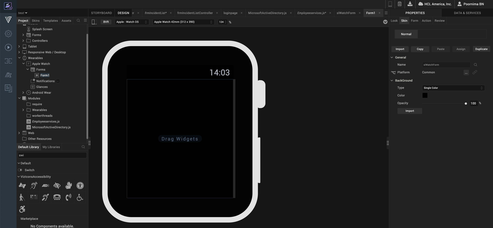
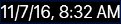
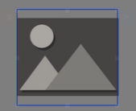
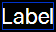
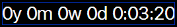
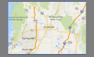
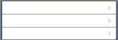

                         

Add Watch Widgets
=================

Widgets are the building blocks of a screen (form) in a digital application, and each one has a specific purpose, such as user interaction or animation. Volt MX Iris provides you with built-in widgets that help you achieve your required functionality. You can configure every widget based on your needs.

This topic covers widgets for the Watch channel. For information regarding widgets for the Mobile, Tablet, and Desktop channels, see [Populate Screens with Widgets](PopulatingWidgets.md).

Volt MX  Iris provides three types of widgets for the Apple Watch: Container, Basic, and Advanced.

Click a topic for more information. 

[Access widgets from the Widget Tab](#access-widgets-from-the-widget-tab)

[The Three Types of Widgets](#the-three-types-of-widgets)

Access Widgets from the Widget Tab
----------------------------------

The widgets are located on the Widget tab of the Volt MX IrisLibrary pane. To add widgets to a form, simply drag and drop them into place. As you do so, alignment guides display to guide your positioning of the widget.

  
_Dragging a button widget onto a Watch form._

The Three Types of Widgets
--------------------------

Volt MX  Iris provides you with three types of widgets.

[Container Widget](#container-widget)

[Basic Widgets](#basic-widgets)

[Advanced Widgets](#advanced-widgets)

### Container Widget

The container widget category for the Watch channel consists of a single widget, the [Group container widget](WatchGroupWidget.md). You can add any of the Watch widgets directly onto a Watch form without using the Group container. But if you want to structure your form with grouped widgets that align on either a horizontal or vertical axis, you can use the Group container. A Group container can orient the widgets it contains either horizontally, or vertically. By nesting one or more vertically-oriented Group containers within a horizontally-oriented Group container, and then adding widgets to those containers, you can create a grid of widgets. Similarly, you can also nest horizontally-oriented Group containers within a vertically -oriented Group container. With the right combination and alignment of horizontal and vertical Group containers, you can position a widget anywhere on the Watch form. For more information about the Group container widget, see [Group Widget](WatchGroupWidget.md).

  
_Two vertically-oriented Group containers, each containing four button widgets, nested within a single, horizontally-oriented Group container._

### Basic Widgets

Basic Widgets help you build the user interface in your application. Along with designing the application, you can also configure events to these widgets or write code snippets to create functionality.

  
| Widget | Description | Image |
| --- | --- | --- |
| [Button](WatchButtonWidget.md) | The Button widget provides input to an application or to trigger an event. For example, you can navigate to a form, interact with a dialog box, or confirm an action. |  |
| [Date](WatchDateWidget.md) | The Date widget can display a date, a time of day, or both. It does not have an Actions tab. |  |
| [Image2](WatchImage2Widget.md) | The Image2 widget is a non-interactive widget that you can use to display a local image file. You can use an Image2 widget in scenarios such as displaying your company's logo, displaying a snapshot, and providing an illustration. |  |
| [Label](WatchLabelWidget.md) | The Label widget displays non-editable text on a form and is non-interactive. |  |
| [Line](WatchLineWidget.md) | The Line widget is a non-interactive widget that provides a means of visually separating widgets from one another on the Watch screen. |  |
| [Slider](WatchSliderWidget.md) | With the Slider widget, you select a value from a defined range of values by moving the thumb (an indicator) in a horizontal direction. |  |
| [Timer](WatchTimerWidget.md) | The Timer widget displays a non-editable countdown on a form and is non-interactive. |  |

### Advanced Widgets

Advanced widgets provide you the capability to achieve the most commonly used functionality in your application. These Widgets are developed by Volt MX Iris. Also, the option to configure properties of the widgets is provided.

  
| Widget | Description | Image |
| --- | --- | --- |
| [Map](WatchMapWidget.md) | The Map widget displays locations defined by latitude and longitude on an on-screen map. |  |
| [Segment2](WatchSegment2Widget.md) | The Segment2 widget consists of multiple segments (rows or records), and each segment (row or record) can have multiple child widgets. |  |
| [Switch](WatchSwitchWidget.md) | The Switch widget presents two mutually exclusive choices or states. |  |
