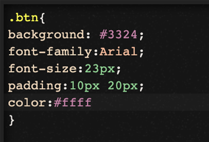

                          

Add Custom CSS Code to an SPA App
=================================

You can customize the look and feel of certain widgets in an SPA app by adding your own CSS code. This code replaces certain properties that you would otherwise set on the **Skin** tab of a widget, including background, border, font, and shadows.

In SPA and Desktop web channels, on some widgets, you have to use selectors in the custom CSS and for other widgets, you don't have to use selectors.

You must write the custom CSS along with selectors such as `.labelskin1 { background-color: red; }` for the following widgets:

*   Label
*   Segment
*   Tabpane
*   Menu container
*   Switch
*   Datagrid

For all remaining widgets, you can write custom CSS without selectors for example, `background-color:red;`.

To add custom CSS code to an SPA app, do the following:

1.  On the **Project** tab of the Project Explorer, expand the Desktop channel, and then navigate to and select the widget that you want to customize with CSS code.
2.  On the **Skin** tab of the Properties pane, check the **Custom CSS** checkbox. Doing so opens a small CSS code editor.
3.  Type or paste the CSS code that you want. The CSS code editor offers syntax recommendations as you type.

