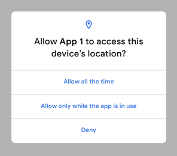

                         


Android 10 Behavioral Changes
=============================

In this document, we will explain the various Android 10 (version Q and API Level 29) behavioral changes that are observed when apps use Android targetSDK version 29 and run on Android 10 devices.

Migration of External Storage to Scoped Storage
-----------------------------------------------

Apps that run on targetSDK version 29 and later are given scoped access to external storage (or scoped storage), by default. These apps can view files in the app-specific directory that can be accessed using the [voltmx.io.FileSystem.getExternalFilesDir()](../../../Iris/iris_api_dev_guide/content/voltmx.io.filesystem_functions.md#volt-mx-io-filesystem-getexternalfilesdir) and [voltmx.io.FileSystem.getExternalFilesDirs()](../../../Iris/iris_api_dev_guide/content/voltmx.io.filesystem_functions.md#volt-mx-io-filesystem-getexternalfilesdirs) APIs within an external storage device, without requiring any storage-related user permissions.

When the targetSDK version is 29 (or later), for backward compatibility on Android 10 (API level 29) devices, the **requestLegacyExternalStorage** tag enables the usage of the [voltmx.io.FileSystem.getExternalStorageDirectoryPath](../../../Iris/iris_api_dev_guide/content/voltmx.io.filesystem_functions.md#volt-mx-io-filesystem-getexternalstoragedirectorypath) API.  
In the application settings, when the targetSDK version is set as 29 (or later), and you enable the READ\_EXTERNAL\_STORAGE or WRITE\_EXTERNAL\_STORAGE permissions, the `android:requestLegacyExternalStorage="true"` tag is added in the Application tags of the AndroidManifest.xml file during the build process.

If any of your third-party libraries use external storage for reading/writing to the files, you must add the **requestLegacyExternalStorage** tag in the library manifest file.

For applications that use Target SDK version 29, the **requestLegacyExternalStorage** tag helps migrate files from legacy storage to scoped storage.

### Storage Migration Recommendations

Applications that use targetSDK version 30 (or later) and run on Android 11 devices can not access files from the legacy external storage. Before you submit the app to the Google Play store with Target SDK version 30 (or later), you must submit an update to the app that migrates the files from the legacy external storage to the scoped storage to prevent data loss. The [voltmx.io.FileSystem.getExternalStorageDirectoryPath](../../../Iris/iris_api_dev_guide/content/voltmx.io.filesystem_functions.md#volt-mx-io-filesystem-getexternalstoragedirectorypath) API returns the legacy external storage location and the [voltmx.io.FileSystem.getExternalFilesDir](../../../Iris/iris_api_dev_guide/content/voltmx.io.filesystem_functions.md#volt-mx-io-filesystem-getexternalfilesdir) API returns the scoped storage location.

Device Location Access
----------------------

In apps that run on Android 10 (API level 29, or later) devices, the Android framework has introduced a new location permission, `ACCESS_BACKGROUND_LOCATION` to fetch location updates when an application is running in the background.

In apps that run on Android 9 (targetSDK version 28) or earlier devices, the `ACCESS_BACKGROUND_LOCATION` permission is automatically added by the system when the app requests for foreground location permission (by using the `ACCESS_FINE_LOCATION` or the `ACCESS_COARSE_LOCATION` permissions).

When an app that runs on Android 10 (API level 29) devices requires location access when the app runs in the background, you must add the following tag in the AndroidManifest.xml file:

```
<manifest ... >  
  <uses-permission android:name="android.permission.ACCESS_BACKGROUND_LOCATION" />  
</manifest>

```

Support to fetch location updates when an application is running in the background has been added in the [voltmx.location.getCurrentPosition](../../../Iris/iris_api_dev_guide/content/voltmx.location_functions.md#getCurrentPosition) and [voltmx.location.watchPosition](../../../Iris/iris_api_dev_guide/content/voltmx.location_functions.md#watchPosition) APIs. You must specify the [requireBackgroundAccess](../../../Iris/iris_api_dev_guide/content/voltmx.location_functions.md#requiredBackgroundAccess) parameter as part of the `positionoptions` parameter to achieve this functionality.

When an app that runs on Android 10 (API level 29) devices requests location access, the following dialog box appears:



The following list provides information about the impact on location updates of every option.

*   Allow all the time — The app can access the device location at any time (while the app is running in the foreground or the background).
*   Allow only while the app is in use — The app can access the device location only when the app is being used (while the app is running in the foreground).
*   Deny — The app cannot access the device location.

### Access Location Information in Camera Metadata

If you want to access the location information of an image (captured by using the [onCapture event](../../../Iris/iris_widget_prog_guide/Content/Camera_Events.md#onCaptur) of the Camera widget), ensure that you declare and request foreground location access on the device (by using the `ACCESS_FINE_LOCATION` or the `ACCESS_COARSE_LOCATION` permissions).

In apps that use Android targetSDK API level 29 (or later) and run on Android 10 (or later) devices, you must additionally declare the ACCESS\_MEDIA\_LOCATION permission in the Android Manifest File. To add the `ACCESS_MEDIA_LOCATION` permission, navigate to **Iris Project Settings** > **Native** > **Android Mobile/Tablet**, and add the following tag in the **Child tag entries under<manifest> tag** field:

<uses-permission android:name="android.permission.ACCESS\_MEDIA\_LOCATION" />
