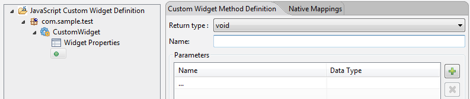
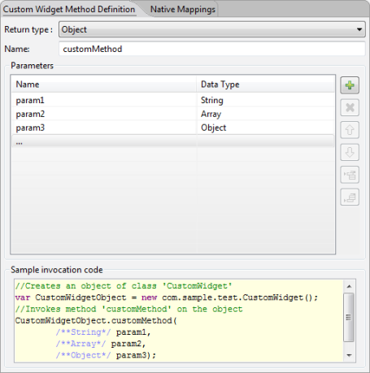
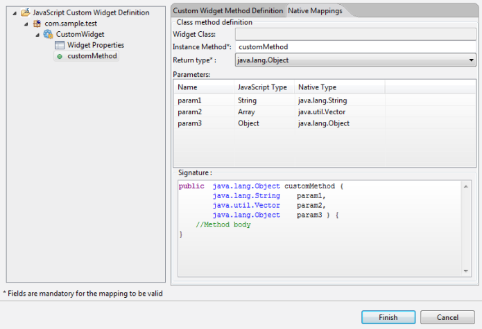

                         


Importing Custom Widgets for Android
------------------------------------

You can import and create your own custom widgets for the Android platform. Volt MX Irisplatform has defined a contract that any custom widget should implement. This contract is referred to as a widget wrapper. The main purpose of the widget wrapper is to enable Volt MX IrisPlatform to initialize the widget when it is placed in a form that is currently being rendered. The wrapper notifies the custom widget when there is a change in its state. The change in state can be a programmatic change to one of the properties exposed by it or a user driven event raised on the custom widget.

All changes in state are notified to the custom widget through the widget wrapper contract. If you want to use a widget developed by using any 3rd party library or framework, you should expose the widget to the Volt MX Iris Android platform by implementing a Java abstract class defined by the Volt MX Iris Android platform. This java class implementation should be done in a separate java project which should be exported as a library jar file. These class files in the library jar are imported using the [Importing Custom Widgets](#importing-custom-widgets-for-android-1) procedure.

### Android Wrapper

The contract definition is as follows:

public abstract android.view.View onCreateView (android.content.Context context)

This mandatory method is called by the platform whenever a new instance of custom widget view is required. The subclasses should not hold the reference to the created View and the context argument in any local instance variables. If reference is held, it should be nullified in onDestroyView callback, otherwise would lead to Out of Memory issues.

public void onPropertySet (View widgetInstance, Object name, Object value)

This method is called by the platform whenever a value is assigned to custom widget property by the application. The widgetInstance argument can be null if the custom widget View component is not yet created.

public void Object onPropertyGet (View widgetInstance, Object key)

This method is invoked by the platform when a property is read by the application. The widgetInstance argument can be null if the custom widget view component is not yet created. If this method is not overridden, or if overridden and do not handle the property key i.e., return null, then platform will pick the value of the property from the model. Subclasses can use the setModelProperty to update the model.

public final void setPropertyToModel(String name, Object value)

This method adds or updates the model for a given property with a given value.

public final Object getPropertyFromModel(String name)

This method returns the value for a given property name

public abstract void onDestroyView(View widgetInstance)

This method is called by the platform just before View instance is freed by the platform.

public void onOrientationChanged(int orientation)

This is a callback invoked by platform whenever an orientation is changed for a Form whose orientation mode is set to BOTH. The value of orientation argument is as that of android platform orientation constants.

> **_Important:_** The abstract class for these contracts are available in the following JAR files at:

*   Location in the **Workspace** folder: **\\temp\\AppName\\build\\luaandroid\\dist\\AppName\\libs\\voltmxwidgets.jar**
*   Location in the **Android-SDK** folder: **\\android-sdk\\platforms\\android-18\\android.jar**

Android wrapper Java class for custom widget implementation should be done in a separate java project that should be exported as a library JAR file. Then this library JAR is imported using the [Importing Custom Widgets](#importing-custom-widgets-for-android-1) procedure.

### Creating a Custom Widget Wrapper Java Project

The java project implementing custom widget require methods/interfaces from Volt MX Iris Android platform to be able to compile the project. These methods are available in the `voltmxwidgets.jar` file. The project must include this JAR file in its project properties as a dependent library.

To get `voltmxwidgets.jar` file, do the following:

1.  Open the project in Volt MX Iris and build the project for Android.
2.  Navigate to the location `<workspace>/temp/<app>/build/luaandroid/dist/<app>/libs` directory. It contains a `voltmxwidgets.jar` file.
    
    > **_Note:_** The `voltmxwidgets.jar` file can either be:
    
    *   Copied to the `libs` directory in the Java project that is created for developing the custom widget. Or
    *   Added as dependent library in the Java project’s properties by giving the path to this file.
    

Java application has to be compiled and exported as a JAR file. It will be used during custom widget importing in Volt MX Iris.

#### Sample wrapper.class File for Android

```
package com.example.bar;

//The following APIs are part of android.jar file

import android.content.Context;
import android.util.Log;
import android.view.View;

//The following APIs are part of voltmxwidgets.jar file

import com.example.bar.RangeSeekBar.OnRangeSeekBarChangeListener;
import com.konylabs.api.ui.KonyCustomWidget;
import com.hcl.vm.Function;

//The class name specified must be the same as the name of the custom widget in Volt MX Iris
public class CustomRange extends KonyCustomWidget {

    Function jsCallback;
    RangeSeekBar < Integer > rangeBar;
    private static String TAG = "CustomRange";
    //This is a mandatory method
    public View onCreateView(Context context) {
        int low = ((Double) getPropertyFromModel("low")).intValue();
        int high = ((Double) getPropertyFromModel("high")).intValue();
        rangeBar = new RangeSeekBar < Integer > (low, high, context);
        rangeBar.setOnRangeSeekBarChangeListener(new OnRangeSeekBarChangeListener < Integer > () {@
            Override
            public void onRangeSeekBarValuesChanged(RangeSeekBar <? > bar, Integer minValue, Integer maxValue) {
                // handle changed range values
                try {
                    jsCallback.execute(new Object[] {
                        minValue, maxValue
                    });
                } catch (Exception e) {
                    // TODO Auto-generated catch block
                    e.printStackTrace();
                }
                Log.i("FullscreenActivity", "User selected new range values: MIN=" + minValue + ", MAX=" + maxValue);
            }
        });
        jsCallback = (Function) getPropertyFromModel("slideCheck");
        return rangeBar;
    }
    //Destroys the widget instance when the form goes out of view
    public void onDestroyView(View widgetInstance) {
        // TODO Auto-generated method stub
        //setPropertyToModel("text",b.gettext());

        widgetInstance = null;
    }

    public void printLog() {
        Log.d(TAG, "**********************CUSTOM WIDGET***************************************");
    }


    public void onPropertySet(View widgetInstance, Object key, Object value) {
        Log.d(TAG, "**********************onPropertySet***************************************");
        String k = ((String) key).intern();
        if (k == "low")
            ((RangeSeekBar < Number > ) widgetInstance).setSelectedMinValue(((Double) value).intValue());
        else if (k == "high")
            ((RangeSeekBar < Number > ) widgetInstance).setSelectedMaxValue(((Double) value).intValue());
    }

    public Object onPropertyGet(View widgetInstance, Object key) {
        String k = ((String) key).intern();
        Log.d(TAG, "**********************onPropertyGet***************************************");
        if (k == "low")
            ((RangeSeekBar < Number > ) widgetInstance).getSelectedMinValue();
        else if (k == "high")
            ((RangeSeekBar < Number > ) widgetInstance).getSelectedMaxValue();
        return null;
    }

    public void onOrientationChanged(int orientation) {}
}					

```

Limitations

*   As JavaScript is dynamic typed language, all it understands is a number which can hold any float number. So, all number type arguments are mapped to Double always. It is the responsibility of the custom widget implementer to convert the double type to the respective types. If not, you would see class cast exception.
*   You cannot pass any kind of java object to JavaScript. It should be either Vector (for JS array) or Hashtable (for JS Object).

### Importing Custom Widgets for Android

To import files for a third-party widget, execute the following:

1.  On the **Edit** menu of Volt MX Iris, point to **Integrate Third Party**, then **Manage Custom Widgets**, and then click **Android**.
2.  In the left pane, right-click **JavaScript Custom Widget Definition** and click **Add JavaScript Namespace**.
    
3.  Under JavaScript Namespace, in the Name field, enter a name. The name you enter should be easily correspondable with the name of the widget you’re importing, must be unique, and cannot be any of the reserved namespace names of the Volt MX system. For example, widget, window, segui, and so forth are reserved namespace names and should not be used for third-party libraries.
4.  Click **Finish**. If you’re asked if you want to proceed with generating code for the custom widget, click **Yes**.
5.  To add the widget libraries to the namespace you just created, on the Project menu of Volt MX Iris, point to **Integrate Third Party**, then **Manage Custom Widgets**, and then click **Android**.
6.  The namespace you created appears in the left pane. Right-click the namespace and select **Add JavaScript Widget**.
7.  Specify a name and an icon for the custom widget. The icon that you specify for the custom widget will accompany the widget in the Volt MX Iris user interface in the list of available custom widgets. The supported icon format is _.png_.
8.  You now import the custom widget’s library. Click the **Native Mappings** tab, click the Manage Libraries icon , and then click **Import** to browse to and select the `.jar` file that consists of the protocols, event delegates, files, and images (if any) required for the custom widget.
9.  Enter the **Package** and **Widget Class** names in the appropriate fields. The names should be the same as the package name and class name in the wrapper file.
10.  Now that you have the library imported, you can add any additional properties that you want the custom widget to have in addition to the default properties that Volt MX Iris provides. To do so, in the left pane of the Custom Widget Interface dialog box, click the arrow  of the widget you created to reveal its properties, and then click **Widget Properties**. Click , and then specify the JavaScript Type, the IDE Data Type, the Default Value for the property, indicate whether or not the property is Writable, and specify any Event Parameters (if applicable). Click **Finish**.
11.  On the Native Mappings tab, map each of the property to its corresponding datatype in the Native platform. To define an event in the Widgets Properties tab, you must specify datatype as **Function**. Volt MX Iris automatically assigns this datatype as **Callback** in the Native Mapping tab.
    
The following table explains the datatype mapping for Android:
    
| JavaScript Type | Native Type |
| --- | --- |
| Number | int, long,float, double , java.lang.Integer, java.lang.Long, java.lang.Double, java.lang.Float(Depending on the metadata provided) |
| String | java.lang.String |
| Boolean | java.lang.Boolean, boolean |
| Array | java.util.Vector |
| Object | java.lang.Object, java.lang.Hashtable |
| Function | com.voltmx.vm.Function |
    
To define a method associated with a widget, do the following:
    
*   In left pane, right-click the defined widget, and select **Add JavaScript Method**. The widget method, is added in the left pane
        
    
        
    *   In the right pane, in the **Custom Widget Method Definition** tab, you can define the parameters and corresponding datatypes of a particular method. You can also set a return type of a method.
        
    
        
    
    *   Under the Native Mappings tab, map each of the parameter to its corresponding datatype in the Native platform. JavaScript data types are represented as Object counter parts in the Native SDK as against primitive types. For example, _java.lang.Double_ is used instead of _double_ and _java.lang.Boolean_ instead of _boolean_.
        
    The following table explains the datatype mapping for Android:
        
     JavaScript Type | Native Type |
    | --- | --- |
    | Number | int, long,float, double , java.lang.Integer, java.lang.Long, java.lang.Double, java.lang.Float(Depending on the metadata provided) |
    | String | java.lang.String |
    | Boolean | java.lang.Boolean, boolean |
    | Array | java.util.Vector |
    | Object | java.lang.Object, java.lang.Hashtable |
    | Function | com.voltmx.vm.Function |
        
    *   Based on the datatypes specified for the parameter and the return type, all the fields in the **Native Mappings** tab are populated. You can change the datatype for a parameter if the JavaScript type is set as Number or Object. Enter a name for the instance method in which the parameters are passed. If any property or parameter to the method is of type Function, then this function/method/callback can be executed from the Java class with the help of a wrapper method provided by the platform.
        
        
        
    
```
public void printLog(String name, Function callbackJS) {
        try {
            callbackJS.execute(new Object[] {
                infotable
            });
        } catch (Exception e) {
            e.printStackTrace();
        }
    }
    If the callback / method has time taking tasks then it should use the method "executeAsync” instead of "
    execute”. And it is always advised not to perform time taking tasks in these callbacks.Also use "executeAsync” as much as possible.try {			callbackJS.executeAsync(new Object[] {infotable});}catch(Exception e) {e.printStackTrace();}}					
    
```
Click **Finish** to import the Custom Widget. A confirmation dialog appears. Click **Yes**.
    
The custom widget is now available at the bottom of the Widget tab, located on the Volt MX IrisLibrary pane, and you can drag it into a container like any other widget, and view its properties on the Properties pane.
    
The Preview feature is not available for custom widgets. After you build the application you can view the library files which are built in the _....webapps/<appname>/platform/jslib/thirdparty/widgets_ folder.
    
> **_Important:_** If you edit the properties of a defined custom widget after you drag and drop it on a form, ensure that you delete the added instances of the custom widget on the form and add it on the form again, since the custom widgets added on the form before the edit will not reflect the newly changed properties.
    

### Important Considerations

*   All resources related to custom widget must reside in this location: `<workspace>/<app>/resources/mobile/native/android`.
*   Under resources folder, sub-directories include: assets, drawable, layout, anim, values, xml, raw, and so on.
*   In the custom widget, these resources cannot be accessed using resource IDs directly like R.drawable.xxx.
    
    These resources can be accessed as follows:
    
```
int resId = VoltMXMain.getAppContext().getResources().getIdentifier(resName, type, VoltMXMain.getAppContext().getPackageName());						
    
```
    *   **Scenario 1:** If the resource name is `logo.png` and it is present in `drawable` (type) directory, then resource ID can be retrieved as follows:
        
```
int resId = VoltMXMain.getAppContext().getResources().getIdentifier(“logo.png”, “drawable”, VoltMXMain.getAppContext().getPackageName());						
        
```
    *   **Scenario 2**: If the xml layout resource `calendar_view.xml` is present in `layout` directory, then it can be retrieved as follows:
        
```
VoltMXMain.getAppContext().getResources().getLayout(VoltMXMain.getAppContext().getResources().getIdentifier("calendar_view", "layout", VoltMXMain.getAppContext().getPackageName()))						
        
```
*   Any UI update made to custom widget must be posted as a runnable to UI Thread as follows:
    
```
KVoltMXMain.getAppContext().getResources().getLayout(VoltMXMain.getAppContext().getResources().getIdentifier("calendar_view", "layout", VoltMXMain.getAppContext().getPackageName()))((Activity) VoltMXMain.getActivtiyContext()).runOnUIThread(new Runnable() {
        public void run() {
            //Do necessary Custom widget UI updates
        }
    });						
    
```
*   To receive touch events for the widget (If custom widget is placed inside a scrollable container), it needs to override below function and the widget or view must be changed to ViewGroup.
    
```
public boolean onInterceptTouchEvent(MotionEvent ev) {
        int action = ev.getAction();
        switch (action) {
            case MotionEvent.ACTION_DOWN:
                this.getParent().requestDisallowInterceptTouchEvent(true);
                break;
        }
        return super.onInterceptTouchEvent(ev);
    }						
    
```
