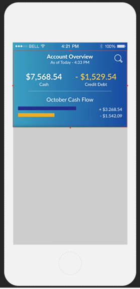
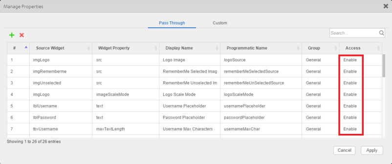
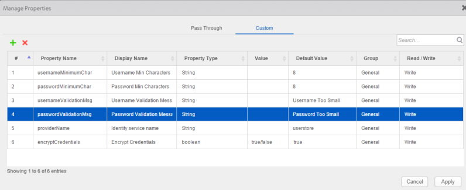
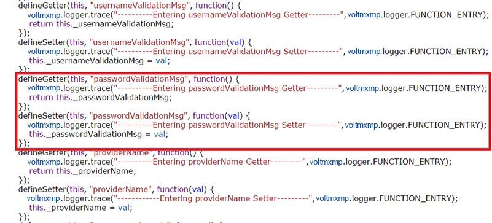

                          

Components Overview
===================

Components provide a powerful way to create complex applications quickly. You can download a rich assortment of components from HCL Forge , or create your own reusable components, and then drag and drop the components into your application to create sophisticated, full-featured applications without writing all of the code.you can also [leverage several Data & Services panel features for components](C_CreatingComponent.md#data-amp-services-panel-support-for-components).

For example, suppose you want to create a digital application that lets users log in to their account and display an account overview. You can build a log-in screen by downloading a log-in component from HCL Forge , and then dragging and dropping it onto a form.

First, navigate to the [HCL Forge site](http://community.hclvoltmx.com/marketplace), either by selecting **Browse** from the **HCL Forge** menu in Volt MX Iris or opening the site in your web browser. Then download the Login component.

You can easily import the component into your Volt MX Iris library, and then drag and drop it onto a form.

You could then create an account overview component that can be used in multiple applications, and drag and drop that component onto a form to display an account overview in your application. Your library can contain multiple collections of components that can be used and reused, serving as building blocks for your applications.

If you are familiar with earlier versions of Volt MX Iris, you may recognize components as an extension of _masters_. Masters helped streamline digital application developing by letting you define multiple user interface elements and action sequences as a single entity. Components extend that ability by providing self-contained and reusable entities that include:

*   Code modules
*   Volt MX Foundry services
*   A component _contract_ to simplify usage and enable rapid digital application development

Because components are self-contained entities, you can:

*   Reuse a component within a project, or across projects in your workspace.
*   Download components created by the HCL Forge Assets team and other developers from HCL Forge , and use them in your projects.
*   Share your components with a wider audience via HCL Forge or a local share.

Components are also fully customizable. You can choose which properties, events, and methods of a component are exposed to users, or create your own custom properties, events and methods.

For example, you can specify which properties of the Login component are exposed to users by enabling them in the **Manage Properties** dialog box:

These are called _pass through_ properties.

The Login component also includes custom properties. You can specify custom properties on the **Custom** tab of the **Manage Properties** dialog box, and then define their behavior in the component's controller module, _loginController.js_:

Here is the code that defines the passwordValidationMsg property:

There are two types of Volt MX Iris components:

*   Components with a contract.
*   Components without a contract.

The contract is a JSON file that specifies the component's exposed properties, events, and methods. You specify those properties, events, and methods within the Iris interface using the **Manage Properties**, **Manage Events**, and **Manage Methods** dialog boxes. You can then define the behavior of custom properties, events, and methods by adding code to the component's controller module.

You can also create a component without contract. A component without contract is similar to a master in earlier versions of Volt MX Iris, except that it includes a controller module. You can publish either a component with contract or a component without contract to HCL Forge , but not a master. However, you can convert a master into either a component with contract or a component without component.

For more information about using components, refer [Using Components](C_UsingComponents.md). For details about creating a component, refer [Creating a Component](C_CreatingComponent.md).
