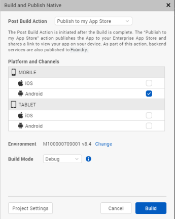
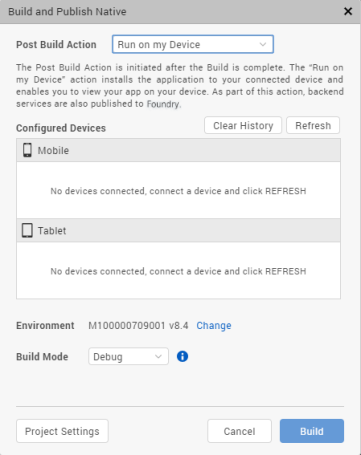

                         

Build and Publish in Volt MX Iris
=======================================

Overview
--------

**Build and Publish**,  Is used to build and publish apps in Volt MX Iris . So far, Volt MX Iris could be used to preview your apps, now you have the feature to build the app and generate native app binaries.

Volt MX  Iris supports the following types of cloud builds:

*   **Build and Publish Native** - Builds the application for the selected native platforms and performs the selected Post Build Action. There are three types of Post Build Actions:
    *   [Publish to my App Store](#publish-to-my-app-store) – This action publishes the application to your Enterprise App Store (EAS).
    *   [Run on my Device](#run-on-my-device) – This action installs the application to your connected device and enables you to view your app on your device.
    *   [Generate Native App](#generate-native-app) – This action generates the binaries and build logs for your Native application and saves it on your file system.
*   **Build and Publish Web** - Builds the web application for selected web platforms and publishes to Volt MX Foundry. For more details refer to [Build and Publish Web Apps on Volt MX Iris](WebPublish.md).

> **_Note:_** You can configure Push Notifications for applications built using cloud build. For information on how to do so, click [here](Native_App_Properties.md#PushCertificate).

Build and Publish Native
------------------------

With the Build and Publish Native feature the dependency on Xcode for building iOS applications and the dependency on Android SDK for building Android applications has been removed.

The _build_ process is a process through which application components are collected and repeatedly compiled for testing purposes, to ensure a reliable final product. Build process creates new resources, updates the existing resources, or does both.

After you develop an application, you must build the application to do the following:

*   Test the application for its performance and appearance on a device or on emulators.
*   Install the application on your devices.

The _publish_ process makes the built application accessible from [VoltMX Enterprise App Store](EAS.md#publish-apps-to-the-enterprise-app-store). When you build and publish a native application, it is hosted on the Enterprise App Store associated to your Cloud account and can be accessed from the server.

To understand the build and publish process for native applications in Volt MX Iris, go to [Build and Publish a Native App](#build-and-publish-a-native-app).

Prerequisites
-------------

**Following are the prerequisites to build and publish a native app within Volt MX Iris**:

*   Access to a Volt MX Cloud account. If you do not have a cloud account, you can register for it at [VoltMX Cloud Registration](https://manage.hclvoltmx.com/registration).
*   Access to a Volt MX Cloud Build Environment. By default, new users get access to the Cloud build environment. Existing users need to request for access.

*   Configure the various Project Settings.  
    Go to **Project** > **Settings** and configure the build settings for each Native platform. For more information on Project Settings, click [here](Project_Properties_in_VoltMX_Iris.md#project-settings-in).
*   Platform specific prerequisites:
    *   If you choose to build an application for the **iOS** platform, you must provide the Mobile Provision, .P12, P12 password, and the Development method. To do so, go to Project Settings > Native > iPhone/iPad. For more details on the iOS configurations, click [here](https://support.hcltechsw.com/csm?id=kb_article&sysparm_article=KB0083760).
    *   If choose to build an application for the **Android** platform in **Release mode**, then the Android signing details are mandatory. To do so, go to Project Settings > Native > Android Mobile/Tablet. For more details on Android signing details, click [here](https://support.hcltechsw.com/csm?id=kb_article&sysparm_article=KB0083782).
*   If you choose to build an application in **Protected mode**, then setting the public and private keys is mandatory. To do so, go to Project Settings > Protected Mode. For more details on how to generate public and private keys, click [here](ApplicationSecurity.md#rsa-key-pair-generation-encryption-and-usage).

Post Build Actions
------------------

The Post Build Action is initiated after the Build is complete. You must choose the Post Build Action in the [Build and Publish](#build-and-publish-a-native-app) window, before the build process begins. There are three types of Post Build Actions, they include:

1.  [Publish to my App Store](#publish-to-my-app-store)
2.  [Run on my device](#run-on-my-device)
3.  [Generate Native App](#generate-native-app)

### Publish to my App Store

The Publish to my App Store action generates native app binaries and publishes the application to your Enterprise App Store. After a successful publish, a confirmation window appears, which shares a link to view the Enterprise app store on your device.

To publish an app to the Enterprise App Store logging in to your Volt MX Account is mandatory.

> **_Note:_** You cannot build apps for the universal channel using this option.

For more information on Publish to my App Store, click [here](EAS.md#publish-apps-to-the-enterprise-app-store).

### Run on my device

The Run on my Device action installs the application to your connected device and enables you to view your app on your device.

Establish a USB connection between the computer that built the app, and your device.

> **_Important:_** **USB Tethering for iOS devices on Windows Machine:**  
**Prerequisites** - Ensure that the latest version of iTunes is installed on the Windows machine. Before you start viewing the app on your iOS device by using the USB feature on Volt MX App, open iTunes on your Windows machine.

If you connect your device to the system after selecting the post build action, use the **Refresh** option to refresh the list of available devices that are connected to the system.

Use the **Clear History** option to clear out old entries of devices that are not connected to the system.

Once this action is completed, by default Android devices launch the app. Whereas, for iOS devices you need to explicitly launch the app by tapping on the app icon.

### Generate Native App

The Generate Native App action generates the binaries and build logs for your Native application and saves it on your file system. The Iris project does not have to be linked to Volt MX Foundry to complete this action.

Once the build is completed,

*   If you have successfully built your Iris project for the Android channel, you will get Android mobile and/or tablet native APKs in your project's Volt MX Iris workspace > binaries folder.
*   If you have successfully built your Iris project for the iOS channel, you will get iOS mobile and/or tablet native IPAs in your project's Volt MX Iris workspace > binaries folder.
*   You will also get the build logs in your project's Volt MX Iris workspace > binaries folder. You can refer to the logs to analyze the build for failures or success.

Alternatively, once the build is complete, you will get notified by an email from "VoltMX Iris – Build Service", with download links for all these binaries.

You can generate native apps even for the Universal channel using option. This option will generate the APK or IPA for each of the platforms and channels selected.

To understand any build failures, you can go through the log file. To understand Run and Publish actions related to this type of Build, go to [Post Successful Build](#post-successful-build).

Build and Publish a Native App
------------------------------

To build an application, follow these steps:

1.  On your Volt MX Iris, from the main menu select **Build**.
2.  From the context menu, select **Build and Publish Native**.
3.  Select the platforms and channels for which you want to build the application.
4.  From the **Post Build Action** drop-down menu, select the desired **Post Build Action**. For more details about the Post Build Action, click [here](#post-build-actions).
5.  You can choose to change the cloud environment on which your app will be published. To do so click on **Change** beside the **Environment** option. By default, the Environment displayed is the one that is last selected.
6.  From the **Build Mode** drop-down list, select your desired build mode.

    *   **Debug mode** \- To help you identify and fix errors, Volt MX Iris emits the complete symbolic debug information . To lessen the amount of time necessary to complete the build, the build is not optimized for code execution, so it may tend to execute slower than a build optimized for release. Also, the inclusion of the symbolic debug information causes the final executable to be larger than a release build.
   *   **Release mode** - Volt MX Iris optimizes the build for execution, requiring more time to generate the build. It also does not emit the complete symbolic debug information, making the final executable smaller than a debug build.
   *   **Protected Mode** \- Applications built in Volt MX Iris can use the additional security enhancements by building the application in the _Protected Mode_. Volt MX IrisPlatform code for iOS and Android is equipped with mechanisms that can protect your application by detecting attacks like tampering, swizzling, debugging, jail breaking (iOS), rooting (Android), and information disclosure. Additional security mechanisms are provided through the use of White Box Cryptography to protect application business logic and source code. Application reacts to the attack by exiting upon detecting attacks to prevent further attempts.  
    If you choose to build an application in **Protected mode**, then setting the public and private keys is mandatory. To do so, go to **Project Settings** > **Protected Mode**. For more details on how to generate public and private keys, click [here](ApplicationSecurity.md#rsa-key-pair-generation-encryption-and-usage).
   *   **Test Mode** - To help you identify and fix errors, Volt MX Iris provides the ability to Test the application on the device or an emulator. When you build an app using the Test Mode, you can leverage the Jasmine testing framework of Volt MX Iris to thoroughly test your app and ensure your application is errors free. You can run jasmine test cases, test suites and test plans by building an app using the Test mode.

7.  Click **Build**. The build generation begins. You can check the status of your build in the Build tab. If there are any errors, they appear in the Build tab. Switch to the Console tab to view a detailed log of the errors.

     You can check the status of your build in the Build tab. It undergoes various actions, like Project compression, uploading the compressed project to the cloud, then the actual build begins. This process may take some time.

     If there are any errors, they appear in the Build tab.

8.  From the Build tab, click on **View logs** to open the build logs for the build service on your system.

Post Successful Build
---------------------

Once the build is completed, the generated binaries with the download link are provided in the Build tab.

1.  Click on the binaries to open them in your default web browser.
2.  You can click on **Run** to run the app on your local device. If your post build action is already selected as Run on my Device, then the Run option is not enabled and there is no need to explicitly run the app again.
3.  You can click on **Publish** to publish the App on Enterprise App Store. If your post build action is already selected as Publish to my App Store, then the Publish option is not enabled and there is no need to explicitly publish the app again.
4.  Click on **View Logs** to view the build related logs.

Alternatively, once the build is complete, you will get notified by an email from "VoltMX Iris – Build Service", with download links for all the successfully built app binaries. The mail contains details related to the Build. It contains the Project name, Build Action Triggered by, Date of Build, Build duration details. The Build Information section contains details about the Channels for which the App has been built.

*   If you have successfully built your Iris project for the Android channel, you will get Android mobile and/or tablet native APKs link in the mail.
*   If you have successfully built your Iris project for the iOS channel, you will get iOS mobile and/or tablet native IPAs link in the mail. The mail will also contain the OTA (plist) link, through which you can directly install the app on your device.
*   You will also get the build logs. You can refer to the logs to analyze the build for failures or success.

> **_Note:_** The artifact links will be available only for 24 hours.
