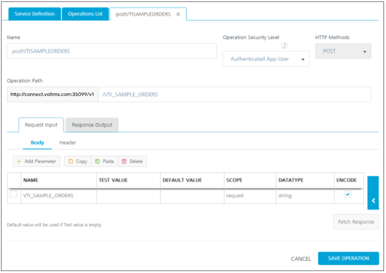

                         

Configure an SAP Service
========================

With Volt MX Foundry, you can access external Volt MX SAP services by using the Volt MX SAP Gateway connector. Based on your Volt MX SAP Gateway authentication, you can use Volt MX SAP libraries and objects along with the supported HTTP methods in your app.

Adding a Volt MX SAP Gateway service involves the following steps:

[Configure a New Volt MX SAP Gateway](#configure-a-new-volt-mx-sap-gateway)

[Edit or Test an Existing Volt MX SAP Gateway Integration Service](#edit-or-test-an-existing-volt-mx-sap-gateway-integration-service)

[Publishing the Service](PublishVoltMXFoundryServicesApp.md)

[Mapping the Service Output to Widgets on a Form](ActionsMapping.md).

### Configure a New Volt MX SAP Gateway

This procedure assumes that you have already configured Volt MX Foundry in Volt MX Iris. 
To configure your Volt MX SAP Gateway, follow these steps:

1.  In Volt MX Iris, open either an existing application or create a new one.
2.  If you have not done so already, log in to your Volt MX account. To do so, in the top right corner of the Volt MX Iris window, click **Login**. The Volt MX Account sign-in window opens. Enter your email and password credentials for your Volt MX user account, and then click **Sign in**.
3.  Create a new Volt MX Foundry application or use an existing one. To do so, on the **Data and Services** panel, click the context menu arrow, and then click either **Create New App**, or **Use Existing App**, and then select from the Volt MX Foundry Application dialog box the services application that you want to publish. The Volt MX Foundry Console opens.

    

    > **_Note:_** If you want to associate your Volt MX Iris project with a different Volt MX Foundry app, on the **Project** tab of the Project Explorer, click the context menu arrow for **VoltMX Foundry**, and then click **Unlink App**. To link to a different Volt MX Foundry app, click the context menu arrow for **VoltMX Foundry**, and then click either **Create New App**, or **Use Existing App**.

4.  To create a new integration service, on the **Integration** tab, click **CONFIGURE NEW**. The **Service Definition** section appears.  
      
      
      
      
      
    
5.  In the **Integration** tab, click **CONFIGURE NEW** to create an integration service.  
      
      
      
    
6.  In the **Service Definition** section, follow these steps:
    1.  In the **Service Name** text box, enter a unique name for your service.
    2.  From the **Service Type** list, select **VoltMX SAP gateway**.  
        By default, XML is selected. If you select **VoltMX SAP gateway**, the **Select authentication service** section is displayed, shown below.
        
        
        
    3.  Under **Select authentication service**, click [Specify Login Endpoint](#Specify_Login_Endpoint):
        
        *   [Use Existing Identity Provider](#configure-a-identity-provider) - to select an identity provider. This drop-down lists all identity providers if you have already created identity providers for SAP in the Identity page.
        *   [Specify Login Endpoint](#Specify_Login_Endpoint)\- to configure a new endpoint.  
            
        
        To configure **Specify Log-in Endpoint**, fill in the details for the following fields:
        
        1.  In the **Gateway address**, enter the domain - for example, connect.voltmx.com_._
            
        2.  In the **Port** text box, enter a valid port number ranging from 1 to 65535.
            
        3.  In the **Header parameter name prefix \*** text box, enter the header - for example, VoltMXSAP.
            
        4.  Under the **User ID** and **Password**, provide valid log-in credentials that you created while registering with Volt MX SAP Gateway services.  
            
        5.  In the **Default Caller ID**, provide the ID that Volt MX SAP Gateway uses for logging and auditing.
        6.  In the **Default Caller Group**, provide the ID that Volt MX SAP Gateway uses for logging and auditing. This information is optional.  
              
              
            
7.  Click the **Advanced** tab to specify API throttling. All options in the Advanced section are optional.
    *   API throttling enables you to limit the number of request calls within a minute. If an API exceeds the throttling limit, the API will not return the service response.**  
        To specify throttling, follow these steps:**  
        1.  In the **Total Rate Limit** text box, enter a required value. With this value, you can limit the number of requests configured in your Volt MX Foundry console in terms of Total Rate Limit.
            
        2.  In the **Rate Limit Per IP** text box, enter a required value. With this value, you can limit the number of IP address requests configured in your Volt MX Foundry console in terms of Per IP Rate Limit.
            
            To override throttling, refer to [Override API Throttling Configuration](../../../Foundry/voltmx_foundry_user_guide/Content/API_Throttling_Override.md).
            
            > **_Note:_** In case of On-premises, the number of nodes in a clustered environment is set by configuring the `VOLTMX_SERVER_NUMBER_OF_NODES` property in the Admin Console. This property indicates the number of nodes configured in the cluster. The default value is 1.  
            Refer to [The Runtime Configuration tab on the Settings screen of App Services](../../../Foundry/vmf_integrationservice_admin_console_userguide/Content/Runtime_Configuration.md).  
              
            The total limit set in the Volt MX Foundry Console will be divided by the number of configured nodes. For example, a throttling limit of 600 requests/minute with three nodes will be calculated to be 200 requests/minute per node.  
            This is applicable for Cloud and On-premises.
            
8. To enable the proxy, select the **Use proxy from settings** check box. By default, the check box is cleared.  
    The **Use proxy from settings** check box dims when no proxy is configured under the Settings > Proxy
9. After you configure the authentication service, click **Save** .  
    
10. Click **Operations List** tab. Based on your Volt MX SAP Gateway authentication, the system loads all tables such as libraries and objects along with supported HTTP methods

    

11. Select a library form the **Libraries** list. The objects of the selected library will be loaded in the Objects list.
12. Select an object from the **Objects** list.
    
    
    
    In the **Operation** list, select an operation or select all the operations.
    
    
    
    1.  To configure more operations for your Volt MX SAP Gateway integration service, repeat steps a through b. You can select a new library and object, and supported operations.
        
    2.  Click **Add Operation**. The system adds your operation under the **Configured Operations** section, and it also adds your new Volt MX SAP Gateway service into the **Integration** page.
    
    
    
13. To configure operations, under **Operations** > **Configured Operations**, hover your cursor over the required service, click the **Settings** button, and then click **Edit**.
    
    
    
    The operation details are displayed.
    
    
    
14. In the **Name** box, modify the name if required.
15. Select one of the following security operations in the **Operation Security Level** field. By default, this field is set to **Authenticated App User.**
    *   **Authenticated App User** – indicates that this operation is secured. To use this operation, an app user must be authenticated by an associated identity service.
    *   **Anonymous App User** – indicates that a user must have the app key and app secret to access this operation.
    *   **Public** – indicates that this operation requires no special security.
16. In the **Operation Path** box, modify the path if required.
    
    > **_Note:_** You can add an entry by clicking the **Add** button if entries for the input and the advanced tabs do not exist. You can also delete an existing entry by clicking the **Delete** button.
    
17. In the **Request Input** tab, provide the following information:
    1.  The **ID** field contains a unique identifier for a parameter. Change the identifier if required.
    2.  The **Test value** field contains a value to be used to test the service. Change the syntax if required.
    3.  In the **Default value** field, change the syntax if required.
    4.  Click **Test** to view the results.  
        You can add more properties to an input parameter such as scope and data types by following the below step. Otherwise, proceed to [Step 14](#Step14-Attributes).
    5.  To add more properties, click the **Edit** button. The **Input Parameter Modal** dialog appears.
        1.  Select request or session in the **Scope** field. By default, this field is set to **Request**.
            *   **Request** - indicates that the value must be retrieved from the HTTP request received from the mobile device.
                
            *   **Session** - indicates that the value must be retrieved from the HTTP session stored on Volt MX Foundry.
                
        2.  Select a data type in the **Datatype** field:
            *   **String** - a combination of alpha-numeric and special characters. Supports all formats including UTF-8 and UTF-16 with no maximum size limit.
            *   **Boolean** - a value that can be true or false.
                
            *   **Number** - an integer or a floating number.
                
            *   **Collection** - a group of data, also referred to as data set.
                
        3.  Select the **Encode** check box to enable an input parameter to be encoded. For example, the name New York Times would be encoded as _New_York_Times_ when the encoding is set to True. The encoding must also adhere to the HTML URL encoding standards.
        4.  Click **Submit**. The input parameter is saved with additional properties.
18. Click the **Attributes** tab to view schema. This is a meta-data schema for which user has configured at Volt MX SAP. The schema is in XML format.
    
    For example, the schema includes elements for the configured tables, such as, table name, description, library name, group name, URL, methods.
    
    
    
19. Click the **Response Output** tab to view the output test values, such as ID, scope, data type. You cannot edit these values.
    
    
    
20. Based on the operation - for example, post or get - provide custom HTTP headers.  
    To provide customer headers, click **Advanced**. In the **Test values** text box, provide custom HTTP headers required by the external data source, shown below:

*   **ID**: The rows are created based on the selected operation. Change the value if required.
*   **Test value**: Enter a value. A test value is used for testing the service.

21. Click **Save Operation** to save the operation. They system displays the **Operation** section for your service.
22. Click **Done** to navigate to the **Integration** page.
23. To close the Volt MX Foundry Console and return to the panes, views, and tabs of the Volt MX Iris integrated development environment (IDE), from the Quick Launch Bar along the upper left edge of Volt MX Iris, click the Workspace icon . Since you are still logged in to your Volt MX account, Volt MX Iris continues to have access to your Volt MX Foundry services.

### Edit or Test an Existing Volt MX SAP Gateway Integration Service

If you want to edit an existing Volt MX SAP service, you can edit details such as service name, authentication service information, operations.

Each operation contains four tabs, including input, attributes, output, and advanced. If you want to test an existing operation for Volt MX SAP service - for example, get or put - enter necessary test values in the input and the advanced tabs. The results are displayed in the JSON format. The input values can be data types, test values, and session keys.

To edit or test an existing Volt MX SAP integration service, follow these steps:

1.  In the **Integration** page, click one of your SAP services.
2.  Make the necessary changes in the **Service Definition** and **Operations** sections. You can test an operation by inputting values. 
3.  Click **Done** to save the changes. The system displays the **Integration** page.

### Configure a Identity Provider

To configure a identity provider and use it in creating a service, follow these steps: 

1.  In Volt MX Iris, launch the Volt MX Foundry console.
2.  In the **Identity** tab, create a new identity service and save it.
3.  Navigate to the **Integration** tab, configure a new service.
4.  In the **Select Authentication Service** section, select **Use Existing Identity Provider** button. The Select Identity Provider list appears.
5.  Select the identity service from list. This list is populated with the identity providers created in the Identity tab.
6.  Provide information in all the fields and click **Save**.
