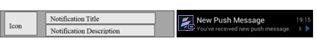
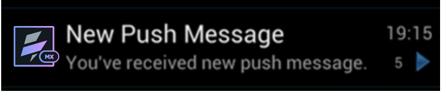
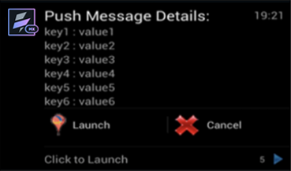

                          

Customizing GCM Broadcast Receiver
==================================

Volt MX  Iris for Android development allows you to customize the native Google Cloud Messaging (GCM) receiver and push message status notification to meet your application requirement. Otherwise, the default settings of Volt MX Iris take effect.

### GCM Overview

An Android application developed in Volt MX Iris shows the status bar notification for new push message if the application is in background, whether running or not running. The default GCM notification message is shown below:

*   The notification provides an icon and two-line text for title and description of the message. The notification message appears below:
    
     
    
*   A push message is composed of key value pairs. A random key is picked from a payload, and its corresponding value is shown as both title and description of a notification.
*   By default, only one notification is displayed per application on the status bar. Any new push message received will overwrite the existing notification.

### Integrating pushconfig.xml

The `pushconfig.xml` file is pre-bundled in the Android application structure in Volt MX Iris. This `pushconfig.xml` file is available once the application is built in Volt MX Iris.

To locate and integrate the `pushconfig.xml` into the application, do the following:

1.  Build your application for the Android platform. Once the build is complete, the Build Generation Status dialog appears.
2.  Click **OK**. The dialog closes.
3.  Open the build folder. To open the build folder, press **Ctrl + Alt + T**, or click the **Open Resource location** drop-down and select **Open Build Folder**.
4.  Navigate to `build\luaandroid\dist\<App_Name>\res\values`.
5.  Select and copy the `pushconfig.xml` file.
6.  Click **Open Resource location** drop-down and select **Open Resource location**.
7.  Paste the file in the following location:
    
    `resources/mobile/native/android/values` (create this folder structure if it does not exist).
    
8.  Open the `pushconfig.xml` and [modify](#modifying-pushconfig-xml-file) values to override the default behavior.

The following table describes the icon names used in this topic:

  
| Icon | Name |
| --- | --- |
|  | _**Open Resource Location** icon_ |

 

You can modify or customize GCM in two ways:

1.  By [modifying pushconfig.xml file](#modifying-pushconfig-xml-file) - Used for modifying only a defined set of options.
2.  By [modifying KonyGCMBroadcastReceiver class](#modifying-konygcmbroadcastreceiver-class) - Used for modifying the way messages appear and other advance options.

### Modifying pushconfig.xml File

The default behavior of the GCM notification message can be customized by modifying the `pushconfig.xml` file. The `pushconfig.xml` file contains key value pairs that allow applications to configure individual keys to override the default behavior.

The registration allows the application to receive the registration ID. The intent can be sent at any time. Google may periodically refresh the receiver ID. An application receiving this intent with a registration\_id parameter must ensure that the third-party application server (for example, VPNS) receives the registration ID. The application may do so by saving the registration ID and sending it to the server. If the network is down or there are errors, the application should resend the registration ID when the network is up again or the next time it starts. An application should keep track of its registration status and attempt to register again if the process is not completed. If the new registration ID arrives while the app is not running, a notification appears on the status bar.

> **_Important:_** Android GCM documentation does not have enough information on what are the circumstances to refresh the registration ID and its frequency of occurrence.

A couple of keys in `pushconfig.xml` are provided to customize the notification.

The table below shows a list of key value pairs, each with a brief description.

| Notification ID | Default Value | Description |
| --- | --- | --- |
| notify\_new\_regid | true | Enable or disable new registration ID notifications. If disabled, new registration IDs are not issued to the application when it is offline. |
| notify\_new\_regid\_icon | icon (.png file) | Specify icon resource without extension. For example, logo for logo.png. The default is icon.png |
| notify\_new\_regid\_title | ID | Text to show for new registration ID notification as title. Since a new registration ID event does not contain any payload, an application can show some meaningful text to the user. |
| notify\_new\_regid\_desc |   | Text displays new registration ID notification. |
| notify\_new\_regid\_sound | false | Enable or disable sound for new registration ID notification. |
| notify\_new\_regid\_vibrate | false | Enable or disable vibrate for new registration ID notification. |
| notify\_new\_regid\_lights | false | Provides option to clear unread new registration ID notification. |
| notify\_push\_msg | true | Enable or disable new push message notifications. If false, no status bar notification is shown when application is running in background. |
| notify\_push\_msg\_notifications\_count | 1 | By default, only latest push message notification is kept in the status bar. Use this option to control the number of messages to be stored. The maximum limit allowed in Android is 50. > **_Note:_** After exceeding the storage limit, older messages are replaced with newer messages. However, sometimes older notifications are replaced with newer messages even before it reaches the specified count (this happens when the app is closed by Android system) |
| notify\_push\_msg\_icon | icon | Specify icon resource without extension. For example, logo for logo.png. The default is icon.png. |
| notify\_push\_msg\_default\_title | new push message | Title is used for new push message notifications if "title\_from\_payload" is set to false. |
| notify\_push\_msg\_title\_from\_payload | true | Indicates whether to pick notification title from the push message. If true, _notify\_push\_msg\_title\_keys_ is used to pick the notification title. |
| notify\_push\_msg\_title\_keys |   | Key to be used to pick the notification title. Keys separated by a comma (,) can be provided, and the first available key in a payload is used as a notification title. |
| notify\_push\_msg\_default\_desc |   | Used to provide new push message notifications description only when _desc\_from\_payload_ is set to false. |
| notify\_push\_msg\_desc\_from\_payload | true | Indicates whether to pick notification description from push message. if true, _notify\_push\_msg\_desc\_keys_ is used to pick the notification description. |
| notify\_push\_msg\_desc\_keys |   | Used to pick the notification description. Keys separated by a comma (,) can be provided, and the first available key in a payload is used as a notification description. |
| notify\_push\_msg\_sound | true | Enable or disable sound for push message notification. |
| notify\_push\_msg\_vibrate | true | Enable or disable vibrate for push message notification. |
| notify\_push\_msg\_lights | true | Enable or disable lights for push message notification. |
| notify\_push\_msg\_clear | true | Indicates that the user must take action to clear the push message notification. Setting the value to _false_ clears the push message notification without user intervention. |

### Modifying KonyGCMBroadcastReceiver Class

If you need to customize GCM apart from what is provided in the `pushconfig.xml` file, you can replace the platform default GCM broadcast receiver with the custom GCM broadcast receiver. The custom GCM receiver inherits from the default Volt MX GCM broadcast receiver _KonyGCMBroadcastReceiver_ class that is available in `voltmxwidgets.jar`. Provide a fully qualified class name in Volt MX Iris by going to `Properties->NativeApp->Android->Push Notification`.

Customizing the KonyGCMBroadcastReceiver class allows you to:

*   Create a multiline notification in the status bar.
*   Know the arrival of a push message immediately even when the application is in the background.
*   Handle an offline push messages when the application is in the background.

Here is the API for the default GCM broadcast receiver along with comments:

```
**package com.hcl.gcm;
public class KonyGCMBroadcastReceiver extends BroadcastReceiver {**
    /* 
This method is called for any event occurs related to GCM like arrival of new registration id or new GCM message. Apps can override this method to bypass the default implementation. 
The default behavior of this method is as follows:
	     i)  Invokes 'handleRegistration()' method for events related to 
                registration and de-registration
	     ii) For new push message events, It invokes 
                'onOnlinePushNotification' callback if app is running in fore                 ground else invokes 'showPushMessageNotification()'.
    */
    **public void onReceive(Context context, Intent intent)**

    
   /* 
This method is called from onReceive() to handle events related to registration and de-registration. The default behavior of this method is as below:
           i) Invokes application success and failure callbacks of 
              registration and de-registration accordingly if app is running
              (either in foreground or background).
	    ii)Invokes 'showRegistrationIdNotification()' method if app is 
              not running
    */
    **protected void handleRegistration(Context context, Intent intent)**

    /* 
This method is called from 'onReceive()' to display status bar notification for the new push message when app is found to be not in foreground. The default behavior of this method is as follows:
	     i)  Creates the Android notification object as per pushconfig.xml 
                (located in res/values/pushconfig.xml)
	     ii) Uses 'createNotificationPendingIntent()' utility method to 
                get the pending intent object for status bar notification.
    */
    **public void showPushMessageNotification(Context context, Intent intent)**

    /* 
This method is called from 'handleRegistration()' for new/updated registration id when app is not running. The default behavior of this method is as follows:	   
	     i) Displays the new registration id as status bar notification. 
               On click of that notification,  'onsuccessfulregistration' 
               callback is invoked.
    */
    **protected void showRegistrationIdNotification(Context context, Intent intent, String regId)**

    /* 
This is utility method to extract payload from push message (payload is part of intent object). Returns ArrayList of keys and values String array objects.

       Example: 
	ArrayList<String[]> payload = getPushMessagePayload(context, intent);
				String[] keys = payload.get(0);
				String[] values = payload.get(1);
    */
    **private final ArrayList < String[] > getPushMessagePayload(Context context, Intent intent);**

    /* 
This is utility method to provide application current status. 
       The following values are returned.
			   0 - app is not running,
			   1 - app is running in foreground,
			   2 - app is running in background 
    */
    **protected final int getAppState();**

    /* 
This is utility method to create pending intent object for new push message status bar notification object.This method is provided to create the pendingIntent object in the format as expected by the Volt MX IrisPlatform. 
	Default implementation of this method is provided below.
	  	context - Application context object
		intent - Intent object that contains the push message payload.
		requestCode - requestCode passed to Android pending intent 
			      object. 
Since intent 'action' & 'category' are fixed, pass different requestCode every time to create new pending intent object otherwise previously created pending intent object would be returned with updated payload(keys & values).
This is needed if you want to display each new push message as separate notification
    */

   **protected final PendingIntent createNotificationPendingIntent(Context context, Intent intent, int requestCode) {**
        ArrayList < String[] > payload = getPushMessagePayload(context, intent);
        String[] keys = payload.get(0);
        String[] values = payload.get(1);
        Bundle pushBundle = new Bundle();
        pushBundle.putStringArray("push-msg-keys", keys);
        pushBundle.putStringArray("push-msg-values", values);
        Intent pushIntent = new Intent();
        pushIntent.putExtra("push-notification-msg", pushBundle);
        String pkgName = context.getPackageName();
        pushIntent.setAction(pkgName + ".GCM_MSG_VIEW");
        pushIntent.addCategory("android.intent.category.DEFAULT");
        PendingIntent pendingIntent = PendingIntent.getActivity(context, requestCode, pushIntent,
            PendingIntent.FLAG_UPDATE_CURRENT);
        return pendingIntent;
    }
}
```

#### GCM Custom Implementation Example

For more information on GCM notifications, see [http://developer.android.com/guide/topics/ui/notifiers/notifications.html](http://developer.android.com/guide/topics/ui/notifiers/notifications.html).

Notification in collapsed mode (normal):


Notification in expanded mode (big view mode):



You can use the following sample code and tweak as required:

```
**package com.voltmx.push.custom;
import com.konylabs.gcm.KonyGCMBroadcastReceiver;

public class CustomPushNotificationReceiver extends KonyGCMBroadcastReceiver{**

      //This method is called for new push message arrival when app is not running in
      // foreground.
	**@Override
	public void showPushMessageNotification(Context context,Intent intent){**
		String pkgName = context.getPackageName();
		long when = System.currentTimeMillis();
		//pick desired icon as notification icon
		int icon = context.getResources().getIdentifier("icon", 
		"drawable", pkgName);
		String[] bigViewLines = new String[6];
		String title = null;
		String desc = null;
		String randomKey = null;
		//taking some random key from payload bundle
		Bundle bundle = intent.getExtras();
		bundle.keySet();
		Set<String> keySet = bundle.keySet();
		if(keySet != null && keySet.isEmpty() == false)	{
			Iterator<String> it = keySet.iterator();
			Int i = 0;
			while(it.hasNext() && i<6){
				key = it.next();
				desc = bundle.getString(randomKey);
				bigViewLines[i] = key + “ : “+ desc;
				++i;
			}
		}
		
		/* Using utility method 'createNotificationPendingIntent()' 
		   to get the notification pending intent. This utility method 
		   creates the pending intent as expected by the Volt MX Iris Android 
		   platform 
		*/
	PendingIntent contentIntent = createNotificationPendingIntent(context,
				      intent, 0); 


		/* Creation of BIG-VIEW notification  */
NotificationCompat.Builder  mBuilder = new NotificationCompat.Builder(this);	
	      	mBuilder.setContentTitle("New push Message");
	      	mBuilder.setContentText("You've received new push message.");
	      	mBuilder.setTicker("New Push Message Alert!");
	     	mBuilder.setSmallIcon(R.drawable.arrow);
	    	Bitmap icon = BitmapFactory.decodeResource(this.getResources(),
			      R.drawable.icon);
		mBuilder.setLargeIcon(icon);
	      	/* 
		Increase notification number every time a new notification 
		arrives 
		*/
		mBuilder.setNumber(5);
	      	/* Add Big View Specific Configuration */
		NotificationCompat.InboxStyle inboxStyle = 
					new NotificationCompat.InboxStyle();
	      	// Sets a title for the Inbox style big view
	     	inboxStyle.setBigContentTitle("Push Message Details:");
	      	// Moves events into the big view
	      	for (int i=0; i < bigViewLines.length; i++) {
		         inboxStyle.addLine(bigViewLines [i]);
	      	}
	      	inboxStyle.setSummaryText("Click to Launch");
	      	mBuilder.setStyle(inboxStyle);
	     	mBuilder.setContentIntent(resultPendingIntent);
	      	mBuilder.addAction(R.drawable.marker, "Launch", 
						resultPendingIntent);
	     	mBuilder.addAction(R.drawable.cancel, "Cancel", 
						resultPendingIntent);
	      	mNotificationManager = (NotificationManager) 
			getSystemService(Context.NOTIFICATION_SERVICE);

	    	/* 
		notificationID allows you to update the notification later on. 
		*/
	      	mNotificationManager.notify(1, mBuilder.build());
	}
}
```
