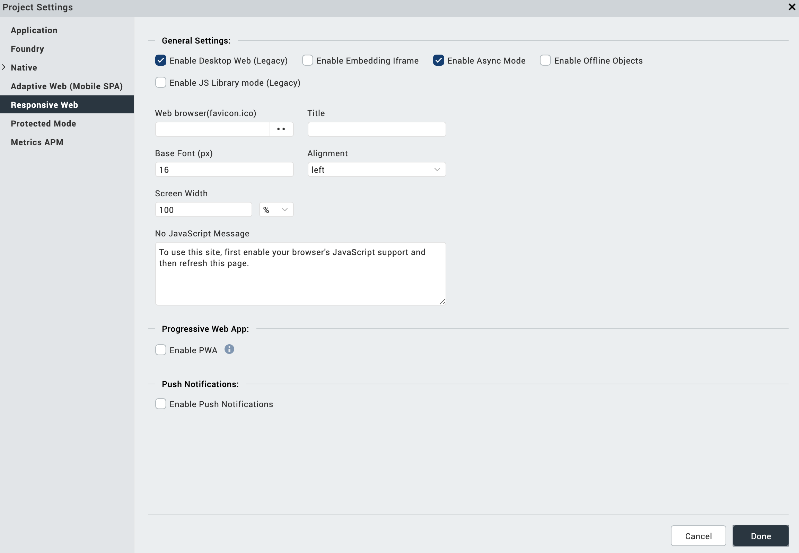

                         

### Desktop Web Properties

Desktop Web is the browser of the desktop. Desktop Web properties specify the properties for the application on Desktop Web under various platforms.

To set Desktop Web properties, do the following:

1.  On the **Edit** menu, click **Settings**, and then click the **Desktop Web** tab.

1.  Browse and select the appropriate **fav icons** for _Desktop Web Browser_. When you launch the application on the Desktop Web Browser you see the icon specified here as the application icon.
2.  Enter a **Title** for the application. This title appears on the web browser when you launch the application on Mobile Web.
3.  If you want to enable support for offline objects for your desktop web application, in the **Offline Objects Support** section, select **Enable Offline Objects**.
4.  If you want to build a Progressive Web App, in the **Progressive Web App** section, select **Enable PWA**.  
    Once you select the option, the Web Manifest JSON option is enabled.
5.  From Web Manifest JSON , select Browse. The file explorer opens.  
    
6.  Navigate to the folder where you have the JSON file and select your desktopweb manifest file.  
    The Web Manifest JSON file contains information on the resources the Progressive Web App required. The information can be name of the app, app icons, etc. Click [here](PWAwebManifest.json) for a sample.
7.  Using the **Enable Embedding iFrame** feature, you can choose the SPA/Desktopweb application behavior in a subwindow (for example, iFrame). The default setting for this feature is not selected. To allow an application to open in a subwindow, select **Enable Embedding iFrame**. The application can be launched in any other main windows application.
    
    To restrict the application from opening in a subwindow, leave the default setting. The application will not open in any other main windows application.
    
8.  Navigate to the **General** tab.
9.  From the **Base Fonts** list, select the appropriate base font size in pixels.

1.  Select appropriate **Base Font** sizes in points for **iPhone** and various categories of browsers.
    
    > **_Note:_** When you specify the font size within the [skin](Customizing_the_Look_and_Feel_with_Skins.md) of a widget, the font size is calculated based on this **Base Font**.
    

11.  In the Screen Width field, specify the width the application occupies in the Desktop Web browser. The screen width value can be percentage based or pixel based.
12.  From the **Alignment** list, select how the application is aligned in the browser. The possible values are center, left, and right.
13.  Select the check box of **Enable Responsive Web** if you want to enable Responsive Web design for your desktop application.

> **_Important:_** If you have enabled Progressive Web App in Project Settings, when you build a Responsive Web application, the build creates a new output in the Progressive Web App format. For more information about Responsive Web apps, click [here](Responsive_Design_8_2.md). For more information about Progressive Web Apps, click [here](ProgressiveWebApp.md).
