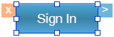

                         

Display Widget Command Handles
==============================

Many widget commands can be accessed from the Iris Canvas by opting to display the widget command handles. By default, these are not activated. There are two handles. One is a delete handle  and the other is a context menu handle . When the command handles are activated and a widget is selected, it looks like this:

Clicking the delete handle deletes the widget immediately with no additional prompts or warnings. Clicking the context menu handle displays all the commands available to that particular widget, and is equivalent to clicking a widget's context menu arrow from the Project tab of the Project Explorer.

To display widget command handles, do the following:

1.  On the **Edit** menu, click **Preferences**.
2.  On the left side of the Iris Preferences dialog box, click **General**.
3.  Set the Widget Highlighter Actions option to **On**.
4.  Click **Apply**.
