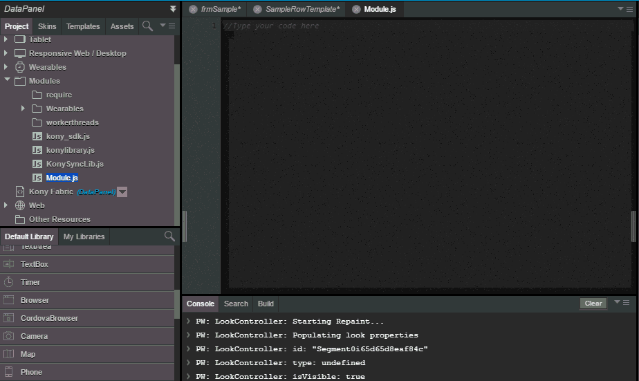

                          

File Update Notification
========================

In Iris, you can edit some files using Iris code editor. These files can also be modified externally from their location through an external code editor. When a file is open in Iris canvas, if that file is modified externally, then you will receive a notification about the modification.

If the file is not active (open on canvas but not in focus), when you view that file, you will get the notification. You can choose how to handle these modifications.

*   When you select **OK**, you override the current file version with the version in the file system.
*   When you select **Cancel**, you retain the version that is on Iris.

