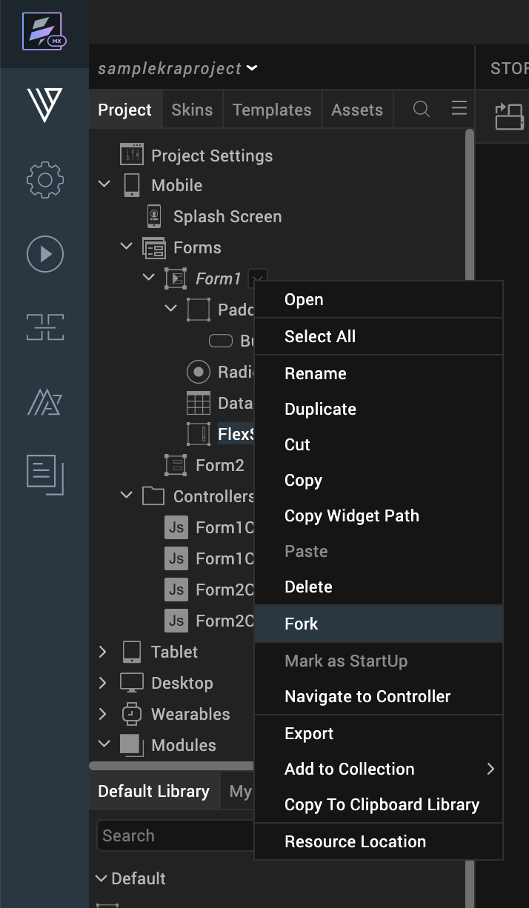
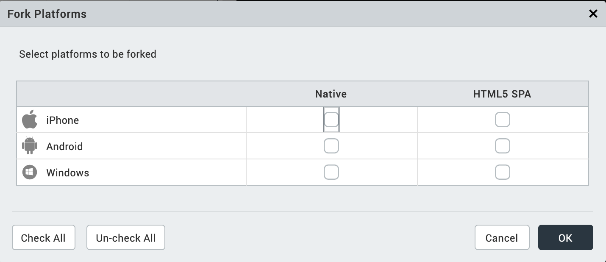
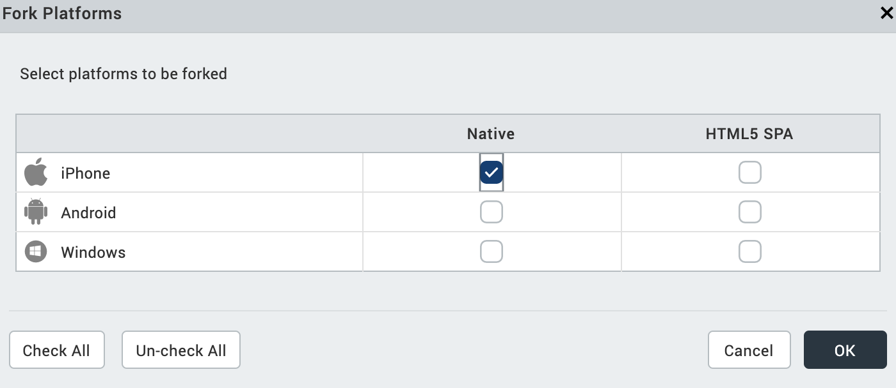

                          

Forking
-------

Forking allows you to customize properties uniquely for a platform. You can fork:

*   [A Form](#forking-a-form)
*   [A Widget Property](#fork-a-widget-property)
*   [A Skin](Customizing_the_Look_and_Feel_with_Skins.md#fork-a-skin)

### Forking a Form

Forking forms enables you to customize the position and availability of widgets on different platforms.

You fork a form to accomplish the following:

*   Position widgets differently on different platforms
*   Make widgets available on one platform but not on another platform
*   Replace a widget on one platform with a widget on another platform

Important Considerations

*   You can fork Flex forms.
*   All the forked forms appear below their source forms in the Project Explorer.
*   Renaming a source form renames all its forked forms.
*   Deleting a source form deletes all its forked forms.
*   A forked form only lists common (i.e. General) properties and platform-specific properties. For example, a form forked for Android Native lists only common properties and Android native specific properties. In the following example, the General properties are not expanded, but are still present.
*   Default skins and user-defined skins are also forked during form forking.
    
*   Notes have only those comments made in the forked form's platform. For example, a form forked for Android Native will have only the notes written on an Android device.
    
*   During forking, any unsupported widgets are ignored. For example, Camera Widget is not supported on iOS web. If a form containing a Camera Widget is forked for iOS web, the form will be forked, but the Camera Widget is not forked.

#### How to Fork a Form

Forking allows you to customize a form specific to a platform. For example, you can fork a form to appear on an iOS (native) platform with green background and have the same form forked to appear on an Android (web) platform with yellow background.

To fork a form, do the following:

1.  In the Project Explorer, on the **Project** tab, expand the channel with the form you want to fork, either Mobile, Tablet, or Desktop.
2.  Expand Forms, click the context menu arrow of the form you want to fork, and then click **Fork**.The Fork Platforms dialog box displays.
    
    
    
3.  Select the platforms for which you want to create a fork, and then click **OK**.
    
    
    
    The form is forked for the platforms you selected, which is reflected on the Project tab.
    

### Fork a Widget Property

Forking allows you to provide different values for the same property or skin, across the platforms. You can fork the flex layout and fork all the look properties associated with the flex container.

Only certain widget properties can be forked. You can identify whether a property can be forked by the presence of an icon( ) to the left of the property's name. Two types of forking are available for you:

1.  Simple Forking: Allows you to fork one platform at a time.
2.  Complex Forking: Allows you to fork multiple platforms at the same time.

#### Simple Forking

This example illustrates how to do a simple forking, which forks just one platform at a time. In it, the **View Type** property of a **Calendar** widget is forked, but the same principle is applicable for all simple forking of widget properties.

To fork **an individual property for a particular platform**, do the following:

1.  On the Iris Canvas, select the widget whose property you want to fork.
2.  Select the desired platform from the Platform list—for example, Android : Native.
3.  In the Properties Editor, on either the Look tab or the properties tab for the specific widget (which, since our example is a Calendar widget, the properties tab is the Calendar tab), configure the value of the property you want to fork. In this example, we'll select **Popup Grid** from the **View Type** drop-down list.
4.  Click the fork icon  located to the left of the property you changed, The icon changes to , indicating that the value is forked specifically for the platform you chose, which in this example is the Android : Native platform.

When you navigate to a different platform, the value of the forked property is replaced either with:

*   A default value of the property.
*   A forked property value, if the property is forked for that specific platform.

#### Complex Forking

This example illustrates how to do a complex forking, which forks multiple platforms at the same time. In it, the **View Type** property of a **Calendar** widget is forked, but the same principle is applicable for all complex forking of widget properties.

Properties for which complex forking is possible have an ellipsis button  located at the far right of the property.

In this section, using the **View Type** property of a **Calendar** widget, let us understand complex forking. The below steps, however, can be used for forking any of the widget properties.

To fork **an individual property for multiple platforms**, do the following:

1.  On the Iris Canvas, select the widget whose property you want to fork.
2.  In the Properties Editor, on either the Look tab or the properties tab for the specific widget (which, since our example is a Calendar widget, the properties tab is the Calendar tab), configure the value of the property you want to fork. In this example, we'll select **Popup Grid** from the **View Type** drop-down list.
3.  Click the ellipsis button to the right of the property you want to fork for multiple platforms.
4.  In the dialog box that opens, click the platforms for which you want to fork the property, and then for each platform, select the property value you want. Click **OK**.

The icon changes to , indicating that the value is forked specifically for the platforms you chose.
