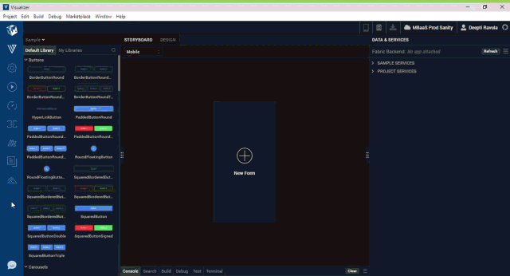

                          

Hikes
=====

Hikes is a mechanism within Volt MX Iris that you can use to learn a few concepts of how to develop applications by using Iris. Hikes are step-by-step interactive walkthroughs that help you understand the basics of using Volt MX Iris.

Access Hikes in Volt MX Iris
----------------------------------

You can access Hikes from the left navigation panel in Volt MX Iris. Hikes are organized into Guided Tours in a catalog, and the Hikes are in a sequence to take you through a learning path. You should go through the Hikes in the specified order.

A few UI elements are displayed as part of the Hike procedure to help you to navigate and perform the required steps. Arrows point to the area where you must focus to perform the action in a Hike step. For some Hike steps, after you successfully perform an action, the card automatically moves to the next step.

> **_Note:_** While using a hike, if you want to go back to a card, click the **Previous** button. If you have rapidly moved from hike **D** card to hike **A** card, you can get back to the hike **D** card by clicking the **shift key** + **Next** button.  
  
To move directly to the first card on any hike, click **shift key** + **Previous** button.

Once you have completed a Hike, you can either move on to the next Hike or close the current Hike. You can always access the list of Hikes from the navigation panel (as mentioned earlier) and start any Hike.

