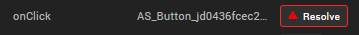

                          

Import a Volt MX Iris Classic Project
========================================

You can import a project that is located locally on your computer, or you can import a project from a cloud account to Volt MX Iris.

For more information, click any of the following sections:

[Import a Local Iris Classic Project](#import-a-local-iris-classic-project)

[Import a Iris Classic Project from a Cloud Account](#import-a-iris-classic-project-from-a-cloud-account)

> **_Important:_**  
If the project you are importing includes Cordova content, ensure the following:

*   Place the Cordova content in the following location:  
    `<ProjectName>/web/cordova`
*   Within the Cordova folder, structure the content in the following way:  
    `config.xml  
    hooks  
    www  
    www/css  
    www/img  
    www/index.html  
    www/js`

**_Notes:_***   If your project was built using a version of Volt MX Studio older than 6.0, you first must import it into Volt MX Studio 6.0 (with the latest hotfix) and then you can import it into Volt MX Iris.
*   If yours is a Volt MX Iris 2.5 or earlier project, importing it updates it so that it can take advantage of all the features of Volt MX Iris, but your earlier version of Volt MX Iris you will no longer be able to open it.

Import a Local Iris Classic Project
-----------------------------------------

When you import a local Iris Classic project, you are essentially locating an archive (.zip) file, which Volt MX Iris then extracts into the proper location of your workspace.

To import a local Iris Classic project, follow these steps:

1.  On the **Project** menu, navigate to **Import** > **Local Project**.
2.  You can do any of the following:
    
    *   Click **Open as New Project** to import the local project as a new Volt MX Iris project.
    *   Click **Add to Current Project** to import the local project to the current Volt MX Iris project.
    
    The **Import into project** dialog box appears. 

    
    

3.  Click **Browse** to locate the archive file that you want to import, select it, and then click **Import**. The project is imported to your new or current project. On successful import of the local project, Volt MX Iris does the following:
    *   The startup form is highlighted in the Project Explorer. Here, **Employee Directory** is the imported sample app and **frmHome** is the startup form.  

        

    *   The startup form of the imported project is displayed on the Project Canvas.
    *   The **Look** tab is auto-selected and displayed on the **Properties** panel.  

        

> **_Note:_** If a project with the same name exists already, the **Conflict** dialog box appears, asking you if you want to overwrite the existing project. Click **OK** to overwrite the existing project. Click **Cancel** to end the import process.

Import a Iris Classic Project from a Cloud Account
--------------------------------------------------------

It is assumed that you have access to the cloud account where the Iris Classic project is located. For access, contact someone with admin privileges to the cloud account. They can invite you by referring to [Invite Users to a Cloud Account](ShareProjectOnTheCloud.md#invite-users-to-a-cloud-account).

To import a Iris Classic project from a cloud account, follow these steps:

1.  In Volt MX Iris, if you are not already signed in, sign in to your Volt MX account.
2.  On the **Project** menu, point to **Import**, and then click **Cloud Project**. The **Import Project** dialog box appears.  
    
3.  In the list of projects, hover over the project you want to import. The project's field highlights, and an Import button appears along the right-edge of the project's field. Click **Import**. The project is imported to your current project. On successful import of the local project, Volt MX Iris does the following:
    *   The startup form is highlighted in the Project Explorer. Here, **Employee Directory** is the imported sample app and **frmHome** is the startup form.  

        

*   The startup form of the imported project is displayed on the Project Canvas.
        
*   The **Look** tab is auto-selected and displayed on the **Properties** panel.  
          

        

> **_Note:_** If a project with the same name exists already, a dialog box appears, asking if you want to overwrite the existing project or rename the project you're importing with a different name. Click **Overwrite** to overwrite the existing project. Click **Rename** to open a dialog box where you can enter a new name for the app that you are importing. Then you can either click **OK** to proceed with the import process from the cloud or click **Cancel** to end the import process without downloading the project from the cloud.

Resolve conflicts between Developer and Designer Actions
--------------------------------------------------------

When a project is imported from Iris Classic to Volt MX IrisV9, the actions associated with the widgets in the project are also imported. Conflicts arise if there are both Designer and Developer actions associated with the same action event. Designer actions are created in Volt MX Iris, and Developer actions are created in Volt MX Iris Classic.

On successful import of the project, Volt MX Iris displays a dialog box to scan the project.  

Click **Continue** if you want to view and resolve all the conflicts at once. For more information, refer [Resolve Action Conflicts in bulk](#resolve-action-conflicts-in-bulk).

Click **Ignore** if you want to manually resolve conflicts in the actions due to the import. For more information, refer [Resolve Action Conflicts by widget.](#resolve-action-conflicts-by-widget)

> **Note:**  
*   If there are no Developer Actions, the Resolve Action pop up displays the Designer Action associated with the widget or form. This Designer Action can either be deleted or converted to a Developer action by clicking **Activate**.  
*   If the imported project contains only Designer Actions, all the actions are converted into Developer Actions.  

### Resolve Action Conflicts in Bulk

Volt MX  Iris scans the entire project, and if there are any conflicts between the Designer and Developer actions, a **Resolve Action** dialog box appears.  

The Resolve Action dialog box displays a list of all the widgets that have conflicts in the actions and details of the Designer and Developer actions associated with the widget. You can choose to retain either the Designer Actions or the Developer Actions for all the widgets.

To retain only the Designer Actions, select **Use Designer**. To retain only the Developer Actions, select **Use Developer**. Volt MX Iris resolves the action conflicts and the actions that you select will be retained in the project.

### Resolve Action Conflicts by Widget

If a widget has both Designer and Developer actions associated with it, a warning symbol appears in the **Action** tab of the **Properties** panel. You can fix the conflicts by using the **Resolve** option in the Action tab.

To manually resolve conflicts between Designer and Developer actions, follow these steps:

1.  From the **Properties** panel of Volt MX Iris, navigate to the Action tab of the widget.  
    For actions that are in a conflicted state, a **Resolve** button appears next to the action.  
    
    
    
2.  Click Resolve.  
    Details of the Developer and Designer actions appear.  
    
    
    
3.  Click the Unlink icon against the action that you do not want to associate with the widget or form, and then click Done.  
    
      

    The action that you choose to retain is associated with the widget and is considered as a Developer action.
    

> **Important:**  
*   When you build the project, only Developer actions are associated with the widgets. In case of conflicts, the Developer actions take precedence, and Designer actions are not considered.  
*   When you export an artifact of a project that contains conflicting actions from Volt MX Iris, the Designer actions are not considered. The artifact is exported with only the Developer actions associated.  
