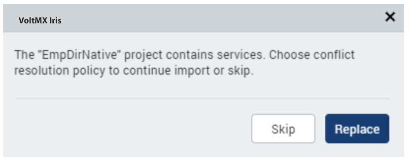
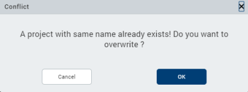

                          

Import a Volt MX Iris Project
===================================

You can import a project that is located locally on your computer or you can import a project from a cloud account to Volt MX Iris.

For more information, click any of the following sections:

[Import a Local Volt MX Iris Project](#import-a-local-volt-mx-iris-project)

[Import a Volt MX Iris Project from a Cloud Account](#import-a-volt-mx-iris-project-from-a-cloud-account)

> **_Important:_**  
If the project you are importing includes Cordova content, ensure the following:

*   The Cordova content needs to be in the following location:  
    `<ProjectName>/web/cordova`
*   Within the Cordova folder, the content must be structured in the following way:  
    `config.xml  
    hooks  
    www  
    www/css  
    www/img  
    www/index.html  
    www/js`

Import a Local Volt MX Iris Project
-----------------------------------------

When you import a local Volt MX Iris project, you are essentially locating the project file from your local system, which Volt MX Iris then extracts into the proper location of your workspace.

> **_Important:_** If your project was created using Volt MX Studio version 6.0, you must first import it into Volt MX Iris Classic version 8.4 (with the latest hotfix) and then you can import it into Volt MX Iris.

To import a local Volt MX Iris project, follow these steps:

1.  On the **Project** menu, point to **Import**, and then point to **Local Project**.
2.  You can do any of the following:
    *   Click **Open as New Project** to import the local project as a new Volt MX Iris project.
    *   Click **Add to Current Project** to import the local project to the current Volt MX Iris project.
3.  You can do any of the following:
    *   Click **From an Archive** to import the local project from an archive (.zip) file.
    *   Click **From a Folder** to import the local project from a folder.
4.  Locate the file that you want to import, select it, and then click **Open**.  
    The project is imported to your new or current project.  
    On successful import, Volt MX Iris opens the app in the Storyboard view, and the startup form is displayed on the Iris Canvas.

### Important Considerations

*   If the project contains Volt MX Foundry Services associated with the app, Volt MX Iris displays a dialog box, prompting if you want to import the Services as part of the project import. Click **Continue** to import the Volt MX Foundry Services associated with the app. Click **Skip** to import the project without importing the Volt MX Foundry Services associated with the app.

    

     
    

     > **_Note:_** You can import the Volt MX Foundry services at any time by using the **Data Panel** > **Export App** option.  
     The Export App option is only enabled if the Volt MX Foundry app is not linked to the project, and the `<workspace>/<project>/Foundry/Apps` folder is present in the project's workspace.
    

*   If your Volt MX Foundry account contains Services with the same name as the Services present in the imported project, Volt MX Iris displays a dialog box, prompting if you want to import the Services as part of the project import. Click **Replace** to import and associate the Volt MX Foundry Services associated with the app. Click **Skip** to use the Services present in your Volt MX Foundry account.
    

    
    

*   If a project with the same name exists already, the **Conflict** dialog box appears, prompting you if you want to overwrite the existing project. Click **OK** to overwrite the existing project. Click **Cancel** to end the import process.
    
    
    
    

Import a Volt MX Iris Project from a Cloud Account
--------------------------------------------------------

It is assumed that you have access to the cloud account where the project is located. For access, contact someone with admin privileges to the cloud account. They can invite you by referring to [Invite Users to a Cloud Account](ShareProjectOnTheCloud.md#invite-users-to-a-cloud-account).

To import a Volt MX Iris project from a cloud account, follow these steps:

1.  In Volt MX Iris, if you are not already signed in, sign in to your Volt MX account.
2.  On the **Project** menu, point to **Import**, and then click **Cloud Project**. The **Import Project** dialog box appears.
3.  Scroll through the list of available projects, and then click **Import** for the project you want to download.
4.  In the list of projects, hover over the project you want to import. The project's field highlights, and an Import button appears along the right-edge of the project's field. Click **Import**. The project is imported to your current project.  
    On successful import, Volt MX Iris opens the app in the Storyboard view, and the startup form is displayed on the Iris Canvas.

> **_Note:_** If a project with the same name exists already, a dialog box appears, prompting if you want to overwrite the existing project or rename the project you're importing with a different name. Click **Overwrite** to overwrite the existing project. Click **Rename** to open a dialog box where you can enter a new name for the app that you are importing. Then you can either click **OK** to proceed with the import process from the cloud or click **Cancel** to end the import process without downloading the project from the cloud.
