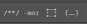
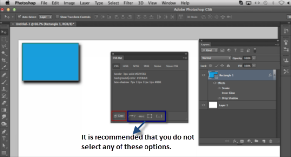
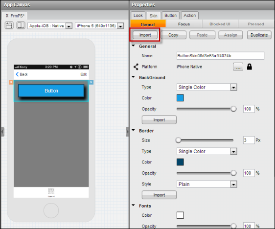
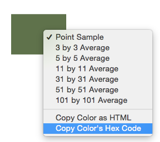
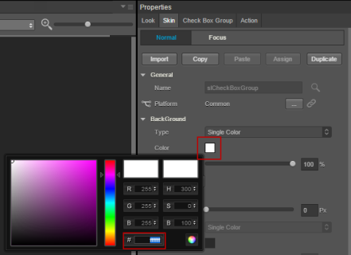

                          

Importing Photoshop Styles and Colors
=====================================

With Volt MX Iris, you can take advantage of styles that you have already created in Photoshop. You can also copy the hexadecimal value for a color in Photoshop, and then paste that into Volt MX Iris to achieve the same color.

You can use one of the following methods to use a color from Photoshop in Volt MX Iris:

*   [Import Photoshop Styles](#import-photoshop-styles)
*   [Copy a Photoshop Color](#copy-a-photoshop-color)

Import Photoshop Styles
-----------------------

You import Photoshop styles into Volt MX Iris by converting them into a cascading style sheet (CSS) file using the CSS Hat plug-in for Photoshop, and then importing that CSS file into Volt MX Iris. If you do not already have the CSS Hat plug-in for Photoshop, you can install it from the [CSS Hat website](https://csshat.com/).

To import Photoshop styles into Volt MX Iris, follow these steps:

1.  In Photoshop, select the layer you want to export to Volt MX Iris.
2.  Open the CSS Hat extension, and ensure that the equivalent CSS properties are populated. Click **Copy**. The CSS values are copied to the clipboard.
    
    > **_Note:_** Do not select any of these options  in the CSS Hat palette.
    

4.  In Volt MX Iris, select a widget to which you want to apply Photoshop styles.
5.  On the **Properties** tab, click **Skin**.
6.  Select a skin state such as Normal, Focus, or Blocked UI.
7.  To import all the Photoshop styles (such as background, border, and shadow), click **Import**. The widget skins are updated based on the Photoshop CSS.
    
    
    
    **Selective Photoshop CSS import**: To import a selective Photoshop style (such as a background, a border, or a shadow style), click **Import** on the individual property tabs. Based on the Photoshop style, the individual property is updated.
    
    
    

### Naming Conventions

Some of the properties in Volt MX Iris are referred to differently in Photoshop. The following table outlines these differences.

  
| Volt MX Iris | Photoshop |
| --- | --- |
| Border | Stroke |
| Background: Multi-step Gradient Background: Two-step Gradient | Gradient Overlay |
| Background: Single Color | Color Overlay |
| Shadow | Drop Shadow |
| Shadow | Outer Glow |
| Shadow (Inset) | Inner Shadow |
| Shadow (Inset) | Inner Glow |

### Limitations

Not all CSS values are imported, and Volt MX Iris ignores the values that are unsupported. The unsupported CSS values are as follows:

*   Font families are not imported from Photoshop. It is recommended that you provide the font family for a widget in Volt MX Iris.
*   Borders with a Multi-Step Gradient (MSG) are not properly imported from Photoshop. It is recommended that you provide the border MSG in Volt MX Iris.
*   If you create non-uniform borders, you need to import the CSS styles in the Native and Web channels.

Copy a Photoshop Color
----------------------

Volt MX  Iris gives you the ability to copy a color from Photoshop and assign this color to any of the widget’s skin properties such as the Background, Border, Font, Shadow, and Font Shadow.

> **_Note:_** Volt MX Iris is not able to copy a two-step or multi-step gradient color from Photoshop.

To copy a color from Photoshop Studio to your widget skin, do the following:

1.  In Photoshop Studio, use the **Eyedropper** tool to copy the color’s hexadecimal value. To do so, hover the **Eyedropper** tool over the object, right-click, and then click **Copy Color’s Hex Code**.
    
    
    
2.  In Volt MX Iris, go to the **Skin** tab of a widget’s Properties pane, click **color**, and then paste the hex code.
    
    
    
    > **_Note:_** You can copy the color to any of the widget's properties such as Background, Border, Font, Shadow, and Font Shadow.
