                          

Debug an Application
====================

Volt MX  Iris provides you with a debugger to detect and diagnose errors in your applications.

You can debug apps in Volt MX Iris.

The debugger allows you to control the execution of your application by:

*   Setting breakpoints.
*   Suspending launched applications.
*   Stepping through your code.
*   Examining the contents of the variables and view them on an emulator.

The debugger has a client and server design. This design allows you to debug applications that are running remotely on the network as well as the applications running locally on your workstation.

Debugging an application involves building the application in debug mode (iOS or Android) and launching the application in an iOS or Android emulator or device. You can then use the Google Chrome debugger to debug the application. For information on using the Chrome debugger, see [Get Started with Debugging JavaScript in Chrome DevTools](https://developers.google.com/web/tools/chrome-devtools/javascript/) on the Google Chrome website.

See the following for information on debugging an application:

*   [Build and Launch an iOS Application](#build-and-launch-an-ios-application)
*   [Build and Launch an Android Application](#build-and-launch-an-android-application)
*   [Debug JavaScript for iOS in Volt MX Iris](#debug-javascript-for-ios-in)
*   [Debug JavaScript for Android in Volt MX Iris](#debug-javascript-for-android-in)

Build and Launch an iOS Application
-----------------------------------

You must build and debug an iOS app in the Mac environment.

To build and launch an iOS application for debugging, do the following:

1.  In Volt MX Iris, build the application in debug mode. To do so:
    *   In Volt MX Iris, from the **Product** menu , click **Build**. In the Build dialog box, select Debug from the Build Mode drop-down list.
    *   In Volt MX Iris, from the **Build** menu, click **Build and Publish Native**. In the Build dialog box, select Debug from the Build Mode drop-down list.
2.  After the build is complete, extract the built _.kar_ file.
3.  Open an Xcode project.
4.  Select the target as **Debug**, choose an emulator, and click **Run**. The emulator launches and the following dialog appears:
    
     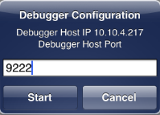
    
5.  Select **Start** in the emulator. The waiting for debugger dialog appears.
    
     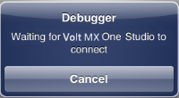
    
6.  Follow the steps in [Debug JavaScript for iOS in Volt MX Iris](#debug-javascript-for-ios-in).

Build and Launch an Android Application
---------------------------------------

To build and launch an Android application for debugging, do the following: 

1.  In Volt MX Iris, build the application in debug mode. To do so:
    *   For Volt MX Iris, from the **Product** menu , click **Build**. In the Build dialog box, select Debug from the Build Mode drop-down list.
    *   In Volt MX Iris, from the **Build** menu, click **Build and Publish Native**. In the Build dialog box, select Debug from the Build Mode drop-down list.
2.  Launch the application in the emulator or device.  
    The device must connected using a USB connection. If you have specified a port other than 9222 as your Android debugger port in:
    *   Volt MX Iris: In the **Window** menu, click **Preferences**. From the Preferences dialog box, click **VoltMX Iris** and update the Android Debugger Ports setting to use the same port.
    *   Volt MX Iris: In the **Edit** menu, click **Preferences**. From the Preferences dialog box, click **Build** and update the **Debugger ports** to use the same port.

      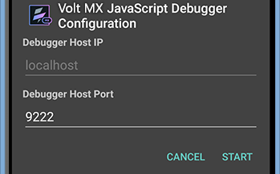

3.  Click **Start** in the emulator. A Waiting for the Debugger message appears.
4.  Follow the steps in [Debug JavaScript for Android in Volt MX Iris](#debug-javascript-for-android-in).

Debug JavaScript for iOS in Volt MX Iris
----------------------------------------------

### Volt MX Iris Classic

With Volt MX Iris, you can perform JavaScript debugging on connected Apple computers and devices. This procedure assumes that you have the Google Chrome web browser installed on your computer. You also need to install and run on your Mac the iOS WebKit Debug Proxy (ios\_webkit\_debug\_proxy). It must be version 1.6 or greater. To install this utility, from your Mac, open a terminal and enter the following command:

`brew install ios-webkit-debug-proxy`

> **_Important:_** You can debug JavaScript applications in iOS using the Volt MX Iris preview app on your device or on the simulator. The option to debug applications in iOS is available from **Preview** > **Debug** in Volt MX Iris .

> **_Important:_** If you are using a Windows machine to connect to a Mac machine for debugging, for iOS applications Functional Preview debugging, a URL will be generated in the console of Volt MX Iris. Ensure that you copy and paste the generated URL in your Chrome browser to start the debugging process.

> **_Important:_** Ensure that you deactivate and activate the breakpoint once your debugging starts in your Chrome browser. This is applicable for Windows and Mac machines.  

To debug JavaScript applications for iOS on a simulator or device:

1.  In Volt MX Iris, build your application for the [iOS](#build-and-launch-an-ios-application) platform in debug mode. To do so,  
    *   In Volt MX Iris, from the **Product** menu , click **Build**. In the Build dialog box, select Debug from the Build Mode drop-down list.
    *   In Volt MX Iris, from the **Build** menu, click **Build and Publish Native**. In the Build dialog box, select Debug from the Build Mode drop-down list.
2.  Launch the application in a simulator on your Mac computer, or on the device.
3.  *   For Volt MX Iris , from the **Product** menu , click **Debug As**, and then select **Debug iOS application on a simulator** or **Debug iOS application on a device**.
    *   For Volt MX Iris, from the **Debug** menu, click **Debug Native App**. From the **Debug Native App** drop-down list, select either **iOS Devices** or **iOS Simulators**.
4.  Volt MX Iris displays a dialog box confirming whether the app is running in an iOS simulator on a Mac computer. .

     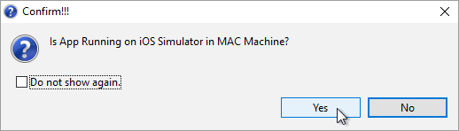

4.  If you click **Yes** in the dialog box and you're running Volt MX Iris on a Windows computer, Volt MX Iris displays a dialog box prompting you for information so that the debugger can connect to the Mac computer running the iOS simulator. Once you have entered the needed information, click Test Connection. If the connection is configured properly, the Result reads **Test connection successful**. Click **OK**.

     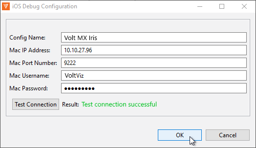

5.  Volt MX Iris tests to see if it can locate Google Chrome on your computer. If it does not find Chrome in the Program Files folder, a Google Chrome Location field appears in the above dialog box. Click its corresponding **Browse** button to locate the Chrome executable.

     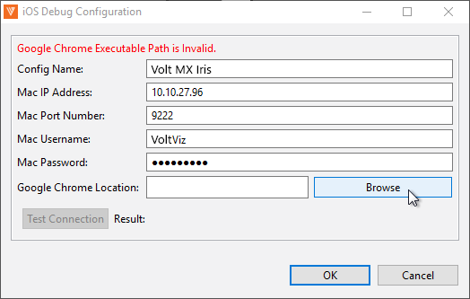

6.  Once the connection to the Mac computer running the simulator is established and Volt MX Iris has verified the location of Google Chrome, Volt MX Iris launches the iOS WebKit Debug Proxy tool. If Volt MX Iris does not find the iOS WebKit Debug Proxy tool, it prompts you to manually run the necessary script file on your Mac computer.

     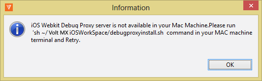

7.  Upon the successful start of the iOS WebKit Debug Proxy tool, Volt MX Iris opens a new Google Chrome debugger window. JavaScript files that you open appear on the Sources panel of the window, and you can add breakpoints and step through the code using the Debugger panel.

     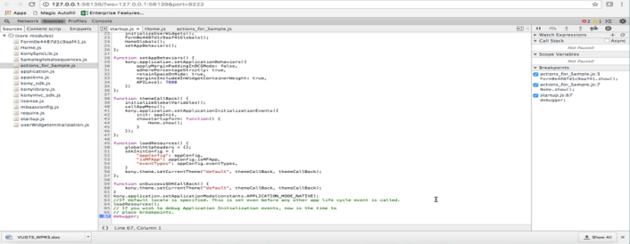

You can then use the Google Chrome debugger to debug the application. For information on using the Chrome debugger, see [Get Started with Debugging JavaScript in Chrome DevTools](https://developers.google.com/web/tools/chrome-devtools/javascript/) on the Google Chrome website.

### Volt MX Iris

Volt MX  Iris supports JavaScript debugging for iOS native applications with Safari web browser and Web Inspector. Ensure that you have the latest version of Safari web browser installed in your system. Ensure that you enable developer settings in your iOS device.

To get started with debugging iOS native applications, you must enable [Developer Settings on your iOS device](#ios-device-developer-settings). If your Mac has an OS earlier than Mojave, the Developer settings are automatically configured. If your Mac has Mojave OS or later, configure [Mojave OS Specific settings](#Mojave).

Once you are done configuring the settings, you can [Build iOS Native Application in the Debug mode](#build-ios-native-application-in-the-debug-mode) and then further, [Debug the iOS Native Application using Safari Browser](#debug-ios-native-application).

##### iOS Device Developer Settings

For the debugging to work, you must enable the Web Inspector developer tool on your device before debugging an application. To enable Web Inspector tool, follow these steps:

1.  On your iOS device, open **Settings**.
    
2.  Go to **Safari** > **Advanced**.
    
3.  Toggle the button next to **JavaScript** to enable JavaScript in the Safari browser.
    
    Toggle the button next to **Web Inspector**to debug iOS native applications.
    

##### Mac Developer Settings

For the Mac OS versions earlier than Mojave, Iris automatically connects to the Safari JavaScript debugger, provided that [the developer settings](#ios-device-developer-settings) in your iOS device are configured.

**Mojave-specific Settings**

For the Mac OS versions Mojave and later, full disk access and accessibility must be provided to the Terminal due to enhanced security of newer Mac OS versions.

For the debugger to run on your Mac, follow these steps:

1.  In your Mac, go to **System Preferences** > **Security and Privacy**.
2.  Click the **Privacy** tab, and then click the lock icon at the bottom of the screen. You may receive a password prompt.
3.  If the password prompt appears, enter your password.
4.  Once you can access the settings, from the left pane, select **Full Disk Access** .
5.  Click the **+** icon to add the **Terminal** to the list of applications with **Full Disk Access**.
6.  From the left pane, select **Accessibility**.
7.  Click the **+** icon, and then add **Terminal** to the list of applications for accessibility.

> **_Note:_** If Iris fails to automatically communicate with Safari to launch Web-inspector, you must [debug the application manually](#manual-debugging).

#### Build and Debug iOS Native Application

##### **Build iOS Native Application in the Debug Mode**

To debug an application, you must first build the application in the Debug mode. To do so, follow these steps:

1.  In Volt MX Iris, from the **Build** menu, click **Build and Publish Native**.
    
2.  In the **Build** dialog box, from the **Build Mode** drop-down list, select **Debug**.
    
3.  Click **Build**.
4.  If you haven't configured the P12 password, .P12 certificate, Mobile Provisioning profile, target iOS version, and development method in the **iPhone** tab of the Project Settings, you will see an error dialog in Iris. Click **Settings** to configure the certificates. Refer to [iOS automation](iOS_Automatic_Output_Generation.md) for more information on configuring the certificates.
    

##### **Debug iOS Native Application**

Follow these steps to debug JavaScript applications for an iOS device:

1.  In Volt MX Iris, from the main menu, click **Debug**.
    
2.  Go to **Debug Native App** > **Connected iOS Devices**.
    
3.  From the list of connected devices, select your device.
    
4.  If you haven't enabled the [Developer settings](#ios-device-developer-settings) in your iOS device already, follow the steps in the popup and click **Yes**.
    
    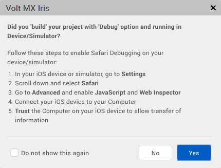  
    You can select the **Do not show this again** checkbox to not see the popup again.  
    
    If the debug process is successful, the Safari web browser with Web Inspector is auto-launched.
    
5.  In case the Safari web browser does not launch automatically, you must debug the application manually.
    
    *   If your Mac OS version is Mojave or later, you must configure the [Mojave-specific settings](#Mojave) or follow the steps in the following popup.
        
        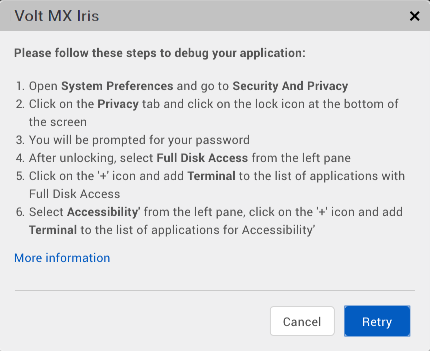
        
    
    *   If your Mac OS version is earlier than Mojave, ensure that you have provided the accessibility to the terminal by following the steps in the popup.  
          
        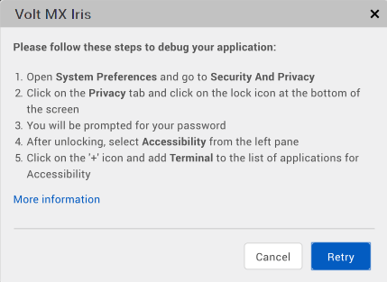

*   If you have configured the Security and Privacy settings and the Safari web browser still does not launch, you must [debug the application manually](#manual-debugging) or follow the steps in the popup.  
      
    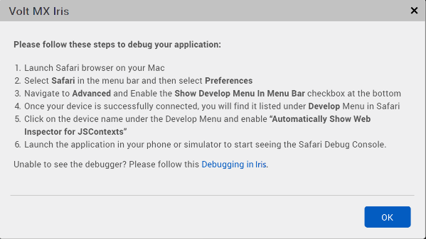

##### Manual Debugging

If the application debugging fails and the Safari web browser does not launch automatically, you must configure the following steps manually:

1.  Launch Safari web browser.
    
2.  From the menu bar, go to **Safari** and click **Preferences**.
    
3.  In the **Preferences** menu, click **Advanced**.
    
4.  Select the **Show Develop Menu In Menu Bar** check box.
    
5.  Connect your device to your Mac system using a USB.
6.  From the menu bar, click the **Develop** menu, you will see the device name that is connected to your Mac system.
7.  Click on the device name and enable **Automatically Show Web Inspector for JS Contexts**.
8.  Launch the application on your device to see the Safari Debug Console.

Debug JavaScript for Android in Volt MX Iris
--------------------------------------------------

With Volt MX Iris, you can perform JavaScript debugging on connected Android computers and devices. This procedure assumes that you have the Google Chrome web browser installed on your computer.

> **_Note:_** By default, the Android debugger uses port 9222. If there is a conflict, you can change the port that the debugger uses.  
In Volt MX Iris, in the **Window** menu, click **Preferences**. From the Preferences dialog box, click **VoltMX Iris** and update the **Android Debugger Port** settings.  
In Volt MX Iris in the **Edit** menu, click **Preferences**. From the Preferences dialog box, click **Build** and update the **Debugger ports** settings.

> **_Note:_** You can now use Android FP debugger from the Preview menu. This uses the Volt MX App app to debug the app. By default, the Android FP Debugger Port feature uses 9333. If there is a conflict, you can change the port that the debugger uses.  
In Volt MX Iris, in the **Window** menu, click **Preferences**. From the Preferences dialog box, click **VoltMX Iris** and update the **Android FP Debugger Port** settings.  
In Volt MX Iris in the **Edit** menu, click **Preferences**. From the Preferences dialog box, click **Build** and update the **Debugger ports** settings.

To debug JavaScript applications for Android in Volt MX Iris: 

1.  In Volt MX Iris, build your application for the [Android](#build-and-launch-an-android-application) platform in debug mode. To do so,
    *   In Volt MX Iris, from the **Product** menu , click **Build**. In the Build dialog box, select Debug from the Build Mode drop-down list.
    *   In Volt MX Iris, from the **Build** menu, click **Build and Publish Native**. In the Build dialog box, select Debug from the Build Mode drop-down list.
2.  Launch the application in an emulator or device. The device must be connected using a USB connection.
3.  *   For Volt MX Iris, from the **Product** menu, point to **Debug As**, and then select **Debug android application**.
    *   For Volt MX Iris, from the **Debug** menu, click **Debug Native App**. From the **Debug Native App** drop-down list, select **Android Devices/Simulators**.
4.  A confirmation dialog box appears asking if the project was built with the Debug option. If you know that it was, click **Yes**. Otherwise, click **No**, which ends the debug process.
    
    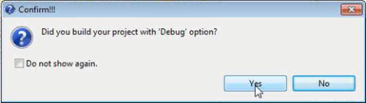
    
    > **_Note:_** To debug applications in Volt MX Iris, you must have built the application using the Build Mode **Debug**. To do so, in the Build dialog box, select Debug from the Build Mode drop-down list.
    
5.  Volt MX Iris displays a popup that the debugging has started. Open your Google Chrome browser and enter the URL displayed in the popup into the address bar of the browser.  
    The URL will be as follows, **chrome-devtools://devtools/bundled/inspector.html?experiments=true&v8only=true&ws=127.0.0.1:<port\_number>**  
    For example,  
    [chrome-devtools://devtools/bundled/inspector.html?experiments=true&v8only=true&ws=127.0.0.1:9222](chrome-devtools://devtools/bundled/inspector.md?experiments=true&amp;v8only=true&amp;ws=127.0.0.1:9222)  
    JavaScript files that you open appear in **Sources** panel. You can add breakpoints and step through the code using the Debugger panel.

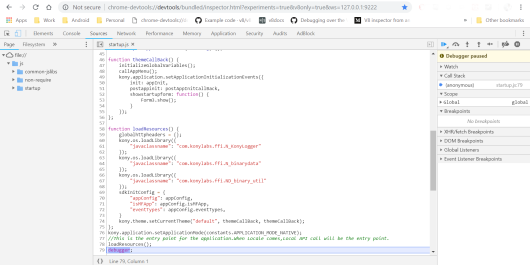

You can then use the Google Chrome debugger to debug the application. For information on using the Chrome debugger, see [Get Started with Debugging JavaScript in Chrome DevTools](https://developers.google.com/web/tools/chrome-devtools/javascript/) on the Google Chrome website.

> **_Important:_** In Google Chrome version 66 and higher, the breakpoints do not get applied. You can write the keyword **debugger** in the JS files where the debugger needs to be stopped. This **debugger** keyword acts as a breakpoint.

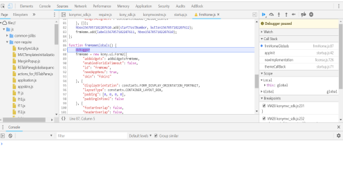

Note the following behavior when debugging an Android application:

*   When the debugger connects, the focus changes to the DevTools console. However, the debugger is paused in _startup.js_, which can be found on the **Pages** tab which is under the **Sources** tab. You must manually switch to the **Sources** tab to debug your JavaScript code.
*   Your application stops working when you try to perform a JSBinding operation after the JSDebbuging is complete.

<table style="margin-left: 0;margin-right: auto;mc-table-style: url('Resources/TableStyles/RevisionTable.css');" class="TableStyle-RevisionTable" cellspacing="0" data-mc-conditions="Default.HTML5 Only,Default.DoNotPublish"><colgroup><col class="TableStyle-RevisionTable-Column-Column1"> <col class="TableStyle-RevisionTable-Column-Column1"> <col class="TableStyle-RevisionTable-Column-Column1"></colgroup><tbody><tr class="TableStyle-RevisionTable-Body-Body1"><td class="TableStyle-RevisionTable-BodyE-Column1-Body1">Rev</td><td class="TableStyle-RevisionTable-BodyE-Column1-Body1">Author</td><td class="TableStyle-RevisionTable-BodyD-Column1-Body1">Edits</td></tr><tr class="TableStyle-RevisionTable-Body-Body1"><td class="TableStyle-RevisionTable-BodyB-Column1-Body1">7.3</td><td class="TableStyle-RevisionTable-BodyB-Column1-Body1">SHS</td><td class="TableStyle-RevisionTable-BodyA-Column1-Body1">SHS</td></tr></tbody></table>
