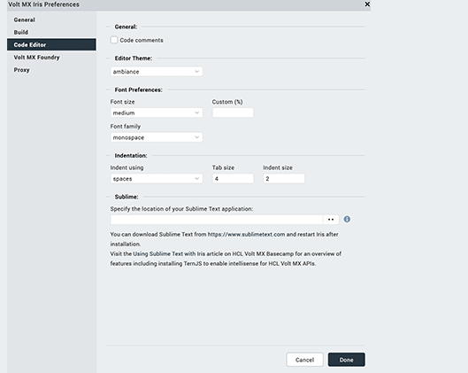
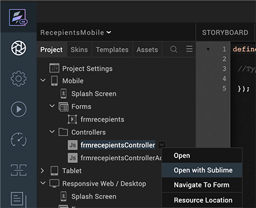
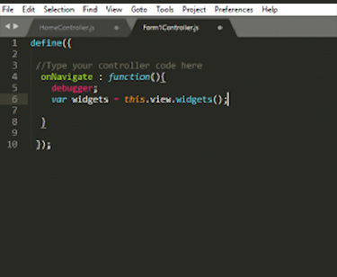
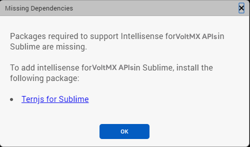

                         


Invoke Sublime Text from Volt MX Iris
===========================================

From V9 SP 2, you can invoke the latest version of Sublime Text (a third-party source code editor) from within Volt MX Iris. This feature ensures that developers have the option to use an alternative tool to write and modify code within Iris, in addition to Iris's in-built code editor. You can also make use of the auto-complete Intellisense feature for Volt MX UI, API, and SDK functions while working with Sublime Text.

Sublime Text is a proprietary cross-platform source code editor with a Python API. This source code editor natively supports various programming and markup languages. You can use Sublime Text to add functions with plugins, which are typically community-built and maintained under free-software licenses.

Prerequisites
-------------

Before you can start using Sublime Text from Iris, you must meet the following prerequisites:

*   Use Volt MX Iris V9 SP2 or later
*   Install the latest version of [Sublime Text](https://www.sublimetext.com/3)
*   Install [Package Control](https://packagecontrol.io/installation)
*   Install [Ternjs for Sublime Text](https://github.com/ternjs/tern_for_sublime) (to add Intellisense for Volt MX Iris APIs)

Enable Sublime Text
-------------------

After you have met the prerequisites mentioned previously, you must enable the feature to invoke Sublime Text from Iris.

> **_Note:_** By default, Iris will recognize Sublime Text if it is installed at a default location.

To enable the feature for Volt MX Iris, follow these steps:

1.  In Volt MX Iris, do the following:
    
    *   **For Windows**: On the main menu, click **Edit** and then click **Preferences**.
    *   **For Mac**: On the main menu, click **VoltMX Iris** and then click **Preferences**.
    
    The **Iris Preferences** window appears.  
    
2.  From the left pane, click **Code Editor**. The Code Editor section appears.
3.  Under the **Sublime** section, click **Browse** and select the absolute file path where you installed Sublime Text in your local system.  
    For example, _C:\\Program Files\\Sublime Text 3\\sublime\_text.exe_.  
    For more information, click the [Using Sublime Text with Iris](https://support.hcltechsw.com/csm?id=kb_article&sysparm_article=KB0083615) link. You will be navigated to the Volt MX Basecamp article on using Sublime Text.  
      
    
4.  Click **Done**. The Sublime Text feature is enabled.

Open a JavaScript File with Sublime Text
----------------------------------------

Now that you have enabled the required option, you can open any JavaScript file in Sublime Text from Iris.

To do so, follow these steps:

1.  In your Volt MX Iris project, in the Project Explorer, right-click a JavaScript file/folder. A context menu appears.  
      
    


2.  Click **Open with Sublime**. The Sublime Text source code editor appears with the code snippet of that particular JavaScript file/folder.  
      
    

You can make any changes to the code in any JavaScript file/folder by using Sublime Text.

Add Intellisense for Volt MX Iris APIs
--------------------------------------------

You can add the auto-complete Intellisense feature for Volt MX UI, API, and SDK functions while working with Sublime Text from Iris. You must install the Ternjs for Sublime package to enable this feature. Ternjs is a package for Sublime Text that provides JavaScript auto-fill intelligence.

To install Ternjs, follow these steps:

1.  Install the [Ternjs for Sublime](https://github.com/ternjs/tern_for_sublime) package from [GitHub](https://github.com/).
2.  Check out the following code into a sub-directory of your Sublime Text's Packages directory.
    

 ```
cd /path/to/sublime-text-N/Packages
     git clone [https://github.com/ternjs/tern_for_sublime.git](https://github.com/ternjs/tern_for_sublime.git)
 ```

Ensure that you have installed [node.js](https://nodejs.org/en/) and [npm](https://www.npmjs.com/) (Tern is a JavaScript program), and then install the dependencies of the package.

```
cd tern_for_sublime
npm install
```

> **_Note:_** On OS X, you might also need to install the [Fix Mac Path](https://github.com/int3h/SublimeFixMacPath) Sublime plugin to help Sublime Text to locate your node binary.

Once you successfully install the Ternjs for Sublime package, the Volt MX JavaScript auto-complete feature appears as you start typing in the Sublime Text editor.

> **_Note:_** If you have not installed the Ternjs for Sublime package, the **Missing Dependencies** window appears asking you to install that package.


