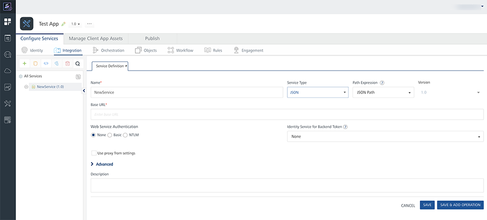
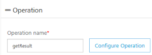
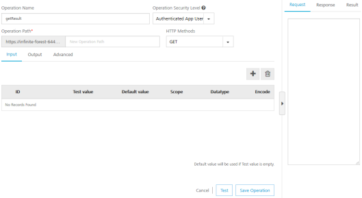
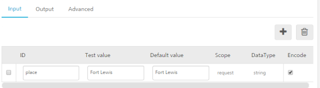
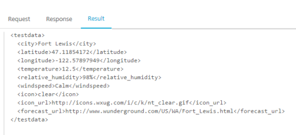

                         

Create a JSON Service
---------------------

A JSON service communicates with an external data source using JSON connector over the HTTP protocol and returns a response in JSON format. JSON is popular over XML and returns a response in JSON format.

You can use the JSON services in any case where you would use an XML service. But, the response of a JSON service is in a JSON format.

In this topic, you will learn about:

[JSON Connector Basics](#json-connector-basics)

[Create a JSON Service](#json-connector-basics)

[Publish the Service](PublishVoltMXFoundryServicesApp.md)

[Map the Service Output to Widgets on a Form](ActionsMapping.md).

### JSON Connector Basics

Notations

*   JSON Object - {}
*   JSON Array - \[\]

Important Considerations

*   JSON Array consists of an array of JSON Objects or a blank array.
*   JSON Object is a key-value pair. The key is a String and value can be a String, number(int, float, double), JSON Object, or JSON Array.
*   JSON string does not contain attributes.
*   JSON path does not provide Axes like Xpath.

Selecting Elements

  
| Element | Description |
| --- | --- |
| _elementname_ | Selects all child elements of the named Element. |
| _//_ | Selects elements in the document from the current element that match the selection no matter where they are. |

Sample Code

{

"bookstore": {

"book": \[

{ "category": "reference",

"author": "Nigel Rees",

"title": "Sayings of the Century",

"price": 8.95

},

{ "category": "fiction",

"author": "Evelyn Waugh",

"title": "Sword of Honour",

"price": 12.99

},

{ "category": "fiction",

"author": "Herman Melville",

"title": "Moby Dick",

"isbn": "0-553-21311-3",

"price": 8.99

},

{ "category": "fiction",

"author": "J. R. R. Tolkien",

"title": "The Lord of the Rings",

"isbn": "0-395-19395-8",

"price": 22.99

}

\]

}

}

Example

  
| Path Expression | Result |
| --- | --- |
| bookstore (or) /bookstore | Selects all the child elements of the bookstore element |
| bookstore/book | Selects all book elements that are children of bookstore |
| //book | Selects all book elements no matter where they are in the JSON string |
| bookstore//book | Selects all book elements that are descendant of the bookstore element, no matter where they are under the bookstore element |

Predicates

Predicates are used to find a specific element or an element that contains a specific value. Predicates are always embedded in square brackets.

  
| Path Expression | Result |
| --- | --- |
| bookstore/book\[1\] | Selects the first book element that is the child of the bookstore element |
| bookstore/book\[last()\] | Selects the last book element that is the child of the bookstore element |
| bookstore/book\[last()-1\] | Selects the last but one book element that is the child of the bookstore element |
| bookstore/book\[position()<3\] | Selects the first two book elements that are children of the bookstore element |
| bookstore/book\[price>35.00\] | Selects all the book elements of the bookstore element that have a price element with a value greater than 35.00 |
| bookstore/book\[price>35.00\]/title | Selects all the title elements of the book elements of the bookstore element that have a price element with a value greater than 35.00 |

Operators

  
| Operator | Description | Example | Result |
| --- | --- | --- | --- |
| \> | Greater than | price>9.80 | True if price is 9.90 False if price is 9.80 |
| \>= | Greater than or equal to | price>=9.80 | True if price is 9.90 False if price is 9.70 |
| < | Less than | price<9.80 | True if price is 9.00 False if price is 9.80 |
| != | Not equal | price!=9.80 | True if price is 9.90 False if price is 9.80 |
| \= | Equal | price=9.80 | True if price is 9.80 False if price is 9.90 |

### Creating a JSON Service

This procedure assumes that you have already configured Volt MX Foundry in Volt MX Iris.
To create a JSON service, do the following:

1.  In Volt MX Iris, open either an existing application or create a new one.
2.  If you have not done so already, log in to your Volt MX account. To do so, in the top right corner of the Volt MX Iris window, click **Login**. The Volt MX Account sign-in window opens. Enter your email and password credentials for your Volt MX user account, and then click **Sign in**.
3.  Create a new Volt MX Foundry application or use an existing one. To do so, on the **Data and Services** panel, click the context menu arrow, and then click either **Create New App**, or **Use Existing App**, and then select from the Volt MX Foundry Application dialog box the services application that you want to publish. The Volt MX Foundry Console opens.

    

    > **_Note:_** If you want to associate your Volt MX Iris project with a different Volt MX Foundry app, on the **Project** tab of the Project Explorer, click the context menu arrow for **VoltMX Foundry**, and then click **Unlink App**. To link to a different Volt MX Foundry app, click the context menu arrow for **VoltMX Foundry**, and then click either **Create New App**, or **Use Existing App**.

4.  To create a new integration service, on the **Integration** tab, click **CONFIGURE NEW**. The **Service Definition** section appears.

    

5.  In the **Base URL**, type the URL.
6.  Under the **Web Service Authentication**, select one of the following modes:
    *   **None**: Select this option if you do not want to provide any authentication for the service.
    *   **Basic**: Provide User ID and Password if the external Web service requires form or basic authentication.
    *   **NTLM**: Your service follows the NT LAN Manager authentication process. You are required to provide the User ID, Password, NTLM Host and NTLM Domain.
    *   Click ****Save and Continue****.
    *   On the **Operation** tab, type a new name for the operation in the **Operation Name** box.
        
        
        
7.  Click **CONFIGURE OPERATION**. The New Operation tab appears.
    
    > **_Important:_** While configuring an integration service with basic auth mode, ensure that some reserved IDs are not used as input/header IDs. Key words such as userid, pwd and password are reserved by middleware when a user selects basic auth mode.
    
    
    
8.  In the **Operation Name** text box, modify the name if required.
9.  Select one of the following security operations in the **Operation Security Level** field. By default, this field is set to **Authenticated App User.**
    
    You can restrict access to this operation based on the following levels:
    
    *   **Authenticated App User** – indicates that this operation is secured. To use this operation, an app user must be authenticated by an associated identity service.
    *   **Anonymous App User** – indicates that a user must have the app key and app secret to access this operation.
    *   **Public** – indicates that this operation requires no special security.
10.  In the **Operation Path** text box, modify the path if required.

11.  Select the required method for this operation from the 
      **HTTP Methods** field.
    
12.  Click the **Request Input** tab to provide the required
     details.

     
    

13.  Click **Response Output** and provide the required details.

  
     | ID | Path |
     | --- | --- |
     | city | //current\_observation/display\_location/city |
     | latitude | //current\_observation/display\_location/latitude |
     | longitude | //current\_observation/display\_location/longitude |
     | temperature | //current\_observation/temp\_c |
     | relative\_humidity | //current\_observation/relative\_humidity |
     | windspeed | //current\_observation/wind\_string |
     | icon | //current\_observation/icon |
     | icon\_url | //current\_observation/icon\_url |
     | forecast\_url | //current\_observation/forecast\_url |

14.  Click **Advanced** to configure the following:

    
**Custom Code Invocation**: Upload the JAR file containing the preprocessor class name and postprocessor class name. This step allows you to further filter the data received from a service call.
    
   **HTTP Headers**: You can provide the HTTP Headers for the call.
    
   **Properties**: You can configure various advanced service properties.
    
15.  Click **Test** to view the result of the operation.
    
     
    
16.  Click **Save Operation** to the save the operation.
17.  Click **Done** to save the service.
18.  To close the Volt MX Foundry Console and return to the panes, views, and tabs of the Volt MX Iris integrated development environment (IDE), from the Quick Launch Bar along the upper left edge of Volt MX Iris, click the Workspace icon . Since you are still logged in to your Volt MX account, Volt MX Iris continues to have access to your Volt MX Foundry services.
