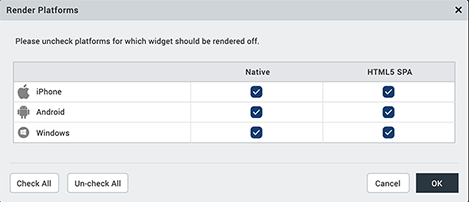
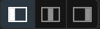
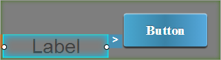

                          

Look Properties
===============

This topic describes the properties located on the **Look** tab of the Properties Editor.

**_Notes:_***   Some of the properties covered in this topic may not be applicable for all widgets.
*   When a widget is placed on a Flex form, the **Look** tab does not have margin properties, but does when placed on a VBox form.
*   The **Look** tab of a widget placed on a VBox form does not have a Flex section with its attendant flex properties.

The properties that are available on the **Look** tab vary depending on whether you place a widget on a Flex form or a VBox form.

[Flex Form Look Properties](#flex-form-look-properties)

[VBox Form Look Properties](#vbox-form-look-properties)

Flex Form Look Properties
-------------------------

The following are the Look properties available for widgets placed on a Flex form.

### ID

Denotes the name of a widget. When a widget is added to a form, a unique name is assigned to the widget. You can rename a widget by entering a new name in the **ID** box.

> **_Note:_** You can also rename a widget from the Project Explorer by right-clicking a widget, and then clicking **Rename**.

### Visible

Controls whether or not the widget is visible to the user of the app.

*   To make a widget visible, click **On**.
*   To make a widget invisible, click **Off**.

### Render

Defines whether a widget appears on a specific platform. By default, a widget is rendered for all platforms.

To change what platforms a widget is rendered for, do the following:

1.  In the Properties Editor, on the **Look** tab of a widget, click the **Edit** button that corresponds to the Render property. The Render Platforms dialog box displays.
2.  Clear the check box of the platforms for which the widget should not be rendered, and then click **OK**.

#### **The Difference between Render and Visible**

Rendering refers to the commitment of resources to generate a widget in an app for a particular platform. To be visible refers to whether the user of an app can see and interact with a rendered widget. Functionally speaking, rendering must take place before a widget can be made visible or invisible. If a widget is not rendered, the value of it's visibility property is irrelevant.

### Content Align

Allows you to define how content lines up within the widget. Following alignment options are available:

1.  Horizontal Alignment : Aligns content relative to the left and right margins of the widget.
2.  Allows you to align the content horizontal.
    
    > **_Note:_** Horizontal alignment of a widget is possible only when the Expand Horiz property is enabled.
    
3.  Vertical Alignment: Allows you to align the content vertically. This type of alignment is possible only when:
    *   Two or more widgets are placed inside a container (with horizontal orientation) such as HBox.
    *   Widget whose content is to be aligned vertically should not occupy maximum height.

You can define the content alignment of a widget specific to a platform by forking **Content Align**. For more information, see [Fork a Widget Property](Forking.md#fork-a-widget-property).

### **Text**

Specifies the text displayed on a widget.

### **Display Text**

Specifies whether the text should be displayed on a widget.

*   To display text on a widget, click **On**.
*   To hide the text on a widget, click **Off**.

You can choose to display the text specific to a platform by forking **Display Text**. For more information, see [Fork a Widget Property](Forking.md#fork-a-widget-property).

### **Flex Properties**

The Flex properties enables you to resize, move and position a widget.

### Left

Determines the left edge of the widget and measured from the left bound of the parent container.

### Right

Determines the right edge of the widget and measured from the right bound of the parent container.

### Top

Determines the top edge of the widget and measured from the top bounds of the parent container.

### Bottom

Determines the bottom edge of the widget and measured from the bottom bounds of the parent container.

### Width

Width determines the width of the widget as measured along the x-axis.

Following are the options that can be used as units of width:

*   %: Specifies the values in percentage relative to the parent dimensions.
*   px: Specifies the values in terms of device hardware pixels.
*   dp: Specifies the values in terms of device independent pixels.
*   Default: Specifies the unit that is considered as default. The default unit is specified in the Flex form's platform specific property: Default Unit.
*   Preferred Size: When this option is specified, the layout uses preferred height of the widget as height and preferred size of the widget is determined by the widget and may varies between platforms.

### Height

Height determines the height of the widget as measured along the y-axis (height of the parent). You can use any of the following options:

*   %: Specifies the values in percentage relative to the parent dimensions.
*   px: Specifies the values in terms of device hardware pixels.
*   dp: Specifies the values in terms of device independent pixels.
*   Default: Specifies the unit that is considered as default. The default unit is specified in the Flex form's platform specific property: Default Unit.
*   Preferred Size: When this option is specified, the layout uses preferred height of the widget as height and preferred size of the widget is determined by the widget and may varies between platforms.

### Min Width

Specifies the minimum width of the widget. This property is considered only when width property is not specified.

### Max Width

Specifies the maximum width of the widget. This property is considered only when width property is not specified.

### Min Height

Specifies the minimum height of the widget. This property is considered only when height property is not specified.

### Max Height

Specifies the maximum height of the widget. This property is considered only when height property is not specified.

### Center X

The Center X property refers to the center of the widget as measured from the left boundary of the parent container.

> **_Note:_** If the Layout Type is set as Horizontal, Center X is measured from the right edge of the left sibling widget.

### Center Y

The Center Y property refers to the center of the widget as measured from the top boundary of the parent container.

> **_Note:_** If the Layout Type is set as Vertical, Center Y is measured from the bottom edge of the top sibling widget.

### Z Index

Specifies the stack order of the widgets. A widget with a higher Z Index is in front of the those with a lower Z Index.

> **_Note:_** Modifying the zIndex does not modify the order of widgets inside a flex container. If widgets are overlapping with each other with the same zIndex, then the widget order decides the order of overlapping. Last added widget will be displayed on top.

Default:1 (Indicates the widgets is lowest bottom in the layer hierarchy.)

VBox Form Look Properties
-------------------------

The following are the Look properties available for widgets placed on a VBox form.

### ID

Denotes the name of a widget. When a widget is added to a form, a unique name is assigned to the widget. You can rename a widget by typing a name in the **ID** box.

> **_Note:_** You can also rename a widget from the Project Explorer by right-clicking a widget, and then clicking **Rename**.

### Visible

Controls the visibility of a widget.

*   To make a widget visible, click **On** .
*   To make a widget invisible, click **Off**.

### The Render Property

Defines whether a widget appears on a specific platform. By default, a widget is rendered for all the platforms. If you do not want to render a widget for a specific platform, click the **Edit** button against the **Render** field to open the **Fork Platforms** dialog box.

Clear the check box of the platforms for which the widget should not be rendered.

**The Difference between Visible and Render**

*   When a Widget is _not_ rendered for a platform, it implies that the widget is hidden from that specific platform.
*   Whereas, when a widget is set as invisible, it implies that the widget is available, but is invisible. This feature is useful when you wanted to display a widget based on certain conditions.

### Content Align

Allows you to define how the widget content is aligned. Following alignment options are available:

1.  Horizontal Alignment : Allows you to align the content horizontal.
    
    > **_Note:_** Horizontal alignment of a widget is possible only when the Expand Horiz property is enabled.
    
2.  Vertical Alignment : Allows you to align the content vertically. This type of alignment is possible only when:
    *   Two or more widgets are placed inside a container (with horizontal orientation) such as HBox.
    *   Widget whose content is to be aligned vertically should not occupy maximum height.
    *   The Expand Vert property is enabled for the widget whose content is to be aligned vertically.
        
        > **_Note:_** You can only view the behavior of the Expand Vert property during the Quick Preview and the Functional Preview.
        

You can define the content alignment of a widget specific to a platform by forking **Content Align**. For more information, see [Fork a Widget Property](Forking.md#fork-a-widget-property).

### Widget Align

Specifies how a widget is aligned with respect to its boundaries and its neighboring widgets (within the same container widget). Following alignments options are available:

1.  Horizontal Alignment  : Allows you to align a widget horizontally within its boundaries. This type of alignment is possible only when:
    
    *   The Expand Horiz property is disabled.
    *   The text entered in the Text box should occupy width less than the Width% set for that widget.
    
    The following table displays how a **Button** widget is aligned within its boundaries.
    
    | Left | Center | Right |
    | --- | --- | --- |
    |  |  |  |
    
2.  Vertical alignment : Allows you to align a widget vertically with respect to its neighboring widget. This type of alignment is possible only when:
    
    *   Two or more widgets are placed inside a container widget (with horizontal orientation) such as HBox.
    *   Widget that is being aligned vertically should not occupy maximum height.
    
    For example, consider a **Label** widget and a **Button** widget are placed inside an **HBox** widget. The following table demonstrates how the Label widget is aligned with respect to the Button widget.
    
    | Left | Center | Right |
    | --- | --- | --- |
    |  |  |  |
    

### **Expand Horiz**

Specifies whether widget is allowed to expand horizontally.

### **Expand Vert**

: Specifies whether widget is allowed to expand vertically.

### **Width %**

Specifies the width of a widget.

*   If the widget is directly placed on a form, the widget occupies 100 percent width.
*   If a widget is placed inside another widget, you can reduce the width of the widget. You can also lock the percentage of the width occupied by the widget.

### **Text**

Specifies the text displayed on a widget.

### **Display Text**

Specifies whether the text should be displayed on a widget.

*   To display text on a widget, click **On**.
*   To hide the text on a widget, click **Off**.

You can choose to display the text specific to a platform by forking **Display Text**. For more information, see [Fork a Widget Property](Forking.md#fork-a-widget-property).

### Margin

Defines the space around a widget. You can use this option to assign the left, top, right, and bottom distance between the widget and the next element.

  
| Property | Definition | Action |
| --- | --- | --- |
| Top | Top margin | Move the slider to adjust the top margin of the widget. |
| Right | Right margin | Move the slider to adjust the right margin of the widget. |
| Bottom | Bottom margin | Move the slider to adjust the bottom margin of the widget. |
| Left | Left margin | Move the slider to adjust the left margin of the widget. |

> **_Note:_**

*   Uniform margins are applied across the directions by clicking .
*   When widget margins are modified, it will affect the margins of its parent widget as well as that of the child widgets.  
    

The following image illustrates the Button widget forking:

  
| Before Applying Margins ||
| --- | --- |
| Iris Canvas | Margin Properties |
|  |  |
| **After applying margins** ||
| Iris Canvas | Margin Properties |
|  |  |

You can provide margins specify to a platform by forking **Margin**. For more information, see [Fork a Widget Property](Forking.md#fork-a-widget-property).

> **_Note:_** When a **Margin** property is forked, you can apply margins in either Pixels or Percentage for native applications.

### Padding

Defines the space between the content of the widget and the widget boundaries. You can use this option to assign the top, left, right, and bottom distance between the widget content and the widget's boundaries.

> **_Important:_** Default padding for Android is not set, as the devices are manufactured with predefined padding values.

  
| Property | Definition | Action |
| --- | --- | --- |
| Top | Top padding | Move the slider to adjust the top padding of the widget. |
| Bottom | Bottom padding | Move the slider to adjust the bottom padding of the widget. |
| Left | Left padding | Move the slider to adjust the left padding of the widget. |
| Right | Right padding | Move the slider to adjust the right padding of the widget. |

**_Notes:_***   When you click the Uniform Padding button , changing the value for one padding boundary changes all of them to the same value.
*   Modifying a widget's padding affects the padding of its parent and its children.

You can provide padding specify to a platform by forking a widget's padding, as illustrated in the following table. For more information, see [Fork a Widget Property](Forking.md#fork-a-widget-property).

  
| Before Applying Padding ||
| --- | --- |
| Iris Canvas | Padding Properties |
|  |  |
| **After applying paddings** ||
| Iris Canvas | Margin Properties |
|  |  |

> **_Note:_** When Padding property is forked, you can apply paddings in either Pixels or Percentage for native applications.
