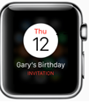
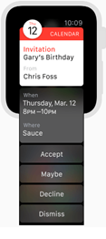
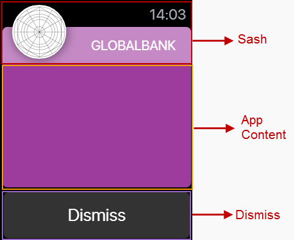
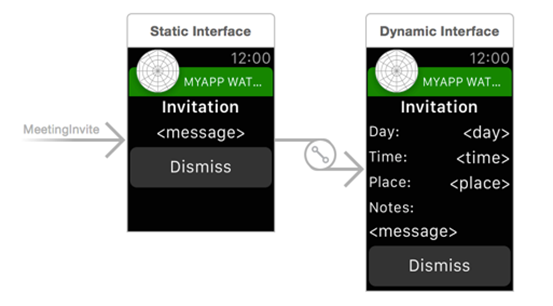

                         

Notifications
=============

A notification informs a user about information received on their Apple Watch, such as a message, an upcoming appointment, or new data. These notifications appear in the form of an alert message or a badge on the app icon. Depending on the app settings, you may also hear a voice alert when you receive a notification. The iOS platform supports both local notifications and remote notifications (or push notifications.)

A local notification is scheduled by an app and delivered on the same device. Whereas, a remote notification is sent by your server to the Apple Push Notification service (APNS) and from there the notification is delivered to your device.

The notifications you receive are either short look notification or long look notifications. To customize a

*   Short-Look Notification uses a static notification.
*   Long-Look Notification you can use both static notification and dynamic notification.

The following example shows how a notification appears on your watch.

  
| Short-Look Notification | Long-Look Notification |
| --- | --- |
|  |  |

You may receive a Short-Look notification instead of a Long-Look notification due to the following reasons:

*   Battery Saver is on.
*   You have exceed your carrier's data plan limits.
*   Data Sense is enabled and you have exceeded your specified limit.
*   Dynamic notification not configured.

A notification consist of following panes:

*   **Sash**: It is the top pane of a notification. In Sash, the app icon (you can upload the icon from the Project Settings > Apple Watch OS > Long-Look Notification Icon) and project title are displayed.
*   **App Content**: The central pane of a notification. Here, you can design a notification using the Volt MX Iris widgets.
*   **Dismiss**: The bottom pane of a notification. This pane contains system defined **Dismiss** button only. You cannot delete this button or add another widget.

Add a Static Notification
-------------------------

In Volt MX Iris, initially when you add a notification, it implies that you are adding a **static** notification. Only after you add a static notification, you can add a dynamic notification.

To add a static notification, follow these steps:

1.  Expand the **Watch** channel and hover on **Notifications** to display a drop-down arrow.
2.  Click the drop-down arrow and click **New Notification**. A new static notification is created. The system assigns a unique name to this notification.
3.  Rename the notification (if required) by clicking the drop-down arrow next to the notification and then clicking **Rename**. The notification name becomes an editable text field. Rename the notification and then press **Enter** on your keyboard.

Add a Dynamic Notification
--------------------------

You can add a dynamic notification only after you have added a static notification. For each static notification, you can add only a single dynamic notification.

To add a static notification, follow these steps:

1.  Hover on a static notification to display a drop-down arrow.
2.  Click the drop-down arrow and then click **Create Dynamic Notification**.
    
    A new dynamic notification is created with the same name as static notification and appended with the word **\[Dynamic\]**. For example, if a static notification is named **watchNotification**, its dynamic notification is named as **watchNotification \[Dynamic\]**.
    
    > **_Note:_** If a static notification is renamed, its dynamic notification is also renamed. The dynamic notification follows the naming convention **Name of the static notification + \[Dynamic\]**.
    

Difference between a Static Notification and Dynamic Notification
-----------------------------------------------------------------

*   A static notification displays the notification’s alert message and any static images and text are configured during design time.
*   A dynamic notification allows you to customize the appearance of your notification’s content. This notification is optional when designing a notification scene.
    
    
    

Notification Properties
-----------------------

The notification properties contain the following tabs:

1.  [Look](#look)
2.  [Skin](#skin)
3.  [Static Notification](#static-notification) (available only on Static Notifications)
4.  [Action](#action)
5.  [Review](#notification-label)

### Look

On the Look tab, you set properties that control the way a notification appears on a watch.

#### ID

Denotes the name of a notification. When a notification is added to a watch, a unique name is assigned to the notification. You can rename a notification by entering a new name in the **ID** box.

> **_Note:_** You can also rename a notification from the Project Explorer by right-clicking a notification, and then clicking **Rename**.

#### Padding

Defines the space between the content of the notification and the notification boundaries. You can use this option to assign the top, left, right, and bottom distance between the notification content and the notification boundaries.

  
| Property | Definition | Action |
| --- | --- | --- |
| Top | Top padding | Move the slider to adjust the top padding of a notification. |
| Bottom | Bottom padding | Move the slider to adjust the bottom padding of a notification. |
| Left | Left padding | Move the slider to adjust the left padding of a notification. |
| Right | Right padding | Move the slider to adjust the right padding of a notification. |

**_Notes:_***   Click  to apply uniform margins across all the padding boundaries of a notification.

### Skin

A skin defines the background color that you apply to a **Normal** state of a notification. For more information on skins, see [Understanding Skins and Themes](Customizing_the_Look_and_Feel_with_Skins.md).

### Static Notification

This section list the properties that you can control for static notifications.

#### Spacing

This property defines the amount of space between the widgets in a notification. The spacing values are assigned in Dp format and can take values in the range of 0-100 Dp.

#### Sash Blur

The **Sash Blur** controls the background color of Sash area. You can either have the background color of a notification as the background color of the Sash area or choose a unique background color for the Sash area. To assign a background color, do one of the following:

*   **On**: When you select **On** button next to **Sash Blur**, the Sash area background color is same as that of its notification's background color but with a blur.
*   **Off**: When you choose **Off** button next to **Sash Blur**, the Sash area background color is controlled by **Sash Color**.
    *   **Sash Color**: Click on the color palette icon next to **Sash Color** to open the color palette. Choose a required color for use as Sash area background color.

#### Title Color

Controls the font color of the title in the Sash area.

Click on the color palette icon next to **Title Color** to open the color palette. Choose a required color for use as font color for the title text.

#### Notification Label

A notification label controls the text that appear on a short notification. The **Notification Label** list displays all the **Label** widgets added to App Content pane. Click on a **Label** widget to use a notification label.

### Action

On this tab, you define the events that are executed when an action is run. For a notification, you can run the following actions:

*   onInit: This action allows you initialize your interface controller.
*   onWillActivate: This action lets you know that your interface will soon be visible to the user. Use this method only to make small changes to your interface. For example, you might use this method to update a label based on new data.
*   onDidDeactivate: This action allows you to clean up your interface and put it into a quiescent state. For example, use this method to invalidate timers and stop animations.
*   onAwake: This action is called to let you know that the interface controller’s contents are onscreen.
