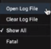

                         

Open Console Logs
=================

For performance reasons, only the 50 most recent log statements are displayed on the Logs tab of the Console. However, if you want to see earlier log activity, you can open the complete log file. The log file contains statements tracking all Volt MX Iris activity and user actions. When a log file reaches 5.2 Mb in size, it is archived and a new log file is created, picking up where the previous log file left off.

Log files are located at the following path:

C:\\Users\\<user>\\VoltMX Iris\\irisdata\\logs

To open the Console log file, do the following:

1.  On the Console, if it's not already the front-most tab, click the Logs tab.
2.  In the upper right corner of the Console, click the context menu arrow, and then select **Open Log File**. The log file opens in your computer's default text editor.

