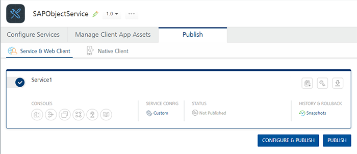
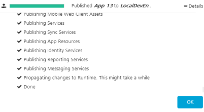

                         

Publish a Volt MX Foundry App
============================

Until an app is published, all its services and features are limited to just the Volt MX Iris development environment. To connect the app to live services, you have to publish the application to Volt MX Foundry. After you have signed in to Volt MX Foundry, you can select and publish your app to any of your cloud accounts. You can publish your app from the Volt MX Foundry Console by using the Publish tab.

**Prerequisites**

Before you can publish an app to Volt MX Foundry, you must meet the following prerequisites:

*   Have a Volt MX Foundry account.
*   Configure Volt MX Foundry in Volt MX Iris.
*   Create a Volt MX Foundry app corresponding to the Volt MX Iris app that you are publishing.

> **_Important:_** If your app contains deprecated widgets, it is possible that their skins may refer to the Helvetica font. If you are not explicitly using Helvetica in your app, you must verify your app's configuration and manually remove references to Helvetica before submitting it to the store.

This topic contains the following sections:

*   [Directly publish an app to Volt MX Foundry](#directly-publish-an-app-to-volt-mx-foundry)
*   [Publish the app from Volt MX Foundry](#publish-the-app-from-volt-mx-foundry)

Directly Publish an App to Volt MX Foundry
-----------------------------------------

From Volt MX Iris FP 35 onwards, an option to directly publish your app to Volt MX Foundry has been provided.

To directly publish an app to Volt MX Foundry, follow these steps:

1.  In Volt MX Iris, sign in to your Volt MX Cloud account. To do so, from the upper-right corner of the Volt MX Iris window, click **Login**. The Volt MX Account sign-in window opens. Type your Volt MX Cloud email and password credentials, and then click **Sign in**. Volt MX Iris uses the configured Volt MX Foundry URL to sign in to Volt MX Foundry.

    > **_Note:_** You can configure the Volt MX Foundry URL by going to: **Edit > Preferences > Volt MX Foundry**.

    > **_Important:_** If you are not able to get beyond the login page for the Volt MX Foundry Console, it could be because you set up Volt MX Foundryby using a **self-signed certificate**. The self-signed certificate allows you to install Volt MX Foundry, however, which Windows and Google Chrome do not trust the allow you to sign in. To resolve this issue, locate the certificate (you may need to contact your system administrator to do so), and then import it to the **Trusted Root Certification Authorities** folder of the Windows Certificate Store. For more information on how to import a certificate into the Windows Store, refer Import or export certificates and private keys on the Microsoft web site.

2.  Select a default environment for Volt MX Foundry. To do so, on the **Project Explorer**, click **Project Settings**.
3.  Click **VoltMX Foundry**.  
    At the top of this tab, under Volt MX Foundry Environment, select an environment from the drop-down list. Click **Done**. If you do not see any environments listed, you need to create one. For more information, refer [Environments](../../../Foundry/voltmx_foundry_user_guide/Content/Environments.md) in the Volt MX Foundry Console User Guide.

    > **_Note:_** If an environment contains an alias hostname, the alias is used in the generated [App Service Document](../../../Foundry/voltmx_foundry_user_guide/Content/Publish_LifeCycle.md#App2). The alias is used to make service calls from the client app.

4.  To publish to Volt MX Foundry, your Volt MX Iris client app must be associated with a Volt MX Foundry app, which means that you need to either create a new Volt MX Foundry app or use an existing one. To do so, at the upper-right corner of the **Data & Services** panel, click the hamburger menu icon hamburger menu icon , and then click either **Create New App** or **Link to Existing App**. From the Volt MX Foundry Application dialog box, select the app to which you want to associate your Volt MX Iris app. For more information about how to create a new Volt MX Foundry app, refer [How to Add Applications](../../../Foundry/voltmx_foundry_user_guide/Content/Adding_Applications.md) in the Volt MX Foundry Console User Guide.  
      
      
      
    Once you link your Volt MX Iris client app with a Volt MX Foundry app, the name of the linked Volt MX Foundry app is displayed beside **Foundry Backend** on the **Data & Services** panel. Here, _App 1_ is the associated Volt MX Foundry app.  
      
    

5.  Right-click Volt MX Foundry for the linked app, and then click **Publish Project Services**. The app is successfully published to Volt MX Foundry.

     > **_Note:_** If you have not done so earlier, a dialog box appears asking you to select a valid Volt MX Foundry environment.

Publish the App from Volt MX Foundry
-----------------------------------

After you have published your app to Volt MX Foundry from Volt MX Iris, you can publish the app from Volt MX Foundry. This feature is applicable only in Volt MX Iris Classic.

To publish your app from Volt MX Foundry, follow these steps:

 Once you have selected a Volt MX Foundry app to which you want to bind your Volt MX Iris app, the Volt MX Foundry Console opens. On the Volt MX Foundry console, click the **Publish** tab.

The status of the environment to which you want to publish the client app indicates whether the Volt MX Foundry app has been published.

<table style="border-left-style: solid;border-left-width: 0px;border-left-color: #ccc;border-right-style: solid;border-right-width: 0pt;border-right-color: #ccc;border-top-style: solid;border-top-width: 0pt;border-top-color: #ccc;border-bottom-style: solid;border-bottom-width: 0pt;border-bottom-color: #ccc;margin-left: 0;margin-right: auto;"><colgroup><col> <col></colgroup><tbody><tr><td><b>Status when Not Published</b></td><td><b>Status when Published</b></td></tr><tr><td></td><td></td></tr></tbody></table>

1.  If the Volt MX Foundry app to which you have bound the client app has not yet been published, select the app for publish.

      

2.  Click **Next**. The **Environments** page appears.

       

3.  The **Configure** page displays options to change the configuration of your Services. To make any changes, click **+ Service Configuration**., and then click any of the blue-text fields.

    > **_Note:_** If your app is an upload of web app ( such as SPA, Desktop Web/Responsive Web, or Progressive Web App) binary , the Configure page displays a drop-down list of options specific to the web client environment.

4.  If available, you can reconfigure the application-level settings and service configuration settings from this page .
5.  Click **Save and Publish**. The app and any associated services are published to the selected environment.

    > **_Note:_** If you are building a Volt MX Iris web app ( such as SPA, Desktop Web/Responsive Web, or Progressive Web App), you must first define and publish any required Volt MX Foundry services. After you build any web application and upload its binaries to Volt MX Foundry, you cannot publish a service to it.  
If you encounter an error while publishing the Volt MX Foundry, try publishing again.  

    

6.  To close the Volt MX Foundry Console and return to Volt MX Iris, from the Quick Launch Bar along the upper left edge of Volt MX Iris, click the Iris icon . Since you are still logged in to your Volt MX account, Volt MX Iris continues to have access to your Volt MX Foundry apps and services.
7.  Launch the app. To do so, on the **Product** menu, navigate to **Run As**, and then select an emulator to run the app on.

Environment List in Iris
------------------------------

It lists only the environments to which you have full access. In Volt MX Iris, you can view the list of all environments associated with your Foundry account. This list includes the environment with both full and read-only access.

The different types of access that a cloud account admin can provide, are:

*   **Full Access**: When your cloud account has **Full Access**, you can build your application and publish your services to Volt MX Foundry. The environment with full access is listed in Iris.
*   **No Access**: When your cloud account has **No Access**, you cannot build and publish your application to Volt MX Foundry. The environment with no access is not listed in Iris.
*   **Custom**: When your cloud account has **Custom** access, your cloud account is provided with permissions depending on the features/components. These features/components include Server, Engagement, etc. You must have one of the following feature level permissions to build your application and see these environments listed in Iris:
    *   Build Client App
    *   Server

The following table shows the actions you can perform for each access.

  
| User Access Type | Environment Access Type | View Environments in Iris | Build native Application | Build Web Application | Publish the Services |
| --- | --- | --- | --- | --- | --- |
| Full Access | Full Access | Yes | Yes | Yes | Yes |
| No Access | No Access | No | No | No | No |
| Custom | Build Client App | Yes | Yes | No | No |
| Custom | Server | Yes | Yes | Yes | Yes |

For more information about the different environment permissions of your cloud account, click [here](../../../Foundry/voltmx_foundry_user_guide/Content/Settings_Cloud.md#FeatureLevelAccessPermission-Cloud).
