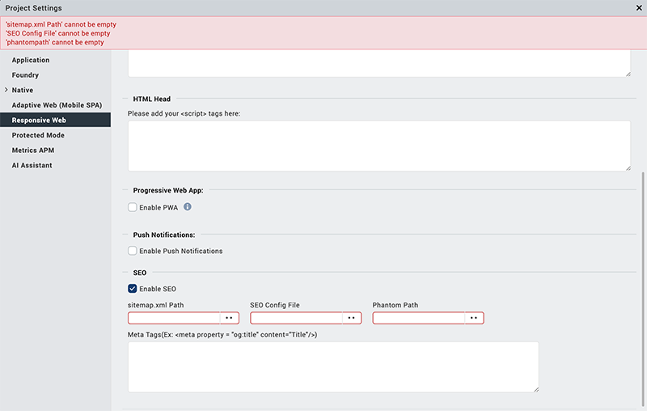

                          


Search Engine Optimization for an Adaptive Web or Responsive Web app
====================================================================

Volt MX  Iris supports search engine optimization (SEO) for Adaptive Web (single-page) apps and Responsive Web apps, making their cached web pages discoverable by search bots and spiders, such as Googlebot.

Implementing SEO in an Adaptive Web or Responsive Web app involves the following tasks. Once you have completed them, building the app optimizes it for search engines.

[Install PhantomJS](#install-phantomjs)

[Create an SEO Configuration File](#create-an-seo-configuration-file)

[Create Sitemap xml](#create-sitemap-xml)

[Create SEO Functions](#create-seo-functions)

[Call the Search Initialization as an App Service](#call-the-search-initialization-as-an-app-service)

[Set the SEO Data Ready Flag](#set-the-seo-data-ready-flag)

[Enable SEO in Volt MX Iris](#enable-seo-in-volt-mx-iris)

Install PhantomJS
-----------------

Based on WebKit, PhantomJS is a headless web page browser that pre-renders the HTML of your Adaptive Web or Responsive Web app so that its pages are accessible to search bots. To download PhantomJS, see the [Download page](http://phantomjs.org/download.html) on the PhantomJS web site.

> **_Note:_** After installing PhantomJS, you may need to ensure that its installation location is added to your computer's PATH environment variable.

Create an SEO Configuration File
--------------------------------

This .json file provides properties to PhantomJS for pre-rendering an SPA's HTML. If both the SEO configuration file and sitemap.xml define values for properties of the same name, the values defined in the SEO configuration file to precedence over those in sitemap.xml.

You specify the location of the SEO configuration file in the project settings, as described in [Enable SEO in Volt MX Iris](#enable-seo-in).

> **_Important:_** The extension of the SEO configuration file must be .json. For example: `seo.json`

### SEO Configuration File Properties

The properties that can be defined in the SEO configuration file are as follows:

<table style="width: 100%;mc-table-style: url('Resources/TableStyles/2015DefinitiveBasicTable.css');" class="TableStyle-2015DefinitiveBasicTable" cellspacing="0"><colgroup><col class="TableStyle-2015DefinitiveBasicTable-Column-Column1" style="width: 136px;"> <col class="TableStyle-2015DefinitiveBasicTable-Column-Column1" style="width: 542px;"></colgroup><tbody><tr class="TableStyle-2015DefinitiveBasicTable-Body-Body1"><td class="TableStyle-2015DefinitiveBasicTable-BodyE-Column1-Body1" style="font-weight: bold;">Property</td><td class="TableStyle-2015DefinitiveBasicTable-BodyD-Column1-Body1" style="font-weight: bold;">Description</td></tr><tr class="TableStyle-2015DefinitiveBasicTable-Body-Body1"><td class="TableStyle-2015DefinitiveBasicTable-BodyE-Column1-Body1"><code>baseurl</code></td><td class="TableStyle-2015DefinitiveBasicTable-BodyD-Column1-Body1">Provides you the option of changing the domain name or IP address of the published server specified in sitemap.xml.</td></tr><tr class="TableStyle-2015DefinitiveBasicTable-Body-Body1"><td class="TableStyle-2015DefinitiveBasicTable-BodyE-Column1-Body1"><code>port</code></td><td class="TableStyle-2015DefinitiveBasicTable-BodyD-Column1-Body1">Provides you the option of changing the port of the published server specified in sitemap.xml.</td></tr><tr class="TableStyle-2015DefinitiveBasicTable-Body-Body1"><td class="TableStyle-2015DefinitiveBasicTable-BodyE-Column1-Body1"><code>channel</code></td><td class="TableStyle-2015DefinitiveBasicTable-BodyD-Column1-Body1">Defines the channel(s) for which you want to run SEO. Possible values are:<code>mobiledesktopwebboth</code></td></tr><tr class="TableStyle-2015DefinitiveBasicTable-Body-Body1"><td class="TableStyle-2015DefinitiveBasicTable-BodyE-Column1-Body1"><code>maxiterations</code></td><td class="TableStyle-2015DefinitiveBasicTable-BodyD-Column1-Body1">Each page is fetched multiple times until the data ready flag is set, otherwise, the build can fail. The default value is 5.</td></tr><tr class="TableStyle-2015DefinitiveBasicTable-Body-Body1"><td class="TableStyle-2015DefinitiveBasicTable-BodyB-Column1-Body1"><code>contextpath</code></td><td class="TableStyle-2015DefinitiveBasicTable-BodyA-Column1-Body1">Provides you the option of changing the contextpath specified in sitemap.xml.</td></tr></tbody></table>

### SEO Configuration File Example

The following is an example of an SEO Configuration file.

<!-- ```
{
    "channel": "mobile",
    "baseurl": "localhost",
    "port": "8888"
}

``` -->

<figure class="highlight"><pre><code class="language-voltmx" data-lang="voltmx">{
    "channel": "mobile",
    "baseurl": "localhost",
    "port": "8888"
}</code></pre></figure>


Create Sitemap xml
------------------

Using the Sitemap Protocol, the sitemap for an SPA is an XML file that lists the SPA's various URLs, providing search bots a means of cataloging and listing them in search results.

In addition to URLs, a sitemap can indicate how often the content of a given URL changes, when it was last updated, and its importance relative to other URLs in the app.

A sitemap file always has the file name `sitemap.xml`.

You specify the location of the sitemap file in the project settings, as described in [Enable SEO in Volt MX Iris](#enable-seo-in).

The following is an example of a sitemap file.

<!-- ```
< urlset xmlns = "http://www.sitemaps.org/schemas/sitemap/0.9" > < url >< loc > http: //localhost:8888/test/p?title=Home</loc><changefreq>daily</changefreq><priority>1.0</priority></url> <url><loc>http://localhost:8888/test/p?title=products</loc><changefreq>daily</changefreq>        <priority>1.0</priority></url> <url> <loc>http://localhost:8888/test/p?title=categories</loc> <changefreq>daily</changefreq>        <priority>1.0</priority> </url> <url> <loc>http://localhost:8888/test/p?title=list</loc> <changefreq>daily</changefreq>        <priority>1.0</priority></url></urlset>

``` -->

<figure class="highlight"><pre><code class="language-voltmx" data-lang="voltmx">  
<urlset xmlns = "http://www.sitemaps.org/schemas/sitemap/0.9" ><url>
<loc>http: //localhost:8888/test/p?title=Home</loc>
<changefreq>daily< /changefreq>< priority>1.0< /priority></url>          <url><loc>http://localhost:8888/test/p?title=products</loc> 
<changefreq>daily</changefreq><priority>1.0</priority></url>
<url><loc>http://localhost:8888/test/p?title=categories</loc> 
<changefreq>daily</changefreq><priority>1.0</priority></url>
<url><loc>http://localhost:8888/test/p?title=list</loc>
<changefreq>daily< /changefreq><priority>1.0</priority></url>
</urlset></code></pre></figure>

Create SEO Functions
--------------------

Two functions are essential for optimizing the content of your Adaptive Web or Responsive Web app for search engines. The first initializes the app's data for searching, and the second sets a flag indicating that the data is ready to be searched. Additionally, you can use a third function to clear the flag indicating that the data is ready to be searched.

These functions reside in a JavaScript file in the Modules folder of your project.

You call the initialization function at the Channel level as an App Service, and you set the Data Ready flag once all service calls are completed. Instructions for doing so are provided in the next two procedures.

The following is an example of a JavaScript file containing these two functions.

<!-- ```
function initDeeplinkforSEO(eventObj) {
    var param = eventObj.launchparams; 
    if (param.title == "home")     return frmHome;
    if (param.title == "products")     return frm01;
    if (param.title == "categories")     return frm02;
    if (param.title == "list")     return frm03;
}

function seoReady() {    //call this method after all service calls are completed   return voltmx.application.setSEOdataReadyFlag;}

``` -->

<figure class="highlight"><pre><code class="language-voltmx" data-lang="voltmx">function initDeeplinkforSEO(eventObj) {
    var param = eventObj.launchparams; 
    if (param.title == "home")     return frmHome;
    if (param.title == "products")     return frm01;
    if (param.title == "categories")     return frm02;
    if (param.title == "list")     return frm03;
}

function seoReady() {    //call this method after all service calls are completed   return voltmx.application.setSEOdataReadyFlag;}</code></pre></figure>


Call the Search Initialization as an App Service
------------------------------------------------

Once you have created a function that initializes the app's data for searching, you create an action sequence that invokes it as a part of the App Service function. The App Service is the first event invoked when an application is launched, and so the logic for presenting search data needs to be added to the App Service function in an action sequence.

To call the search initialization as an app service, do the following:

1.  On the Project tab of the Project Explorer, click the channel for which you want to initialize search, either Desktop, Tablet, or Desktop. Doing so displays the **App Events** tab on the Properties pane.
2.  On the **App Events** tab on the Properties pane, click the **Edit** button that corresponds with App Service. An action sequence opens in the Action Editor.
3.  Scroll down in the Actions pane to the Functions section, and then click **Add Snippet**. A code snippet opens in the Code Editor.
4.  In the Code Editor, invoke the function that initializes the app's data for searching. Using the earlier example, if the function name is initDeeplinkforSEO, the code snippet would be as follows:

     return initDeeplinkforSEO (eventobject);

5.  Save the action sequence by pressing **Ctrl+S**.

Set the SEO Data Ready Flag
---------------------------

You indicate that the data of your app is ready to be optimized for search by invoking the second function that you created, which sets the Data Ready flag. This takes place at the form level of your project.

To set the Data Ready flag for a form, do the following:

1.  On the Project tab of the Project Explorer, navigate to the first form in your app, and click it. Doing so opens it in the Iris Canvas.
2.  On the Properties pane, click the **Action** tab, and under the General section, click the **Edit** button that corresponds with the postShow event. An action sequence opens in the Action Editor.
3.  Scroll down in the Actions pane to the Functions section, and then click **Invoke Function**. From the **Function Name** drop-down list in the bottom pane of the Action Editor, click the name of the function you created that sets the Data Ready flag. Using the earlier example, if the function name that would be selected is `seoReady`.
4.  Save the action sequence by pressing **Ctrl+S**.
5.  Repeat this procedure for every form in the app.

Enable SEO in Volt MX Iris
--------------------------------

With your channels, app forms, and modules properly set up for optimizing your app for search engines, you need to enable SEO in the project settings of Volt MX Iris.

To enable SEO in Volt MX Iris, do the following:

1.  On the **Project** menu, click **Settings**, and then click the **Responsive Web** tab.
2.  Configure the following settings, using the illustration below as a guide.

*   In the SEO section, click **Enable SEO**.
*   Click the **Browse** button corresponding to **sitemap.xml Path**, navigate to the location of your app's sitemap.xml file, click sitemap.xml, and then click **Open**.
*   Click the **Browse** button corresponding to **SEO Config File**, navigate to the location of your app's SEO configuration file, click it, and then click **Open**.
*   Using your computer's file explorer, navigate to the location of the executable for PhantomJS (i.e. `phantomjs.exe`), copy the folder path, and then in Volt MX Iris, paste it into the **Phantom path** text box of the **Mobile Web** tab.
*   In the Meta Tags text box, enter meta tags for the web page. The content entered in this text box is added to the Meta tag under the head section of HTML for the associated Web app during its initial page launch.

    

3.  Click **Done**.
4.  Build your app.
