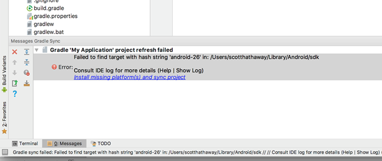
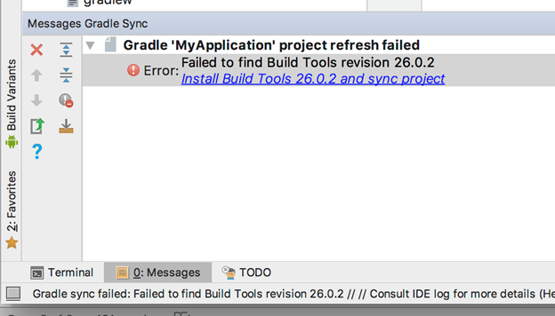
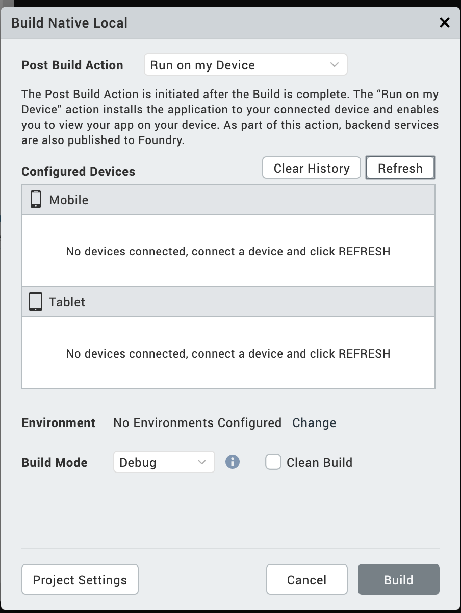
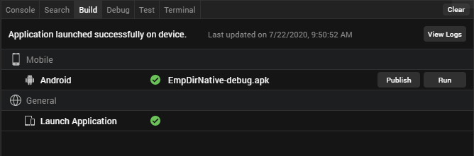
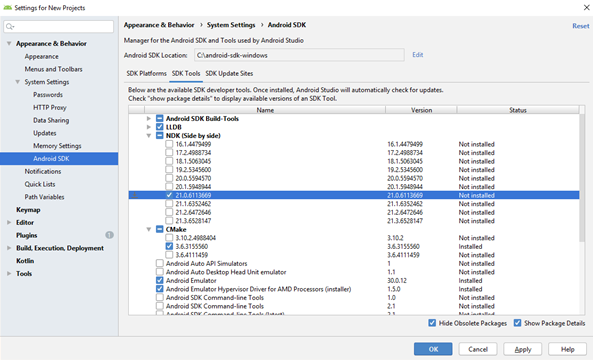
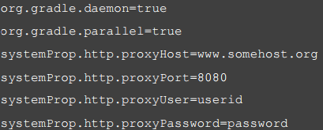

                           


Android SDK and Emulator
========================

Building and testing Android applications in Volt MX Iris requires two primary resources: Android SDK and Gradle. Gradle is an advanced build toolkit that manages dependencies and allows a developer to define custom build logic. This section describes how to install and configure these resources.

**Prerequisites that you need to download**:

For any queries you may have about installing Android SDKs and Android Studio, see [Android SDK and Platform FAQs](FAQs.md#android-sdk-and-emulator-setup-faqs).

To build and view applications on the Android platform, do the following:

*   [Download and install Android Studio](#download-and-install-android-studio)
*   [Download and unzip the Android SDK and setup necessary support packages](#download-and-unzip-the-android-sdk-and-support-packages)
*   [Configure Volt MX Iris to build for the Android platform](#configure-volt-mx-iris-to-build-for-the-android-platform)
*   [Set the Android SDK Home Environment Variable](#set-the-android-sdk-home-environment-variable)
*   [Manually Set the Android Environment Variables](#manually-set-the-android-environment-variables)  

    (This is necessary only if the Android SDK was installed after installing Volt MX Iris)
*   [Configure Device for USB debugging](#enable-usb-debugging-on-your-android-device)
*   [Listing devices and viewing logs](#list-devices-and-view-logs)
*   [Configure an Android emulator](#configure-an-android-emulator)
*   [Launch the app using Run on My Device or the Emulator Menu](#launch-the-app-using-run-on-my-device-or-the-emulator-menu)
*   [Launch the App from the Post Successful build](#launch-the-app-post-successful-build)

*   [Follow Gradle Recommendations:](#follow-gradle-recommendations)
    *   [General Recommendations](#general-recommendations)
        
    *   [Build-related Recommendations](#build-related-recommendations)
*   [Be Aware of Common Issues with Gradle Migration](#common-issues-with-gradle-migration)

Download and install Android Studio
-----------------------------------

You must install Android Studio for building and testing Android applications using Volt MX Iris. To download and install Android Studio, click [Google Android Studio](https://developer.android.com/studio/index.md).

Download and unzip the Android SDK and support packages
-------------------------------------------------------

Required SDKs and support packages can be optionally downloaded during the Android Studio installation process. If you have not downloaded the required SDKs during the Android Studio installation, you can download and install the Android Command line tools (stand-alone SDK tools) by doing the following:

To download and install the Android Command line tools and necessary support packages, do the following:

1.  Using a web browser, navigate to the Command Line Tools download section on the Android studio and SDK tools [download site](https://developer.android.com/studio/index.md).
2.  Depending on the operating system of your computer, click the appropriate SDK tools package. After reviewing the terms and conditions of the Android SDK license agreement, if you agree to them, check the option indicating that you have read and agree to them, and then click the download button.
3.  Once the zip file downloads, navigate to the downloaded zip file location and unzip it. Place the contents in a folder in your system.
    
    > **_Important:_** For Windows users, install the Android SDK to a folder with a path that has no spaces, for example:  
    C:\\Android\\android-sdk  
    The default installation path contains at least one space, which may result in the emulator not being accessible in Eclipse and, therefore, Volt MX Iris.
    
4.  Volt MX Iris Android project will download all required SDKs, support packages, and any project specific build library dependencies using the Gradle Auto Download mechanism during the Android native project build.  
      
    All required SDK, support packages, and dependent libraries are auto downloaded by Gradle build.
5.  You can also download the missing artifacts using Android Studio.
    
    Click **Install missing platform(s) and sync project** link in the message that appears.  
      
    
    
    Select the defaults through the Component Installer and wait until **Finish** is enabled.
    
    Click the **Install Build Tools 26.2 and sync project** link in the message window.  
    
    
    Select the defaults through the Component Installer and wait until Finish is enabled.
    

**Known Issues**:

*   When a download dependency is in progress, and the network disconnects in the middle, Android build may hang indefinitely. This is a known technical issue with Gradle. Refer [https://github.com/gradle/gradle/issues/868](https://github.com/gradle/gradle/issues/868) for more info. You may have to restart iris to build again.
*   When an SDK component is partially downloaded or corrupted, the build fails. Delete the corrupted SDK component and then proceed with the build.

Configure Volt MX Iris to build for the Android platform
--------------------------------------------------------------

Now that you have installed the Android SDK, you need to configure Volt MX Iris to recognize the Android platform.

To configure Volt MX Iris to build for the Android platform, do the following:

1.  In Volt MX Iris, click the **Window** menu, and then click **Preferences**.
2.  In the left pane, double-click **VoltMX Iris**, and then click **Build**.
3.  If it hasn't done so already, at this point Volt MX Iris auto-detects the Android SDK and asks if you would like to use the path that it has discovered as the Android Home. If you wish to, click **OK**. If Volt MX Iris did not auto-detect the Android SDK, in the **Android Home** text box, enter the path to the Android SDK packages. To ensure you don't introduce errors into the path that you type, you may want to click the accompanying **Browse** button, navigate to the Android SDK's location, and then click **OK**.
4.  Click **OK**.
5.  Specify which Android SDK to use when building an app. To do so, on the Project menu, click **Settings**.
6.  In the Project Properties dialog box, click the **Native** tab. A row of secondary tabs displays. From this row, click **Android**.
7.  In the **SDK Versions** section of the tab, from the **Minimum** drop-down list, ensure you set the minimum SDK version.
8.  From the **Target** drop-down list, select the SDK version you would prefer to build for.
9.  Click **Finish**.

Set the Android SDK Home Environment Variable
---------------------------------------------

The following procedure is for the Windows environment, for the Mac, run the following command:  
`export ANDROID_HOME=/<installation location>`

To set the Android SDK home environment variable, do the following:

1.  Click **Start**.
2.  Right-click **Computer**, and then select **Properties**.
3.  Click **Advanced system settings**.
4.  On the Advanced tab, click **Environment Variables**.
5.  Under User variables, click **New**.
6.  For Variable name, type the following value:  
    ANDROID\_HOME
7.  For Variable value, type the path to the parent directory where your Android SDK is installed. For instance:  
    C:\\Android\\android-sdk
8.  Click **OK** until you have closed all dialog boxes. Do not click **Cancel**.
9.  Restart your computer.

Manually Set the Android Environment Variables
----------------------------------------------

Under some circumstances, you might have to add the Android SDK environment variables manually. This is most commonly necessary if you installed Volt MX Iris before installing the Android SDK. If you already had the Android SDK installed when you install Volt MX Iris, Volt MX Iris detects the presence of the Android SDK and adds the necessary environment variables automatically.

For more information, click the procedure you want.

[Add Windows Android Environment Variables Manually](#add-windows-android-environment-variables-manually)

[Add Mac Android Environment Variables Manually](#add-mac-android-environment-variables-manually)

### Add Windows Android Environment Variables Manually

To manually set the Android environment variables for a Windows computer, do the following:

1.  Click **Start**.
2.  Right-click **Computer**, and then select **Properties**.
3.  Click **Advanced system settings**.
4.  On the Advanced tab, click **Environment Variables**.
5.  Under System Variables, double-click **Path**.
6.  Add to the Path variable the location of the `/bin` folder in 
    your installation of the JDK. For example:
   `C:\Java\jdk1.7.0_79\bin`
7.  Add to the Path variable the locations of the `/emulators, / tools`, and `/platform-tools` folders in your installation of the Android SDK. For
    example:  
   `C:\Android\android-sdk\emulator; C:\Android\android-sdk\tools;C:\Android\android-sdk\platform-tools`
8.  Click **OK** until you have closed all dialog boxes. Do not click **Cancel**.
9.  Restart your computer.

### Add Mac Android Environment Variables Manually

To manually set the Android environment variables for a Mac computer, do the following:

1.  In the home directory, locate `.bash_profile`, and then open it. If you do not have the `.bash_profile` file, create it.
2.  Add to the Path variable the locations of the `/emulators, /tools`, and `/platform-tools` folders in your installation of the Android SDK. For example:  
    `export PATH=/users/<userid>/android-sdk/emulator; /users/<userid>/android-sdk/tools; /users/<userid>/android-sdk/platform-tools:$PATH`  
    
3.  Save the file and close it.

Enable USB debugging on your Android Device
-------------------------------------------

On Android 4.1 and lower, the Developer options screen is available by default. On Android 4.2 and higher, do the following:

1.  Open the **Settings** app.
2.  Select **System**.
3.  Scroll to the bottom and select **About phone**.
4.  Scroll to the bottom and tap **Build number** 7 times.
5.  Return to the previous screen to find **Developer options** near the bottom.
6.  Scroll down and enable **USB debugging**.

List Devices and View Logs
--------------------------

To List the Android devices connected to the Windows 10 PC, do the following:

1.  Navigate to **C:\\Users\\USERNAME\\AppData\\Local\\Android\\platform-tools**.
2.  Open a command window.
3.  Run `adb devices -l` to list the Android devices connected to the Windows 10 PC.

To connect to an Android device on your Windows machine, do the following:

1.  Navigate to **C:\\Users\\USERNAME\\AppData\\Local\\Android\\tools**
2.  Run `monitor.bat` and click on the connected device.

Configure an Android Emulator
-----------------------------

Google has stopped supporting the standalone AVD manager and SDK Manager GUI tools, with latest Android SDK tools. When using, latest Android SDK tools >= 25.3.0, support for launching AVD Manager GUI to create android emulators and SDK manager to download missing components are deprecated from Volt MX Iris V9 release. You must install Android Studio on your machine to get GUI to create and use Android emulators. Click [here](https://developer.android.com/studio/run/managing-avds.md) for more information.

Alternatively, you can use avdmanager command line utility to create the emulators. Refer [https://developer.android.com/studio/command-line/avdmanager.html](https://developer.android.com/studio/command-line/avdmanager.md) for avdmanager command usage.

When using older Android SDK tools( < 25.3.0), you still would be able to create and launch AVDs using AVD Manager and SDK Manager GUI Tools.

Launch the App Using Run on My Device or the Emulator Menu
----------------------------------------------------------

1.  Open your application project in Volt MX Iris.  
    The application opens in the default view.
2.  From the **Build** menu, select **Build Native Local/Build and Publish Native**.  
    The Build Native Local/Build and Publish Native window appears.
3.  From the **Post Build Action** drop-down list, select **Run on my Device/Emulator**.  
    A new category **Configured Devices & Emulators** appears.  
    The Configured Devices & Emulators window displays available devices and emulators. Mobile Emulators appear under the Mobile section, and Table Emulators appear below the Tablets section.  
      
    
4.  Select the Emulator on which you want to test the app.
5.  Click **Build**.  
    The application generates and automatically opens on the devices or the AVD’s that are selected before. A message Application launched successfully on the device appears.
6.  Click **OK**.

There are two other options in this window that you can use.

*   **Refresh**: If you connect your device to the system after selecting the post-build action, use the Refresh option to refresh the list of connected devices and Emulators.
*   **Clear History**: Use the Clear History option to remove old entries of devices and emulators that are not available on the system.

Launch the App Post Successful Build
------------------------------------

1.  Open your application project in Volt MX Iris.  
    The application opens in the default view.
2.  From the main menu, navigate to Build, select **Build Native Local**.  
    The Build Native Local window appears.
3.  From **the** Post Build Action drop-down list, select **Generate Native App or Run on my Device/Emulator**.
4.  From the **Platforms and Channels** section, choose the channels you want to build the app.
5.  Click **Build**.  
    Once the build is complete, details of the generated binaries appear in the Build.  
      
    If you select **Run on my Device/Emulator** under the Post Build Action tab, the application installs and runs on the selected emulator.  
      
    If you select **Generate Native App** under the Post Build Action tab, then Volt MX Iris builds the app, you should run the application manually.
6.  Under the **Build** tab, you can see two sections: General and Mobile. Launch Emulators appear under the General, and Mobile platforms appear under Mobile. The mobile platform list appears based on your selection from the Build Native Local tab. This includes devices, emulators, and AVDs.  
      
    

    
7.  Click **Run** to launch the app on your AVD.

Limitations
-----------

*   Volt MX Iris does not store the details of the emulators in the **.devices** file since they do not always have the same unique identifier.

Follow Gradle-related Changes for different Volt MX Iris Versions
-----------------------------------------------------------------------

This section describes the various Gradle-related changes pertaining to different versions of Volt MX Iris.


#### Important Considerations

##### Resolve AAPT errors on Windows 8 machines

If you are using Windows 8 machines, you may run into AAPT issues. Follow these steps to resolve AAPT errors on Windows 8 machines:

1.  Install the Windows 10 Universal C Runtime from : [https://www.microsoft.com/en-us/download/details.aspx?id=48234&WT.mc\_id=rss\_alldownloads\_devresources.](https://www.microsoft.com/en-us/download/details.aspx?id=48234&amp;WT.mc_id=rss_alldownloads_devresources)
2.  Extract the downloaded zip file.
3.  Double-click the **.msu** file that corresponds to your system configuration to run the Microsoft Update Standalone Package.

If you view the alert message `Windows Update cannot check for updates, the service is not running`, follow these steps to fix the error:

1.  Click **Start** from the taskbar.
2.  In the **Search** field, type **Administrative Tools**.
3.  In the **Administrative Tools** window, double-click **Services**.
4.  In the **Services** window, right-click **Windows Update**, and then click **Properties.**  
    The **Windows Update Properties (Local Computer)** window appears.
5.  In the **General** tab, for the **Startup type**, select  **Automatic (Delayed Start)**.  
    
6.  In the **Services** window, ensure that the **Windows Update Status** has changed to **Started**, and close the window.  
    If the Windows Update Status has not changed to Started, close the window and Restart your system.

##### Limitation with 32-bit Architecture Support on Mac OS Catalina

While building an app, if the **Support for 32-bit devices** option is enabled, build issues may occur. For information on how to resolve these build issues, refer [MacOS Catalina issues](https://support.hcltechsw.com/csm?id=kb_article&sysparm_article=KB0083360).

##### Heap size issue

Depending on the available RAM, you can increase the heap size of the Android build by adding any of the following entries in gradle.properties entries:

*   `org.gradle.jvmargs=-Xmx2048m`
*   `org.gradle.jvmargs=-Xmx4096m`

For more information, refer [gradle entries](../../../Iris/iris_user_guide/Content/Native_App_Properties.md#GradleEntries).

##### Migration to AndroidX from android.support package

With the introduction of Android X packages, android.support is now deprecated.

All references to android.support made through NFIs, Android Manifest tag entries in Iris, Cordova and Reactnative entries must be replaced with androidx references manually, and the application must be rebuilt. This issue occurs due to an Android Build tools [issue](https://issuetracker.google.com/issues/122273720).  
For more information on migration to AndroidX, click [here](../../../Iris/iris_user_guide/Content/AndroidX_Behavioral_Changes.md).

##### Deprecated widgets

If an app contains deprecated widgets, when a user tries to launch the app, an exception appears and the app does not launch.

##### NDK Version Compatibility Issue

When you install the latest V9SP1GA Volt MX Iris or, if you have the Android plugin version 9.1, you may face the following build error.

What went wrong:  
Execution failed for task ':stripDebugDebugSymbols'.  
  
No version of NDK matched the requested version 21.0.6113669. Versions available locally: 20.1.5948944 (or with different version)  
  

To overcome the issue, you must install the 21.0.6113669 version of the NDK using Android Studio.

After opening the SDK manager under the SDK Tools section, select the **Show package details** checkbox to list all NDK versions in Android Studio.



If your project does not require the NDK support, you can fix the issue by renaming or deleting the NDK bundle folder in Android. The path for the NDF folder is `ANDROID_HOME/ndk-bundle`. ANDROID\_HOME is the android sdk root folder.

Follow Gradle Recommendations
-----------------------------

For using Gradle, you must go through the following sections:

*   [General Recommendations](#general-recommendations)
*   [Build-related Recommendations](#build-related-recommendations)

> **_Important:_** When you upgrade to Volt MX Iris 9.2 and later, ensure that there are no conflicts in the dependencies of the build.gradle and libs folder. For example, appcompat-v7 added to the build.gradle is X version and if the same file is in the libs folder is of Y version. Due to differences in versions of the file, following build exceptions occur.  
**duplicate entry exception or com.android.builder.dexing.DexArchiveMergerException: Unable to merge dex**  
For more information on how to debug these type of conflicts, click [here](#compilation-dependencies-and-gradle-build-java-symbol-conflicts-resolution-methodology).

### General Recommendations

*   Gradle generates a build error if it detects that a JPEG file is named as a PNG file (that is, the JPG has a .png extension). For instructions on how to automatically convert such JPGs, see [Convert JPGs named as PNGs to the PNG Format](#convert-jpgs-named-as-pngs-to-the-png-format).
*   Android has deprecated libraries that are included in earlier versions using the `libproject`mechanism.
*   The default NDK support has changed to arm-v7, so any third party FFI modules which use NDK need to include the arm-v7 libraries.
*   Libraries to be included must be added in `.aar` format in the `lib` folder.
*   Google-play-services are added from Gradle directly. You must install the Android Support Library so that the required libraries are detected.
*   For guidelines on converting to the `.aar` format, see [Migrating from Eclipse ADT](https://developer.android.com/sdk/installing/migrate.md) on the Android Developer site.
*   The Gradle build system strictly enforces its build requirements, so you must ensure that you have followed all of the Gradle requirements with regard to names, tags in xml, and so on when creating Native Android applications.

### Build-related Recommendations

Build failures occur if there are any deviations from the Android-specified requirements. To build an understanding of how Android enforces its requirements, you can create a native application and test various scenarios. In creating such an app, you will want to be aware of the following:

*   Any files not supported by Android must not reside in any part of the application folder (build folders which are generated). For example, if a file named `abc.txt` or `cert.crt` is added to the drawable folder, Gradle will fail the build.
*   FFI JARs must use correct _pro-guard obfuscation techniques_ (if you are planning to mask the jar). If they do not, build errors occur, such as _Unknown verification type \[\] in stack map frame_. This error indicates that there are masking issues with the JAR that need to be corrected.
*   Gradle generates a build error if it detects that a JPEG file is named as a PNG file (that is, the JPG has a .png extension). For instructions on how to automatically convert such JPGS, see [Convert JPGs named as PNGs to the PNG Format](#convert-jpgs-named-as-pngs-to-the-png-format). Otherwise, you can use some third party application to convert such files. The error that is generated is as follows:

`libpng warning: iCCP: Not recognizing known sRGB profile that has been edited`

#### Compilation Dependencies and Gradle Build Java Symbol Conflicts Resolution Methodology

If the build fails with the following exceptions and you do not know the root cause, following the debugging procedure provided here:

*   Execution failed for the task :**app:transformClassesWithDexForDebug**.  
    com.android.build.api.transform.TransformException: Error while generating the main dex list.
    
*   **DexArchiveException** or **ProgramTypealreadyPresent** or **DuplicateClassesException**
    

The debugging procedure for these build issues is as follows:

1.  Find the two jars/dependencies that are conflicting by making the following changes in the generated native Android build project. These latest tools will print exactly which classes conflict and their sources/origins. These are taken from [Google's suggestions form](https://issuetracker.google.com/issues/122429716):
    
    a.  Go to the folder where the native Android project is generated:
       *   For Mobile: **<workspace>\\temp\\<appid folder>\\build\\luaandroid\\dist\\<appid folder>\\**
            
       *   For Tablet: **<workspace>\\temp\\<appid folder>\\build\\luatabandroid\\dist\\<appid folder>\\**
            
    b.  Change `com.android.tools.build:gradle version` to **3.4.0-beta03** in the `build.gradle` file:  
        `buildscript {dependencies{classpath 'com.android.tools.build:gradle:3.4.0-beta03'}}`
    c.  Change the `distributionUrl` in the `gradle-wrapper.properties` file (available in **dist\\<appid folder>\\gradle\\wrapper**) to **https://services.gradle.org/distributions/gradle-5.1.1-all.zip**.
    d.  Type the following command in the command prompt, with the same directory as the native Android project: `gradlew assembleDebug`
    
    The build log then prints the complete details of all the conflicting libraries that fetch duplicate classes.
    
2.  Identify from where the conflicting dependencies are pulled by using this command: `gradlew dependencies`  
    This command helps you to view the dependency tree hierarchy in your project. You can then locate the dependency version that was enforced by the relevant compilation dependency.
3.  Resolve the conflicts by following these steps:
    
    a.  Adopt the conflict resolution strategy, if dependency version conflicts is the reason. For example, if the project specifies design dependency version (say X) and another version of design dependency (say version Y) is pulled form recursive dependencies of another dependency (say appcompat-v7), then the build fails.  
        To resolve this build issue, you can force the build to use only the Y version, regardless of any version included by the dependency tree by adding a snippet as shown in the build.gradle.
    
    > ```
configurations.all {
    >     resolutionStrategy {
    >         force "com.android.support:design:Y"
    >     }
    > }						
    > 
    > ```
    
    b.  Remove any duplicate jars or classes found in any of the .aar files and libraries.  
        For example, you can use the following script to delete the volley and gson-2.2.4 jar files from libs if they conflict with your dependencies in the build.gradle file.
        
```
task deleteJars
        {  
         delete "libs/volley.jar"   
         delete "libs/gson-2.2.4.jar"  
        }}						
        
```

> **_Note:_** To add additional entries in the build.gradle file, select the **build.gradle entries to suffix** option under the **Gradle Entries** tab in **Application Properties**. For more information on Gradle properties, click [here](Native_App_Properties.md#GradleEntries).

#### Proxy-Related Build Recommendations

If your computer has proxy settings, you can alleviate build errors at the system level, and at the project level.

##### System-Level Proxy Recommendations

To address proxy-related build issues at the system level, you can either disable your computer's proxy settings, or create a gradle.properties file to your Gradle installation.

To create a gradle.properties file, do the following:

1.  Navigate to the following folder:  
    **For Windows**  
    `C:\Users\<UserName>\.gradle`  
      
    **For the Mac**  
    `/Users/<UserName>/.gradle`  
    
2.  Create a new text file using a text editor such as Notepad or
    TextEdit, and save it with the following file name:  
    `gradle.properties`
3.  Edit the `gradle.properties` file to include the following
    settings (replace the values given in the example with your own settings).

    

4.  Replace _http_ with _https_, based on the proxy server settings.

For more information, see [The Build Environment](https://docs.gradle.org/current/userguide/build_environment.md) on the Gradle web site.

##### Project-Level Automated Recommendations

To automate project-level requirements, do the following:

*   1.  Create Android pre-compile and post-compile automated tasks. For more information, see [Android Pre-compile and Post-compile Ant Tasks Support](Inputs_to_Android_Application_Developers.md#android-pre-compile-and-post-compile-ant-tasks-support).
    2.  Add the `gradle.properties` file mentioned earlier to the project folder. For example:  
        **For Windows**  
        `C:\<workspace>\<ProjectName>  
          
        `**For the Mac**  
        `/Users/<UserName>/<Workspace>/<ProjectName>`  
        
    3.  Copy the file `androidprecompiletask.xml` from the path  
        `<workspace>\temp\DeepLinkApp\build\luaandroid\extres`  
        to  
        `<workspace>\DeepLinkApp`
    4.  Open `androidprecompiletask.xml` in a text editor such as Notepad or TextEdit, and edit it as your situation requires. For example:
    
```
<target name = "PreCompileSetup">
    <echo message = "basedir = ${basedir}, appdir = ${app.dir}, isMobileBuild = ${isMobileBuild}">
    <echo message = "Build mode = ${build.option}, Packagepath = ${packagepath}, x86 Support = ${supportx86}">
    <delete file = "${app.dir}/gradle.properties">
    <copy file = "${basedir}/gradle.properties">
    tofile = "${app.dir}/gradle.properties">
    </target>						
    
```

##### Project-Level Manual Recommendations

To manually make the necessary changes at the project level, do the following:

> **_Note:_** This needs to be done following each time you build the project

1.  In Windows Explorer or Finder, navigate to the following path:  
      
    **For Windows**  
    `` `<Workspace>\temp\<ProjectName>\build\luaandroid\dist\<ProjectName>` ``  
      
    **For the Mac**  
    `` `/Users/<UserName>/<Workspace>/temp/<ProjectName>/build/luaandroid/dist/<ProjectName>` ``  
    
2.  If you haven't done so already, edit the `gradle.properties` file to include the proxy settings mentioned earlier.
3.  Open a command or terminal window.

    *   To open a terminal on a Mac, from the Dock, select **Finder**, double-click **Applications**, next double-click **Utilities**, and then double-click **Terminal**.
    *   To open a command window in Windows, Click **Start**, and then in the **Search programs and files** text box, type _cmd.exe_. When it appears in the search results, right-click it, and then click **Run as administrator**.

4.  Navigate to the path in step 1.
5.  Build the application using the following command line:  
    `gradle assembleDebug`

#### Packaging Error Build Recommendations

Android generates a packaging error if one or more JAR files have duplicate files or classes. To solve this issue, do one of the following:

*   Manually delete duplicate files from the JAR files and perform a command-line build. To build the APK file from the command line, do the following:

1.  Open a command or terminal window.

    *   To open a terminal on a Mac, from the Dock at the top of the screen, select **Finder**, double-click **Applications**, next double-click **Utilities**, and then double-click **Terminal**.
    *   To open a command window in Windows, Click **Start**, and then in the **Search programs and files** text box, type `cmd.exe`. When it appears in the search results, right-click it, and then click **Run as administrator**.

2.  Navigate to the following path:  
    **For Windows**  
    `<Workspace>\temp\<ProjectName>\build\luaandroid\dist\<ProjectName>`  
      
    **For the Mac**  
    `/Users/<UserName>/<Workspace>/temp/<ProjectName>/build/luaandroid/dist/<ProjectName>`  
    
3.  Run the following command:  
    `gradle assembleDebug`
4.  Install the generated APK file.

*   Use the post compile task and exclude the duplicate files from getting packaged by adding the `packagingOptions` tag in the `build.gradle` file. To do so, do the following:
    
    1.  Navigate to the `build.gradle` file, which is located at the following path:  
          
        **For Windows**  
        `<Workspace>\temp\<ProjectName>\build\luaandroid\dist\<ProjectName>`  
          
        **For the Mac**  
        `/Users/<UserName>/<Workspace>/temp/<ProjectName>/build/luaandroid/dist/<ProjectName>`  
        
    2.  Open the `build.gradle` file in a text editor such as Notepad or TextEdit.
    3.  In the `build.gradle` file, inside the Android tag, add the following lines.
    
```
packagingOptions {
        exclude 'META-INF/LICENSE.txt' //File name to delete }						
    
```

Convert JPGs named as PNGs to the PNG Format
--------------------------------------------

Gradle checks for PNG files while building your application. If a JPEG file in the folder is named as a PNG file (that is, the JPG has a .png extension) Gradle generates a build error. To avoid this issue, Volt MX developed a Python script tool to check if the image files are correctly named. You can use this tool to convert the JPEG files to PNG.

To use the Python JPG conversion tool, do the following:

1.  Install the following Python executables: 

     [https://www.python.org/ftp/python/2.7.10/python-2.7.10.msi](https://www.python.org/ftp/python/2.7.10/python-2.7.10.msi)

     <!-- [http://effbot.org/downloads/PIL-1.1.7.win32-py2.7.exe](http://effbot.org/downloads/PIL-1.1.7.win32-py2.7.exe)  -->
     [http://effbot.org/downloads/PIL-1.1.7.win32-py2.7.exe](http://instaar.colorado.edu/~jenkinsc/carboClinic/Python2.7_win32_installables/) 

2.  Download the following archive from [here](../../../Iris/iris_user_guide/Content/pngConversion.zip) and execute the following command: 

$ python pngConversion.py -p E:\\res\\drawable(replace with the folder)

Common Issues with Gradle Migration
-----------------------------------

The following issues and errors can arise as a result of a Gradle migration.

**Gradle Could not resolve com.android.tools.build:gradle:1.3.1**  
This condition can occur if there is no internet connection or when the system is being used when the proxy is not set. To resolve, set the proxy, or connect the computer to an internet connection.

**Error: Gradle Wrapper not found in Android SDK**  
If you have been using Cordova applications in Iris and upgrade your Android SDK tools version to later than 25.2.5, when you build a project with Cordova support the Gradle Wrapper not found error occurs. Android removed Gradle wrapper package from the Android SDK tools version later than 25.2.5. As a result, Gradle wrapper does not exist in the Android SDK PATH and that results in the error.

To resolve, add Gradle to your path environment variable. For more information, refer to Gradle in [Android Platform Guide](https://cordova.apache.org/docs/en/latest/guide/platforms/android#installing-the-requirements).

**Error: Unsupported type net, etc.**  
This condition can occur if the application is packing some internal files which are used in the android fwk, this would normally happen if the application is be packing \*.xml which can be found in the following folder:  
`..\resources\res\values`  
To resolve, modify the XML files to change the custom tags net to string.

**Duplicate Entry error**  
Occurs when the same .jar files are being added multiple times, or when different .jar files have the same classes. To resolve, remove the duplicate classes from .jar files.

**Gradle OOM issue**  
To resolve, add javaMaxHeapSize (build.gradle), org.gradle.jvmargs(gradle.properties) values to the script. These are general options, which you can configure according to the needs of your app.

**Peer not authenticated (proxy with https setting)**  
To resolve, download the local proxy server certificate and add it to the Java Key store.

**Error: Could not create the Java Virtual Machine**  
Usually occurs when Gradle is not able to allocate the required memory to build the project, generally noticed on 32-bit computers. If the error occurs on a 64-bit computer, add javaMaxHeapSize (build.gradle), org.gradle.jvmargs (gradle.properties) values to the script. These are general options, which you can configure according to the needs of your app.
