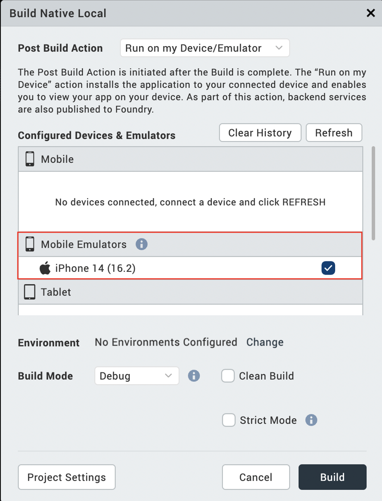

                          

iOS SDK and simulator
======================

Building and testing iOS and iPadOS applications on a device or simulator via Volt MX Iris requires Xcode, the development environment containing the SDK for iOS, iPadOS, and watchOS

In Volt MX Iris V9 SP2 GA version and later, you can view the list of simulators within Iris and run your apps on the simulators directly from Iris. When you open any project, you can view simulators from the Build menu. Previously, if you wanted to launch an app, you had to create a binary file and install it on a device. With this new capability to view the simulators within Iris, the aforementioned steps are performed by Iris, making the process seamless.

You cannot create simulators directly within Volt MX Iris. However, you can view the simulators running on the system. So, before you can get started using the simulators, you must first ensure that you have at least one simulator configured in Xcode.

> **_Note:_** iOS, iPadOS, and watchOS-related code and applications can only be built and tested on a macOS machine.

Prerequisites
-------------

*   Volt MX Iris V9 SP2 GA or later
*   Access to a Volt MX Cloud account
*   Xcode installed on your Mac
*   Configured simulators in Xcode (ensure that simulator is launched)

For information on how to create emulators, see Apple [documentation](https://developer.apple.com/documentation/xcode/running-your-app-in-simulator-or-on-a-device/).

In all, getting your system set up to build and test iOS applications in Volt MX Iris involves The following tasks.

1.  [Confirm your system meets iOS and iPadOS development requirements](#confirm-your-system-meets-iOS-and-iPadOS-development-requirements)
2.  [Download install and configure Xcode](#download-install-and-configure-xcode)
3.  [Launch the app using Run on my Device or the Emulator Menu](#launch-the-app-using-run-on-my-device-or-the-emulator-menu)
4.  [Launch the app Post Successful Build](#launch-the-app-post-successful-build)
    

Confirm your system meets iOS and iPadOS development requirements
-------------------------------------------------------------------
To develop for the iOS and iPadOS platforms and run on simulators, your computer needs to meet certain hardware and software requirements.

*   Apple computer with a x86-64/M1/M2 CPU
*   150 GB of internal storage
*   4 GB of memory
*   Network interface card
*   Mac OS Catalina version 10.15.6 and higher

Download Install and Configure Xcode
--------------------------------------

Xcode, the Apple development environment for creating iOS and iPadOS apps, contains the simulators you need to emulate iOS devices in Volt MX Iris. However, it is not automatically installed when you install Volt MX Iris. Volt MX Iris supports Xcode 12.5,  Xcode 13, and Xcode 14.

To download, install, and configure Xcode, do the following:

1.  In a browser, navigate to the [Apple Developer site](https://developer.apple.com/downloads/index.action), and log in to your Apple developer account. If you do not have one, create one.
2.  Navigate to the [Apple developer download page](https://developer.apple.com/downloads/index.action).
3.  From the list of downloads, double-click the listing of the version of Xcode you want to download, and then click the listed .dmg file to initiate the download.
4. Once the package has downloaded to your Mac, open the Downloads folder, double-click the file you just downloaded, and then follow the prompts to install Xcode.
5.  When Xcode has finished installing, launch it by opening the _Applications_ folder, and clicking **Xcode**.
    
    > **_Important:_** It is imperative that you launch Xcode so that it runs its initialization and configuration routines. Until it does so, you cannot use iOS simulators in Volt MX Iris.

6.	Once it has finished its automated configuration, you can quit Xcode.

Launch the App Using Run on My Device or the Emulator Menu
------------------------------------------------------------

1.  Open your project in Volt MX Iris; it opens in the default view.
2. 	From the **Build** menu, select **Build Native Local**. The Build Native Local window appears. 
3.  From the **Post Build Action** drop-down list, select **Run on my Device/Emulator**. A new category **Configured Devices & Emulators** appears. It displays available devices and emulators/simulators. Mobile simulators appear under the Mobile Emulators section, and Tablet simulators appear below the Tablet Emulators section. Running to a watchOS device/simulator from this menu is not supported.

     

     

4. Select the simulator(s) on which you want to test the app. 
5. Click **Build**. The application generates and automatically opens on the selected device or simulator(s).

There are two other options in this window that you can use.

* **Refresh**: If you connect your device to the system after selecting the post-build action, use the Refresh option to refresh the list of Connected Devices and Emulators.
* **Clear History**: Use the Clear History option to remove old entries of devices and simulators that are not available on the system.

Launch the App Post Successful Build
------------------------------------

1.	Open your project in Volt MX Iris.
2.	From the main menu, navigate to Build, select **Build Native Local**. 
3.	From the Post Build Action drop-down list, select **Generate Native App**.
4.	From the **Platforms and Channels** section, choose the channel(s) you want to build.
5.	Click **Build**. Once the build is complete, details of the generated binaries appear in the build tab. You can see sections based on what channels you selected (i.e. Mobile, Tablet, Universal, Wearables).
    

    

6.	Click **Run**. The Run on my local device window appears. This displays the list of simulators on which you can launch your app.
7.	Select one or more simulators, and click **Run**.

Limitations
-----------

iOS and iPadOS Simulators on Windows
-------------------------------------

* When you select Run on Device/Emulator from the Post Build Action list, Volt MX Iris fetches the list of simulators from the cached data. The list is available in the location users/username/Iris/irisdata/devices/.devices
* If you provide details about the MAC in Volt MX Iris, the build process takes some time to launch the simulators as you are accessing the MAC using the remote connection.
* Click on the refresh button available on the pop up to fetch the current list of simulators.
* If you do not provide any MAC details, Volt MX Iris does not display any simulators.

> **_Note:_** If you want to add the MAC details in the Volt MX Iris, from the Edit menu, click Preferences, and from the Iris Preferences window, click Mac Details. Fill the Mac details in the provided text boxes.