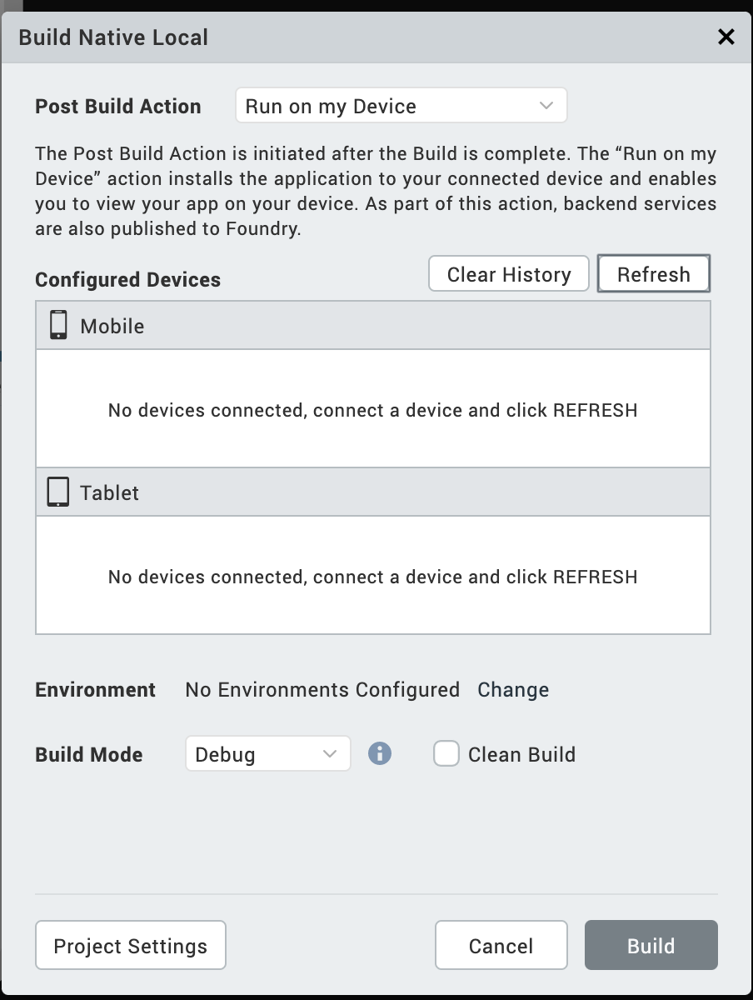

                          

iOS SDK and Emulator
====================

Building and testing iOS applications in Volt MX Iris requires two primary resources: Java SE 7 runtime, which is required by Eclipse, the hosting application of Volt MX Iris; and XCode, the SDK for iOS and Mac OS. You are prompted to install these two resources the first time you launch Volt MX Iris.

In Volt MX Iris V9 SP2 GA version, you can view the list of emulators within Iris and run your apps on the emulators directly from Iris. When you open any project in Iris, you can view emulators from the Build menu. Previously, if you wanted to preview an app, you had to create a binary file, install it on a device, and then launch the application. With this new capability to view the emulators within Iris, you can skip the process of creating a binary and installing it directly on the device/emulators. You can now directly go to the last step of launching the app in an emulator to view the app in action.

You cannot create the emulators directly within Volt MX Iris. However, you can view the emulators on the system using XCode (emulators). So, before you get started with using the emulators, you must first ensure that you have a few emulators configured in XCode.

> **_Note:_** iOS-related code and applications can only be developed on a Mac OS computer.

Prerequisites
-------------

*   Volt MX Iris V9 SP2 GA or later
*   Access to a Volt MX Cloud account

*   Install XCode on your Mac
*   Configured Emulators in the XCode, Ensure that you launch the Emulator via XCode

For information on how to create emulators, see Apple [documentation](https://developer.apple.com/documentation/xcode/running_your_app_in_the_simulator_or_on_a_device).

In all, getting your system set up to build and test iOS applications in Volt MX Iris involves The following tasks.

1.  [Confirm your system meets iOS development requirements](#confirm-your-system-meets-ios-development-requirements)
2.  [Download and install Java SE 7 runtime](#download-and-install-java-se-7-runtime)
3.  [Download, install, and configure XCode](#download-install-and-configure-xcode)
4.  [Launch the app using Run on my Device or the Emulator Menu](#launch-the-app-using-run-on-my-device-or-the-emulator-menu)
    
5.  [Launch the app from the Post Successful Build](#launch-the-app-post-successful-build)
    

Confirm your system meets iOS development requirements
------------------------------------------------------

To develop for the iOS platform and run its emulators, your computer needs to meet certain hardware and software requirements.

*   Apple computer with a x86-64 CPU (64-bit Intel Core 2 Duo, Intel Core i3, Intel Core i5, Intel Core i7, or Xeon processor.)
*   150 GB of internal storage
*   4 GB of memory
*   Network interface card
*   Mac OS Catalina version 10.15.6 and higher

Download and install Java SE 7 Runtime
--------------------------------------

Eclipse, the integrated development environment (IDE) application, requires Java SE 7 to run, but it is not automatically installed when you install Volt MX Iris. You are prompted to install it when you first launch Volt MX Iris.

To download and install Java SE 7, do the following:

1.  Launch Volt MX Iris. By default it is installed in the Applications folder.
2.  As Eclipse and Volt MX Iris load, a dialog box displays informing you that Java SE 7 runtime is required. Click **More info** to launch the Apple download site for Java SE 7 runtime.
3.  The Apple Support website opens in the Safari web browser. Follow the prompts to download Java SE 7 runtime. It will likely have an alternate name, such as Java for OS X.
4.  Once the download package has downloaded to your Mac, open the _Downloads_ folder, and double-click the file you just downloaded.
5.  Follow the prompts to install Java SE 7 runtime.

Download, Install, and Configure XCode
--------------------------------------

XCode, the Apple SDK for creating iOS apps, contains the simulators you need to emulate iOS devices in Volt MX Iris. However, it is not automatically installed when you install Volt MX Iris. It is imperative to install XCode before working with Volt MX Iris. Volt MX Iris supports XCode 12.5 and XCode 13.

To download, install, and configure XCode, do the following:

1.  In a browser, navigate to the [Apple Developer site](https://developer.apple.com/downloads/index.action), and log in to your Apple developer account. If you do not have one, create one.
2.  Navigate to the [Apple developer download page](https://developer.apple.com/downloads/index.action). The URL is as follows:  
    `https://developer.apple.com/downloads/index.action`
3.  From the list of downloads, double-click the listing of the version of XCode you want to download, and then click the listed .dmg file to initiate the download.

5.  Once the download package has downloaded to your Mac, open the _Downloads_ folder, double-click the file you just downloaded, and then follow the prompts to install XCode.
6.  When XCode has finished installing, launch it. To do so, open the _Applications_ folder, and then click **XCode**.
    
    > **_Important:_** It is imperative that you launch XCode so that it runs its initialization and configuration routines. Until it does so, you cannot use iOS simulators in Volt MX Iris.
    
7.  Once it has finished its automated configuration, quit XCode.

Launch the App Using Run on My Device or the Emulator Menu
----------------------------------------------------------

1.  Open your application project in Volt MX Iris.  
    The application opens in the default view.
2.  From the **Build** menu, select **Build Native Local/Build and Publish Native**.  
    The Build Native Local/Build and Publish Native window appears.
    
    > **_Note:_** For iOS, Launching an Emulator is not supported through the Build and Publish Native option.
    
3.  From the **Post Build Action** drop-down list, select **Run on my Device/Emulator**.  
    A new category **Configured Devices & Emulators** appears.  
    The **Configured Devices & Emulators** window displays available devices and emulators. Mobile Emulators appear under the Mobile section, and Tablet Emulators appear below the Tablets section.  
      
    
4.  Select the Emulator on which you want to test the app.
5.  Click **Build**.  
    The application generates and automatically opens on the devices or the emulators that are selected before. A message Application launched successfully on the device appears.
6.  Click **OK**.

There are two other options in this window that you can use.

*   **Refresh**: If you connect your device to the system after selecting the post-build action, use the Refresh option to refresh the list of connected devices and Emulators.
*   **Clear History**: Use the Clear History option to remove old entries of devices and emulators that are not available on the system.

Launch the App Post Successful Build
------------------------------------

1.  Open your application project in Volt MX Iris.  
    The application opens in the default view.
2.  From the main menu, navigate to Build, select **Build Native Local**.  
    The Build Native Local window appears.
3.  From **the** Post Build Action drop-down list, select **Generate Native App or Run on my Device/Emulator**.
4.  From the **Platforms and Channels** section, choose the channels you want to build the app.
5.  Click **Build**.  
    Once the build is complete, details of the generated binaries appear in the Build.  
      
    If you select **Run on my Device/Emulator** under the Post Build Action tab, the application installs and runs on the selected emulator.  
      
    If you select **Generate Native App** under the Post Build Action tab, then Volt MX Iris builds the app, you should run the application manually.
6.  Under the **Build** tab, you can see two sections: General and Mobile. Launch Emulators appear under the General, and Mobile platforms appear under Mobile. The mobile platform list appears based on your selection from the Build Native Local tab. This includes devices, emulators, and AVDs.  
      
    
7.  Click **Run** to launch the app on your device/emulator.

Limitations
-----------

**iOS emulators on Windows**

*   When you select Run on Device/Emulator from the Post Build Action list, Volt MX Iris fetches the list of emulators from the cached data. The list is available in the location `users/username/iris/irisdata/devices/.devices`
*   If you provide details about the MAC in the Volt MX Iris, the build process takes some time to launch the emulators as you are accessing the MAC using the remote connection.
*   Click on the refresh button available on the pop up to fetch the current list of emulators.
*   If you do not provide any MAC details, Volt MX Iris does not display any emulators.

> **_Note:_** If you want to add the MAC details in the Volt MX Iris. From the Edit menu, click Preferences, and from the Iris Preferences window, click Mac Details. Fill the Mac details on the provided Text boxes.
