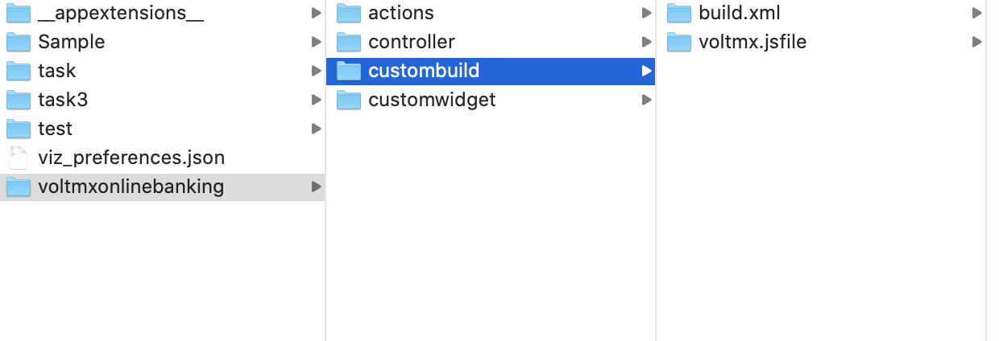

                          


Securing your Web Applications
==============================

Client- side attacks leave your web applications vulnerable, allowing attackers to steal data. Obfuscators protect your apps from reverse engineering and malware attacks. Using Volt MX Iris V9 SP2, you can create a post-build hook for your Adaptive Web or Desktop Web applications.

> **_Note:_** Ensure that the Volt MX Iris Application is working before you implement obfuscation.  
Also, make sure that the obfuscation of the web artifact works before importing it into Volt MX Iris.

To implement obfuscation in your web apps, do the following:

1.  Navigate to the location of your project. For example, `<your workspace folder>/<appid>/`.
2.  Create a New Folder with the name **custombuild**.
3.  In the **custombuild** folder, create a new file, **build.xml**.
4.  In the build.xml file, create an ANT task, **postbuild**.
    
    1.  In the postbuild task, write a code that implements an obfuscation of your choice.
    2.  After you implement an obfuscation, write a code to replace the existing artifact in the web artifact folder with the protected artifact.  
        The protected artifact is generated as the output from the obfuscator tool.
    
    Here is an example of the contents of the **build.xml** file with the **postbuild** task:
    
```
<?xml version="1.0" encoding="UTF-8"?>
    <project name="CustomBuildTask" basedir=".">
        <target name="postbuild"  description="post build for spa/desktopweb">
            <echo message="Post Build Started for Project :: ${projname}" />
            <!-- Code to generate protected artifact from chosen obfucator and replacing the existing webartifact -->
            <!-- App Developer Code start -->
            <exec executable="cmd" failonerror="true">
                <arg line="${project.loc}\custombuild\somebatch.bat --app ${webartifactpath} -- ANY OTHER INPUTS FOR YOUR OBFUSCATOR" />
                <redirector output="${basedir}\protected_ob.log" alwayslog="true"></redirector>
            </exec>
            <!-- start error message code - to halt the system when any error occurs -->
            <loadfile srcfile="${basedir}\protected_ob.log" property="errorline">
                <filterchain>
                    <linecontains>
                        <contains value="ERROR, UNEXPECTED EXCEPTION"></contains>
                    </linecontains>
                </filterchain>
            </loadfile>
            <fail message="Unable to obfuscate - ${errorline}">
                <condition>
                    <contains string="${errorline}" substring="ERROR, UNEXPECTED EXCEPTION"/>
                </condition>
            </fail>
            <!-- error message Code end -->
            <!-- replacing old artifact with protected artifact start-->
            <move  file="${webartifactfolder}/${projname}.${webartifacttype}" tofile="${webartifactfolder}/${projname}-old.${webartifacttype}"/>
            <move  file="${basedir}/protected_${projname}.${webartifacttype}" tofile="${webartifactfolder}/${projname}.${webartifacttype}"/>
            <!-- replacing old artifact with protected artifact end-->
            <!-- App Developer Code end -->
        </target>
    </project>
```
    
    5. Once you create the ANT task, save and close the file.

      > **_Note:_** Ensure that you exclude any variables with global scope from obfuscation.
      
    6.  Build the project. After the project is built, the protected binary is uploaded to Volt MX Foundry.  
    Once the build is completed, you must publish the app to your [Foundry environment](PublishVoltMXFoundryServicesApp.md). Once you publish the app, you will get the Web Application URL.

 

Secure Web Application by using CI Build
========================================

From Volt MX Iris V9 SP2 GA, developers can build protected mode web applications by using the Iris CI build feature. The Iris CI build feature is implemented only through command prompt.

> **_Note:_** You can also secure your web apps by using the CI/CD builds in HCL App Factory. For more information, refer to [Building a Iris app in App Factory](../../../Foundry/voltmx_appfactory_user_guide/Content/BuildingAnApp.md#Web_Protection) .

During the implementation, you can view protection presets in the CI build.

There are three different Protection build presets. Based on your requirements, you can choose one of the following presets.

*   **Basic**: Provides the basic level protection.
*   **Moderate**: Provides moderate level protection. CI build for this preset takes some time to process and the produced output is big in size.
*   **Custom**: This preset is used to customize the protection level. This option is recommended only when the application doesn’t meet the Basic or Moderate protection requirements.

To implement the Secure Web applications using CI build, do the following:

Before you get started, raise a ticket with the support team to get a **securejs.properties** file. To know how to generate the encryption keys, click [here](ApplicationSecurity_Web.md#rsa-key-pair-generation-encryption-and-usage).

1.  On your computer where Volt MX Iris is installed, navigate to Iris workspace.
2.  Open **HeadlessBuild.properties** in a source code editor.
3.  For the following properties, enter their corresponding values or paths.
    
    1.  Modify the **protectedmodeenabled.web** property value to true.
    2.  **web.protection.properties**\= `<path_to_securejs_properties_file>`
    3.  **web.encryption.dir**\= `<path_to_ encryption_keys_directory>`
    4.  **web.protection.preset**\=BASIC/MODERATE/CUSTOM
    5.  **web.custom.protection.blueprint.path**\= `<path_to_custom_blueprint_file>`(optional)
    
    > **_Note:_** When preset and blueprint paths are provided, the blueprint file takes the priority. The blueprint file will overwrite any existing preset files.  
    When you choose CUSTOM as the preset, ensure that you provide the path to the blueprint file.
    
    > **_Note:_** A custom blueprint file is a JSON file that is used to increase the protection level of the application. This file is provided by the Volt MX support team on a need basis.
    
4.  By default, Iris includes all the files in the directory for protection. To exempt certain files from protection, follow these steps.  
    
    1.  Navigate to the **custombuild** folder.
    2.  Create a new text file in it and rename the file **excludefileslist.txt**.
    3.  In the text file, add names of files and folders in you want to exempt from protection. For example,  
        
        @cacheid@/desktopweb/jslib/tparty  
        @cacheid@/desktopweb/resources/strings
        
    4.  Open the **Headlessbuild.properties** file in the **edit** mode.
    5.  Provide the path for web protection exclude list in the following format.  
        **web.protection.excludelist**\=`<path_to_exclude_list_file>`
    
    Here is how a sample **Headlessbuild.properties** file looks.
    
```
  
  
    #properties for doing Web Protected build.  
   #This feature only supports web platforms  
   #Set the value to true to enable Web obfuscation  
   protectedmodeenabled.web=true  
   #Provide full path of securejs properties file  
   web.protection.properties=<path_to_securejs_properties>  
   #Provide full path of web encryption keys directory  
   web.encryption.dir= <path_to_encryption_keys>  
   #Provide Web Protection Configuration Options: BASIC,MODERATE,CUSTOM  
   web.protection.preset =BASIC  
   #Provide Absolute path of custom protection blueprint json file web.custom.protection.blueprint.path=<path_to_custom_blueprint_file>  
   #Provide Absolute path of excludelist.txt file  
   web.exclude.file.list.path=<path_to_excludelist_text_file>  
   ```

  6.  Build the application.  
      Iris takes some time to build the project.  
      After the build completes, Iris displays a success message.

Implement Obfuscation for Web Apps
----------------------------------

If you want to implement obfuscation for your web apps, do the following:

Before you get started, raise a ticket with the support team to get a **securejs.properties** file.

1.  Navigate to the location of your project. The path may look like `<your workspace folder>/<appid>/`  
    
2.  Download the [custombuild.zip](https://docs.voltmx.com/voltmxlibrary/iris/zip/user_guide/custombuild.zip) file
3.  Copy the**securejs.properties** file received over customer service ticket into `<your workspace folder>/<appid>/custombuild` folder.
4.  To exempt certain files from protection do the following, in the custombuild folder, create a text file excludefilelist.txt. In the text file, add sections of the application(you can add both files and/or directors) to exclude.
    *   Ensure that each path is defined in a new line. For example,  
        @cacheid@/desktopweb/jslib/tparty  
        @cacheid@/desktopweb/resources/strings
        
        > **_Note:_** @cacheid@ is the placeholder to be replaced within the **build.xml** in the custombuild folder.
        
          
        
        
5.  Build the project.  
    After the project is built, the protected binary uploads to the Foundry environment.
    
6.  Once the build is completed, publish the app to your [Foundry environment](../../../Iris/iris_user_guide/Content/PublishVoltMXFoundryServicesApp.md).  
    Once the app is published, you will receive the Web Application URL.
