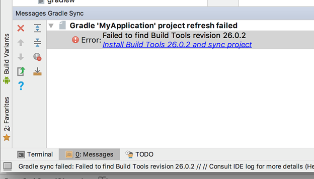

                         

Setting a New Android Environment in Windows
============================================

This section explains how to set up new Android Environment on Windows.

1.  Download the latest version of Android Studio for the desired operating system. [https://developer.android.com/studio/index.html](https://developer.android.com/studio/index.md)
2.  Install Android Studio.
3.  Start Android Studio.
4.  Following the instructions by the Android Studio install wizard to download and install SDK Components. Select default options as required.
5.  Start a new Android Studio project.
6.  In the Target Android Devices page, make sure to select the form factor and minimum SDK as **API 27**.  
    
7.  Continue selecting defaults until the **Finish**button is available.
8.  At this point, the AVD button in the top right will be greyed out.  
    
9.  Click **Install missing platform(s) and sync project** link in the message that appears.  
    
10.  Select the defaults through the Component Installer and wait until **Finish** is enabled.
11.  Click the **Install Build Tools 26.2 and sync project** link in the message window.  
    
12.  Select the defaults through the Component Installer and wait until Finish is enabled.
13.  Wait for the Gradle build to complete, and the AVD button should now enable.  
    
14.  Click the AVD button and select **Create Virtual Device**.
15.  Select **Nexus 5X** and then click **Next**.
16.  Download the **Oreo API 26 x86 image** from the **Recommended** tab.  
    
17.  Once the download completes, finish the setup with defaults.
18.  Launch the emulator from the **AVD window**.
19.  Open Volt MX Iris.
20.  Navigate to **Edit** > **Preferences**.
21.  Select > **Build**.
22.  Set the Android Home field to the same location as the SDK install location of Android Studio and then click **Apply**.
    
    If you have trouble finding this, in Android studio open the SDK Manager and look at the Android SDK Location.
    
23.  Open the Preferences again and navigating to **VoltMX Iris** > **Emulators** > **Mobile** > **Android**
24.  Click on the **+** sign
25.  Set the name to **Nexus5X**.
26.  Set the emulator location by browsing to the SDK location tools directory and selecting the emulator launcher.
27.  Select **Nexus\_5X\_API\_276** for the AVD Name. (If it is not there, you might need to restart Iris)
28.  Click **Save** and then **OK**.

> **_Note:_** If you are asked to install the Intel HAXM software, install the software.

> **_Important:_** There is a bug in Iris for Windows that stops the emulator from launch when you click **RunAs**. You must launch the emulator first from AVD to work around this issue.
