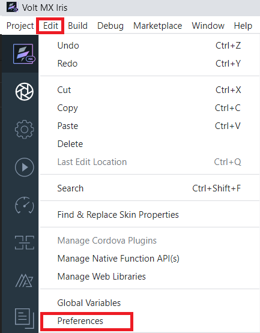
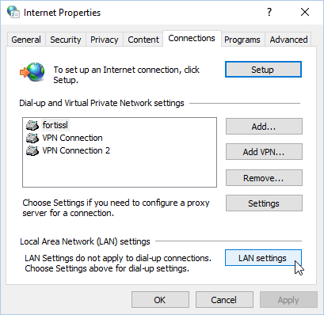
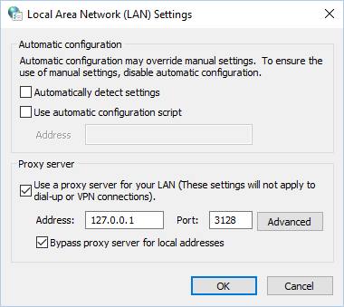

                          

Use a Proxy Server
==================

If your network configuration uses a proxy server, you can configure Volt MX Iris to recognize it, whether it is a Basic or NTLM proxy. If yours is an NTLM proxy server, you must follow the procedures for both the Basic proxy and the NTLM proxy.

[Basic Proxy Configuration](#basic-proxy-configuration)

[NTLM Proxy Configuration](#ntlm-proxy-configuration)

Basic Proxy Configuration
-------------------------

Configuring Volt MX Iris to recognize a Basic proxy server involves the following procedures:

[Configure the Proxy Server in Volt MX Iris](#configure-the-proxy-server-in)

[Configure a Manual Proxy for Your Computer](#configure-a-manual-proxy-for-your-computer)

### Configure the Proxy Server in Volt MX Iris

If your network configuration uses a proxy server, you can configure Volt MX Iris to recognize the specific proxy configured.

If you have not configured the Proxy Server during the Installation process, you can enable Proxy configuration and edit the Proxy Settings through the Preferences section in Volt MX Iris.

To configure the proxy server in Volt MX Iris, follow these steps:

1.  In Volt MX Iris, click **Edit** > **Preferences**.  
    The **Iris Preferences** window appears.  
    
2.  Click the **Proxy** tab.
3.  Under the **Proxy Settings** section, select the **Enable Proxy** check box.  
      
    
4.  From the **Proxy Type** list, select the type of the Proxy Service that you want to configure, either Basic or NTLM.
    
    > **_Note:_** You can only configure a BASIC Proxy.
    
5.  In the **Proxy Host** text box, enter the value of the proxyHost.
6.  In the **Proxy Port** text box, enter the value of the proxyPort.
7.  In the **Proxy Username** text box, enter the username to sign in to the Proxy Server.
8.  In the **Proxy Password** text box, enter the password to sign in to the Proxy Server.
9.  In the **No Proxy Hostnames** text box, enter the URL of the domain that must bypass the Proxy server. You can also provide a list of URLs separated by commas.
10.  After you provide all the inputs, click **Validate** to verify the connection.  
    Once all the details are validated, the Done button is enabled.
11.  Click **Done**.

### Configure a Manual Proxy for Your Computer

In addition to configuring Volt MX Iris to recognize the proxy server, your operating system needs to be configured, as well. Doing so differs between Mac and Windows computers.

[Configure a Manual Proxy for a Mac](#configure-a-manual-proxy-for-a-mac)

[Configure a Manual Proxy for Windows](#configure-a-manual-proxy-for-windows)

#### Configure a Manual Proxy for a Mac

To configure a manual proxy for a Mac, do the following:

1.  Click the Apple menu, next click **System Preferences**, and
    then click **Network**.
2.  From the list, select the network service you are using, such as
     Wi-Fi or Ethernet.
3.  Click **Advanced**, and then click **Proxies**.
4.  From the **Select a protocol to configure** list, clear the
    check box for Auto Proxy Discovery and Automatic Proxy Configuration.
5.  From the **Select a protocol to configure** list, check the
    check box for **Web Proxy (HTTP)**.
6.  With **Web Proxy (HTTP)** selected, in the **Web Proxy Server** 
    text box, enter the proxyHost value.

     > **_Important:_** For an NTLM proxy server, the Web Proxy Server value should be `127.0.0.1`.

7.  In the accompanying port text box, enter the proxyPort value.

     > **_Important:_** For an NTLM proxy server, the Port value should be `3128`.

8.  Repeat steps 5 through 7 for the **Secure Web Proxy (HTTPS)**
    protocol and the **FTP Proxy** protocol.
9.  Check the **Exclude simple host names** check box.
10.  Click **OK**.

#### Configure a Manual Proxy for Windows

To configure a manual proxy for Windows, do the following:

1.  Click the **Start** menu, and then click **Settings** (for
    Windows 10) or **Control Panel** (for Windows 7 and earlier).
2.  In the search box, type _Internet options_, and then press
    **Enter**.
3.  From the search results, click **Internet options**. Doing so
    brings up the Internet Properties dialog box.
4.  Click the **Connections** tab, and then click **LAN Settings**.

    

5.  Clear the **Automatically detect settings** check box.
6.  Under Proxy server, check the check box for using a proxy server 
    for your LAN.
7.  In the **Address** text box, enter the proxyHost value.

    > **_Important:_** For an NTLM proxy server, the Address value should be `127.0.0.1`.

8.  In the Port text box, enter the proxyPort value.

    > **_Important:_** For an NTLM proxy server, the Port value should be `3128`.

9.  Check the check box for **Bypass proxy server for local addresses**.

      Your settings should look something like this (settings shown are for an NTLM proxy server):

      

10.  Click **OK**, and then click **OK** again.

NTLM Proxy Configuration
------------------------

To configure Volt MX Iris to recognize an NTLM proxy server, you must follow all the procedures related to both the Basic proxy and the NTLM proxy. If you have not yet followed the procedures for a Basic proxy, see [Basic Proxy Configuration](#basic-proxy-configuration). Once you have done so, completing the NTLM proxy configuration involves two additional tasks.

[Run a Cntlm Process](#run-a-cntlm-process)

[Allow CONNECT Requests from Non-SSL Connections and Ports](#allow-connect-requests-from-non-ssl-connections-and-ports)

[White-List Essential Domains](#white-list-essential-domains)

### Run a Cntlm Process

Cntlm is an HTTP proxy that efficiently provides NTLM authentication on the fly. Cntlm integrates TCP/IP port forwarding, SOCKS5 proxy mode, and standalone proxy configuration to allow intranet, Internet, and corporate web server access with NTLM protection.

You run the Cntlm process configured with the proper NTLM host and port information, and any additional needed authentication data.

For more information, refer to the following links:

[The Cntlm Authentication Proxy web site](http://cntlm.sourceforge.net/)

[Download Cntlm](https://sourceforge.net/projects/cntlm/)

[Cntlm Documentation](http://cntlm.sourceforge.net/cntlm_manual.pdf)

### Allow CONNECT Requests from Non-SSL Connections and Ports

By default, proxies such as Squid and ISA do not allow http CONNECT requests from non-SSL connections and ports it deems unsafe. As a result, the proxy server has to be explicitly configured to allow such connections and ports. To do so, contact your system administrator and request that CONNECT requests from non-SSL connections and ports be allowed.

### White-List Essential Domains

Volt MX  Iris access particular domains that the proxy server must be configured to allow. Contact your system administrator and request that the following domains be white-listed:

https://manage.hclvoltmx.com  
https://api.voltmx.com  
https://visualization.voltmx.com  
https://prototypetransit.voltmx.com.s3.amazonaws.com  
https://accounts.auth.voltmxcloud.com
