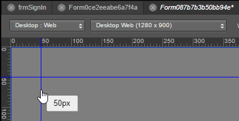
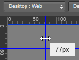

                          

Use Rulers and Guides for the Desktop Channel
=============================================

For Desktop Web channel forms, you can display horizontal and vertical rulers to help you accurately position widgets. The rulers are available at a zoom level of 75% and higher. Guides are lines you pull from either ruler and position on the canvas to help you align widgets with one another. You can move guides, or lock them so that they're immovable, unlock them again, hide them, and remove them.

Rulers and guides are only available for the Desktop Web channel; they are not available for the Mobile, Tablet, and Watch channels.

For more information, click any of the following procedures:

Rulers  
[Show or Hide Rulers](#show-or-hide-rulers)

Guides  
[Add a Guide](#add-a-guide)

[Reposition a Guide](#reposition-a-guide)

[Lock and Unlock Guides](#lock-and-unlock-guides)

[Hide or Show Guides](#hide-or-show-guides)

[Clear a Guide](#clear-a-guide)

[Clear All Guides](#clear-all-guides)

Show or Hide Rulers
-------------------

Horizontal and vertical rulers are available on the Iris Canvas for forms in the Desktop channel. If your work requires, you can hide the rulers, and also show them again.

To hide or show the rulers, do the following:

1.  In the upper right corner of the Iris Canvas, click the round option button , hover over **Ruler**, and then click **Hide Ruler**. The horizontal and vertical rulers become hidden.
2.  To show the rulers again, click the round option button, and then click **Show Ruler**.

**_Notes:_***   You can also toggle rulers to show or hide by pressing **Ctrl+;**
*   For Desktop channel forms, the rulers display only at a zoom level of 75% and higher.

Add a Guide
-----------

To add a guide to your canvas, do the following:

*   Click on either the horizontal or vertical ruler, and drag onto the canvas. A guide tracks with the mouse pointer onto the Iris Canvas, displaying the position of the guide as you go.

Reposition a Guide
------------------

To reposition a guide, do the following:

1.  Hover over the guide with the mouse pointer until it becomes a two-headed arrow.

3.  Click and drag the guide to the position you want.

Lock and Unlock Guides
----------------------

To lock and unlock guides, do the following:

1.  In the upper right corner of the Iris Canvas, click the round option button , hover over **Ruler**, and then click **Lock Guides**.
2.  To unlock the guides, click the round option button, hover over **Ruler**, and then click **Unlock Guides**.

Hide or Show Guides
-------------------

To hide or show guides, do the following:

1.  In the upper right corner of the Iris Canvas, click the round option button , hover over **Ruler**, and then click **Hide Guides**.
2.  To show the guides, click the round option button, hover over **Ruler**, and then click **Show Guides**.

Clear a Guide
-------------

To clear a guide, do the following:

1.  Hover over the guide with the mouse pointer until it becomes a two-headed arrow.
2.  Click and drag the guide back to the ruler.

Clear All Guides
----------------

To clear all guides, do the following:

*   In the upper right corner of the Iris Canvas, click the round option button , hover over **Ruler**, and then click **Clear All Guides**.
