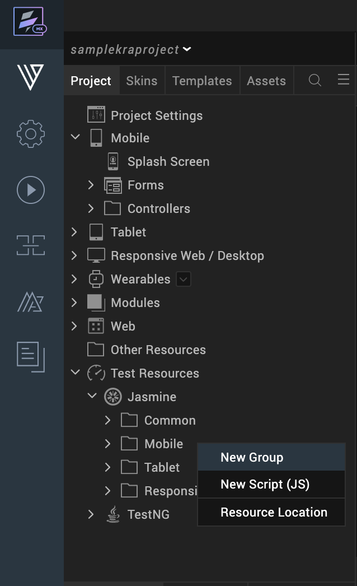
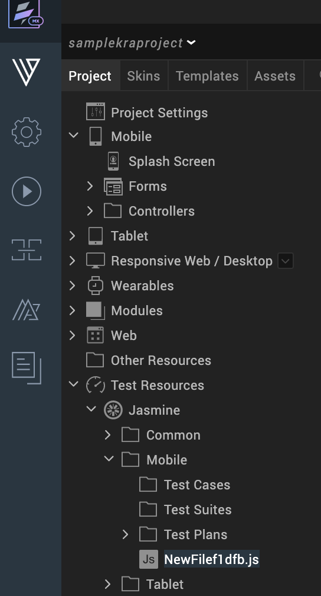

                         


Using Jasmine Test Scripts
==========================

The following sections in the document describe about creating and executing test scripts for the Jasmine test framework.

[Create a test script for Jasmine](#create-a-new-jasmine-test-script)

[Execute test script for Jasmine](#execute-your-test-script-in-jasmine)

[Debug test script for Jasmine in Android](#debug-test-script-for-jasmine-in-android)

Create a New Jasmine Test Script
--------------------------------

**To create a new test script in the Jasmine folder, do the following**:

1.  In Volt MX Iris, open the project that you want to create the test scripts for.
2.  From the Project explorer, go to **Test Resources** > **Jasmine**.
3.  Click on the drop-down icon of the channel in which you want to create the test script and then select **New Script (JS)**.  
      
      
    
    > **_Note:_** It is not mandatory to create the new file. You can write all your automation scripts in the **automationStartup.js** file, that is auto generated. You must create a new file only when you want to segregate test scripts for each of your app flow.
    
4.  A new test script is created.  
      
    
5.  Enter your automation code in the new test script created. For instance, following is the code for testing a button on-click action.  
```
describe("sample", function() {
    
        beforeEach(function() {
            //gets executed once before each spec in the describe
        });
    
        afterEach(function() {
            //gets executed once after each spec.
        });
    
        it("sample_testCase", async
            function() {
                voltmx.automation.button.click(["Form1", "Button0ec5b6258f1504e"]);
            });
    
    });
    
```
    
    To execute the script, enter the code in the following format, in the automationStartup.js file.
    
```
require(["testScripts/sample-suite"], //prepending testScripts
        function() {
            jasmine.getEnv().execute();
        });
    
```
    
    You must prepend each file that is being required with a key word **testScripts**. In the require callback, you must appropriately call the jasmine execution. If you want to require multiple files, jasmine execution must be called in the last required file.
    
     

You will notice an auto generated script **customReporter.js** in the Common folder. The customReporter.js file contains several jasmine test reporting callbacks (jasmineStarted, suiteStarted, specStarted, specDone, suiteDone, and jasmineDone). Using the customReporter test script, you can configure where you want to export your test results. When you build any of your app, the file customReporter.js is added to mobile, tablet, and desktop web channel test folders.  
  

> **_Important:_** The name **customReporter.js** file is reserved for the Jasmine test scripts common js file. If you name any of your test scripts with customReporter.js, testing feature as explained in this section will not work. Ensure that you give unique test javascript file names across channels.  

With the customReporter.js test script, you can access all Volt MX Iris APIs and methods used in Volt MX Iris . In any test script that you create on your own in the common folder, you can only access the voltmx.print API. Ensure that you do not modify anything in the customReporter.js. You can write your code in the jasmine callbacks.

Execute your Test Script in Jasmine
-----------------------------------

**To execute test scripts in Jasmine, do the following**:

1.  Open **Iris**.
2.  From the **Project** Explorer, right click on **Jasmine** and then select **Deploy**.  
    
3.  From the **Build** menu, build the app for the channel that you are testing the script, in **debug mode**.
    
4.  Run your app on the target simulator or device.
    
    > **_Note:_** The test scripts are hosted on the Iris node server. The target device should have access to this server (Iris needs to be running). Ensure that the system on which the Volt MX Automator runs and the target device are on the same network. If the network changes, you must rebuild the app.  
    
    Although the system and the target device are connected on the same network, you may have trouble executing your test script when the app uses an inaccessible IP address. To modify the IP address, follow these steps:
    
      
    
    1.  Open the **voltmxiris\_preferences.json** file located at **Users\\<user ID>\\ Iris\\ irisdata**.
    2.  Set the "**autoDetectIP**" key as **false**.
    3.  Under the "**general**" Object, specify the required IP address against the "**staticIP**" key.
    

> **_Note:_** In Jasmine, the `jasmine.DEFAULT_TIMEOUT_INTERVAL` property is available for iOS and Web channels. The property is not considered for the Android channel.

For more information about APIs and automation in Volt MX, click [here](../../../Iris/iris_api_dev_guide/content/voltmx.automation_namespace.md).

Debug Test Script for Jasmine in Android
----------------------------------------

To debug an Android application while using Jasmine test scripts, follow these steps.

1.  In Volt MX Iris, from the **Build** menu, select **Build and Publish Native**.
2.  In the **Build Generation** dialog box, select Android platform.
3.  Select the Build Mode as **Test** and click **Build**.
4.  If you have not set the debugging as true:
    1.  Go to the <workspace location>/<app name> folder.
    2.  Open the **projectProperties.JSON**file and then add the following script.  
        
        “enableJasmineJSDebuggingForAndroid” : "true"
        
5.  Switch back to Volt MX Iris. From the **Project** Explorer, right-click **Jasmine**, and then click **Deploy**.
6.  Start the app on your device. The **Waiting for Debugger to connect...** dialog box appears on your device.
7.  From Volt MX Iris, go to **Product**\>**Debug As**\>**Debug android application**. The Google Chrome web browser opens with the chrome devtools URL.  
    For example,  
    [chrome-devtools://devtools/bundled/inspector.html?experiments=true&v8only=true&ws=127.0.0.1:9222](chrome-devtools://devtools/bundled/inspector.md?experiments=true&amp;v8only=true&amp;ws=127.0.0.1:9222)  
      
    For more information about how to debug an Android application, click [here](Inline_Debugger.md#debug-javascript-for-android-in).

> **_Note:_** The chrome devtools URL uses only the **9222** port while using Jasmine test scripts.
