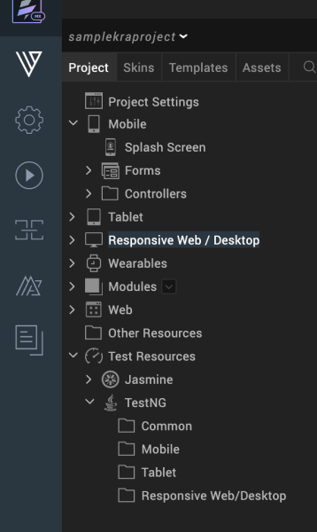
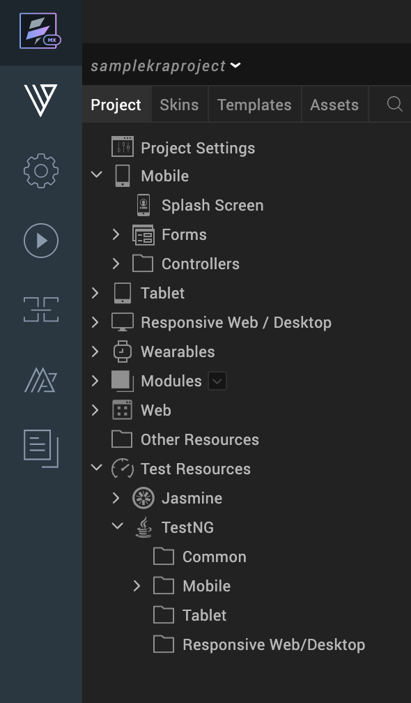
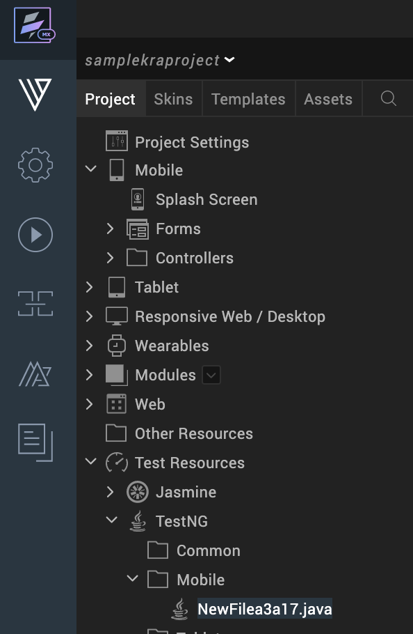

                         

Use Test Scripts in Volt MX Iris
======================================

You can create test scripts and use them . Even though testing scripts were supported by Volt MX Iris earlier, they were never supported in Volt MX Iris directly. In previous releases of Volt MX Iris, you could create scripts and place them in the Other Resources folder in the Project View of Volt MX Iris.

The new Test Resources folder in Volt MX Iris allows you to create test scripts for specific channels such as Mobile, Tablet, Desktop Web etc. The new feature also allows you to use multiple testing frameworks. For each one of the testing framework, the test resources folder has separate child folders for each channel. This allows you to easily identify the script types and use the ones which are appropriate for the channel you are testing. You can now manage your scripts directly from the Volt MX Iris UI.

The Test Resources folder contains TestNG and Jasmine folders by default. The folders further contain default channel folders.

You can create a new test script specific to the channel by placing a test script within the channel's sub folder. If the file is created under the TestNG or Jasmine sub directory, the new file contains an empty shell with the basic TestNG or Jasmine test script. When you make edits to a script, it is saved when the project is saved.

The following sections in the document describe about creating and executing testscripts for TestNG test framework.

[Create a test script for TestNG](#create-a-new-testng-test-script)

[Execute test script for TestNG](#execute-your-test-script-in-testng)

Create a New TestNG Test Script
-------------------------------

**To create a new test script in TestNG folder, do the following**:

1.  In Volt MX Iris, open the project you want to create the test scripts.
2.  Navigate to the TestNG folder in the Project Panel.
3.  Click on the drop-down icon of the channel in which you want to create the test script.  
    
4.  Select **New Script (Java)**  
    A new test script is created  
    
5.  Edit your script using Java.

Execute your Test Script in TestNG
----------------------------------

**To execute test scripts in TestNG, do the following**:

1.  Open **Iris**.
    
2.  In the **Build** menu, build the app for the channel you are testing the script.
    
3.  Run your app on the simulator.
    
4.  Copy the workspace location of your test scripts.
    
5.  Open Command Prompt on your system.
    
6.  Run the following command  
    **ant build.xml/Project name/<location\_of\_scripts\_in\_workspace>**
    
    Your test scripts are executed.
