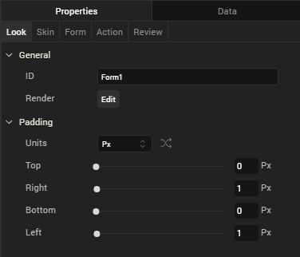
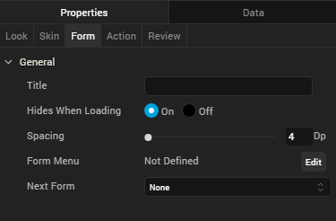

                         

Apple Watch
===========

The Apple Watch is a smartwatch that runs on the WatchOS platform, and is paired to an iPhone (5 or above) to perform functions such as calling, texting, and receiving notifications. Volt MX Iris supports Apple Watch 42mm and Apple Watch 38mm.

The following are the main features of a watch:

*   [Forms](#forms)
*   [Notifications](Notifications.md)
*   [Glances](Glances.md)
*   [Reviews](#review)

Forms
-----

A form is the starting point for any application, and is the top most container. A form can contain any number of widgets but cannot contain another form. For more information regarding Watch widgets, see [Add Watch Widgets](AddAppleWatchWidgets.md).

Your Watch app can consist of multiple forms, and you can move from one form to another using a couple of different methods. You can use an action sequence, such as assigning the Navigate to Form action to a button so that, when it's clicked, it displays a different form.

#### Add a Form to a Watch

To add a form, follow these steps:

1.  From the **Project** tab of the **Project Explorer**, expand the **Watch** folder. Right-click **Form** > **New Form**. This results in creating a new form with a default name assigned to it.
2.  You may choose to rename the form by clicking the down-arrow next to the form and then clicking **Rename**. The name of the form becomes editable.
3.  To make a form function as the app's startup form (that is, the first form to appear after the application is loaded), click the down-arrow next the form, and then click **Mark as Startup**.

The following widgets are supported on a form:

<table style="margin-left: 0;margin-right: auto;width: 40%;"><colgroup><col style="width: 45px;"> <col style="width: 45px;"> <col style="width: 45px;"> <col style="width: 45px;"></colgroup><tbody><tr><td>Group</td><td>Button</td><td>Date</td><td>Image2</td></tr><tr><td>Label</td><td>Line</td><td>Slider</td><td>Timer</td></tr><tr><td>Map</td><td>Segment2</td><td>Switch</td><td>&nbsp;</td></tr></tbody></table>

#### Add a Widget to a Form

To add a widget to a form, do the following:

To add a widget to a form, follow these steps:

1.  From the Widget Library, drag the required widget and drop it on
    a form on the Iris Canvas.
2.  If you want, rename the widget.
3.  Save the form.

#### Duplicate a Form

When you want to have a form that is similar to an existing form, you can duplicate the required form and reuse it.

To duplicate a form, do the following:

1.  Right-click the form you want to duplicate, and then click **Duplicate**.

    A duplicate form is created.

2.  If you want, rename the form.

#### Delete a Form

When you no longer require a form, you can delete it.

To delete a form, do the following:

1.  Right-click the form you want to delete, and then click **Delete**.
2.  A deletion confirmation message appears. Click **OK** to delete the form.

#### Open the Assets' Folder

To navigate to the location where the form assets are available on your computer, do the following:

Right-click the required form and click **Resources Location**.
    
    The Windows Explorer where the form assets are located appears.
    

### Form Properties

You can customize the following properties of a form:

*   [Look](#look)
*   [Skin](#skin)
*   [Form](#form)
*   [Action](#action)
*   [Review](#review)

#### Look

On the Look tab, you set properties that control the way a form appears on an app. The following are the major properties you can condition for a form:

1.  **ID**: It is the unique identifier of the form. When a form is added, system assigns a unique ID (or name). You can rename the form ID, if required.
2.  **Render**: This property defines if a form should appear on a specific platform. By default, a form is rendered for all the platforms.
    
    If you do not want to render a form for a specific platform, click the **Edit** button against the **Render** to open the **Fork Platforms** dialog box. Clear a platform check box for which you do not want to render the form.
    
3.  **Padding**: Defines the space between the content of the form and the form boundaries. The following padding options are available for the form.
    
    | Property | Definition | Action |
    | --- | --- | --- |
    | Top | Top padding | Move the slider to adjust the top padding of the widget. |
    | Bottom | Bottom padding | Move the slider to adjust the bottom padding of the widget. |
    | Left | Left padding | Move the slider to adjust the left padding of the widget. |
    | Right | Right padding | Move the slider to adjust the right padding of the widget. |
    

#### Skin

On this tab, you define properties such as background color, borders, and shadows for a form. For a Watch form, you can define a skin its **Normal** state.

For more information on skin properties, see [Understanding Skins and Themes](Customizing_the_Look_and_Feel_with_Skins.md).

  > **_Note:_** Custom themes developed in Volt MX Iris are not supported on Apple Watch. Apple Watch applications support the default theme of Volt MX Iris.

#### Form

On this tab, you set properties that are common for all the platforms and also, set properties that are unique to a platform.

#### Title

Use this property to set the title of a form.

#### Hides When Loading

This property specifies if the form should be hidden while loading the application.

#### Spacing

This property defines the amount of space between the widgets in a notification. The spacing values are assigned in Dp format and can take values in the range of 0-100 Dp.

#### Next Form

From the **Next Form** list, click the form that should appear after the current form.

#### Action

On this tab, you define the events that are executed when an action is run. For a notification, you can run the following actions:

*   onInit: This action allows you initialize your interface controller.
*   onWillActivate: This action lets you know that your interface will soon be visible to the user. Use this method only to make small changes to your interface. For example, you might use this method to update a label based on new data.
*   onDidDeactivate: This action allows you to clean up your interface and put it into a quiescent state. For example, use this method to invalidate timers and stop animations.
*   onAwake: This action is called to let you know that the interface controller’s contents are onscreen.
*   localNotificationActionHandler: This action delivers a local notification payload and a user-selected action to the interface controller.
*   remoteNotificationActionHandler: This action delivers a remote notification payload and a user-selected action to the interface controller.
*   didAppear: This action is invoked to let you know that the content from the form is now onscreen.
*   interfaceDidScrollToTop: This action is invoked when the user performs a scroll-to-top gesture and the scrolling animation has finished.
*   interfaceOffsetDidScrollToTop - This action is invoked to let you know that the user has scrolled to the top of the interface and the scrolling animation is completed by the interface controller.
*   interfaceOffsetDidScrollToBottom – This action is invoked to let you know that the user has scrolled to the bottom of the interface and that the scrolling animation is completed by the interface controller.

For more information on using these actions, see the topic, [Add Actions](working_with_Action_Editor.md).

#### Review

This tab can be used to add Notes and Comments to the selected form.

You can search for the notes written about a form by typing its name in the **Search**box.

You can expand, contract, add, and delete notes.
