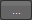

                          

Group Widget
============

The container widget category for the Watch channel consists of a single widget, the Group container widget. You can add any of the Watch widgets directly onto a Watch form without using the Group container. But if you want to structure your form with grouped widgets that align on either a horizontal or vertical axis, you can use the Group container. A Group container can orient the widgets it contains either horizontally, or vertically. By nesting one or more vertically-oriented Group containers within a horizontally-oriented Group container, and then adding widgets to those containers, you can create a grid of widgets. Similarly, you can also nest horizontally-oriented Group containers within a vertically -oriented Group container. With the right combination and alignment of horizontal and vertical Group containers, you can position a widget anywhere on the Watch form.

  
_Two vertically-oriented Group containers, each containing four button widgets, nested within a single, horizontally-oriented Group container._

Click any of the following to learn about the properties found on the tabs of the Group container widget.

[Look Tab](#look-tab)

[Skin Tab](#skin-tab)

[Group Tab](#group-tab)

[Action Tab](#action-tab)

[Review Tab](#review-tab)

Look Tab
--------

On the Look tab, you define properties and behaviors related to a Group container's appearance and position. The following sections describe each of the properties.

### ID

Denotes the name of a widget. When a widget is added to a form, a unique name is assigned to the widget. You can rename a widget by entering a new name in the **ID** text box.

> **_Note:_** You can also rename a widget from the Project Explorer by right-clicking a widget, and then clicking **Rename**.

### Visible

Controls whether or not the user of the app can see the widget.

*   To make a widget visible, click **On**.
*   To make a widget invisible, click **Off**.

### Render

Defines whether a widget appears on a specific platform. Currently, the Watch channel supports only the Apple Watch Native and HTML5 SPA platforms. Clicking the Render property's **Edit** button opens the **Render Platforms** dialog box.

Clear the check box of the platforms for which the widget should not be rendered.

**The Difference between Visible and Render**

*   When a Widget is _not_ rendered for a platform, it implies that the widget is hidden from that specific platform.
*   Whereas, when a widget is set as invisible, it implies that the widget is available, but is invisible. This feature is useful when you wanted to display a widget based on certain conditions.

### Widget Align

The Widget Align property specifies how a widget's boundaries are aligned with respect to its parent. The following alignment options are available:

<table style="margin-left: 0;margin-right: auto;"><colgroup><col style="width: 69pt;"> <col style="width: 352pt;"></colgroup><tbody><tr><td></td><td>Aligns the left edge of the widget with the left edge of its parent.</td></tr><tr><td></td><td>Aligns the horizontal center of the widget with the horizontal center of its parent.</td></tr><tr><td></td><td>Aligns the right edge of the widget with the right edge of its parent.</td></tr><tr><td></td><td>Aligns the top edge of the widget with the top edge of its parent.</td></tr><tr><td></td><td>Aligns the vertical center of the widget with the vertical center of its parent.</td></tr><tr><td></td><td>Aligns the bottom edge of the widget with the bottom edge of its parent.</td></tr></tbody></table>

### Width

Width determines the width of the widget as measured along the x-axis.

Following are the options that can be used as units of width:

*   **%.** Specifies the values in percentage relative to the parent dimensions.
*   **Dp.** Specifies the values in terms of device independent pixels.
*   **Preferred.** When this option is specified, the layout uses preferred height of the widget as height and preferred size of the widget is determined by the widget and may varies between platforms.

### Height

Height determines the height of the widget as measured along the y-axis (height of the parent). You can use any of the following options:

*   **%.** Specifies the values in percentage relative to the parent dimensions.
*   **Dp.** Specifies the values in terms of device independent pixels.
*   **Preferred.** When this option is specified, the layout uses preferred height of the widget as height and preferred size of the widget is determined by the widget and may varies between platforms.

### Padding

Defines the space between the content of the widget and the widget boundaries. You can use this option to assign the top, left, right, and bottom distance between the widget content and the widget's boundaries.

> **_Important:_** Default padding for Android is not set, as the devices are manufactured with predefined padding values.

  
| Property | Definition | Action |
| --- | --- | --- |
| Top | Top padding | Move the slider to adjust the top padding of the widget. |
| Bottom | Bottom padding | Move the slider to adjust the bottom padding of the widget. |
| Left | Left padding | Move the slider to adjust the left padding of the widget. |
| Right | Right padding | Move the slider to adjust the right padding of the widget. |

**_Notes:_***   When you click the Uniform Padding button , changing the value for one padding boundary changes all of them to the same value.
*   Modifying a widget's padding affects the padding of its parent and its children.

Skin Tab
--------

A widget’s appearance is defined by the skin that is applied to it. Every widget has a skin, even if it’s just the Volt MX Iris default skin. Skins give you the ability to establish visual continuity in your app. On the **Skin** tab, you can select to use a specific skin for your widget. In addition, you can configure the widget's background and font.

In the Mobile, Tablet, and Desktop channels, a widget may have a number of states, such as Normal (when it's not being interacted with), Focus (e.g. when it's been tabbed to), or Pressed. However, the Watch channel has only one button state: Normal.

### General

Under the General section of the **Skin** tab, you can change the name of the skin currently applied (if it's not one of the default skins), or you can select from the other available skins by clicking the magnifying glass icon next to the **Name** text box.

#### Platform

In channels that support multiple platforms, it's possible to fork a skin by clicking the Platform ellipsis button , and then selecting the platforms that you want to fork the widget to. In the case of the Watch channel, currently the only platform available is Watch (Native). For more information, see [Forking](Forking.md).

### Background

Under the Background section of the **Skin** tab, you can set the type of background you want to use, and set the color and its opacity.

#### Type

For the Watch channel, the Group widget is capable of two types of backgrounds:

<table style="width: 100%;mc-table-style: url('Resources/TableStyles/2015DefinitiveBasicTable.css');" class="TableStyle-2015DefinitiveBasicTable" cellspacing="0"><colgroup><col style="width: 136px;" class="TableStyle-2015DefinitiveBasicTable-Column-Column1"> <col class="TableStyle-2015DefinitiveBasicTable-Column-Column1"></colgroup><tbody><tr class="TableStyle-2015DefinitiveBasicTable-Body-Body1"><td class="TableStyle-2015DefinitiveBasicTable-BodyE-Column1-Body1"><b>Background Type</b></td><td class="TableStyle-2015DefinitiveBasicTable-BodyD-Column1-Body1"><b>Description</b></td></tr><tr class="TableStyle-2015DefinitiveBasicTable-Body-Body1"><td class="TableStyle-2015DefinitiveBasicTable-BodyE-Column1-Body1">Single Color</td><td class="TableStyle-2015DefinitiveBasicTable-BodyD-Column1-Body1">Applies a uniform, single color as the background of the skin that you choose.</td></tr><tr class="TableStyle-2015DefinitiveBasicTable-Body-Body1"><td class="TableStyle-2015DefinitiveBasicTable-BodyB-Column1-Body1">Image</td><td class="TableStyle-2015DefinitiveBasicTable-BodyA-Column1-Body1">Applies an image of your choosing as the background of the skin. The image stretches to fill the dimensions of whatever widget the skin is applied to.</td></tr></tbody></table>

#### Color

If you select Single Color as the background type, you can configure the hue you want by clicking the square color icon and dragging the cursor to the color of your choosing.

#### Opacity

Similarly, with Single Color as the background type, you can configure the opacity of the background color. By default, the opacity is set to 100, making the background completely opaque with no transparency. However, if you want the background to have a degree of transparency, you can decrease its opacity. To do so, type a value between 0 and 100 in the Opacity text box, or drag the opacity slider to the degree of opacity that you want.

### Border

The Border section on the Skin tab of the Group container widget determines the degree to which the corners of the Group widget are rounded. The style of the rounding is set as **Custom** in the **Style** drop-down list. By changing the radius of the border, you can change how rounded the corners are. The higher the number in pixels, the more rounded the border. To see the rounding, make sure you have the background color set to something other than black, and the opacity higher than 20% or so.

Group Tab
---------

Widgets placed within a Group container widget cannot overlap each other. They are aligned either horizontally, like a row of widgets, or vertically, like a column. On the Group tab, you can set the following properties:

**Orientation.** Specifies whether the widgets inside the Group widget are oriented horizontally, like a row, or vertically, like a column.

**Spacing.** Specifies the amount of space in Dp (device-independent pixels) you want to have in between the widgets that are inside the Group widget.

**Opacity.** Specifies the degree to which the Group widget is transparent or opaque. By default, the opacity is set to 100, making the background completely opaque with no transparency. However, if you want the background to have a degree of transparency, you can decrease its opacity. To do so, type a value between 0 and 100 in the **Opacity** text box, or drag the opacity slider to the degree of opacity that you want.

Action Tab
----------

On this tab, you define the events that are executed when an action is run. A Group widget supports only one action.

**onClick.** This action is invoked by the platform when the user performs a click action on the button.

For more information, see [Add Actions](working_with_Action_Editor.md).

Review Tab
----------

On this tab, you can add and review notes. With the Review Notes feature, you can capture feedback from users who are evaluating your app design. Such requirements capturing helps ensure that the design of your app successfully meets the requirements of potential users. The Review Notes feature supports rich text formatting such as font type and size, paragraph alignment, numbered and bulleted lists, block quotes, and even tables.

For more information, see [Capture Product Requirements with Review Notes](CapProdReqsWithNotes.md).
