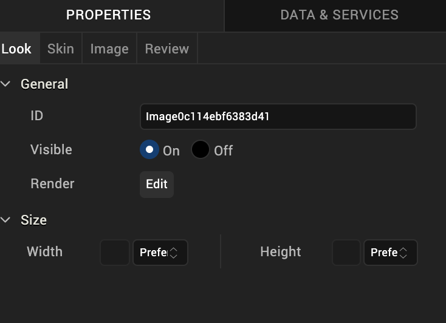
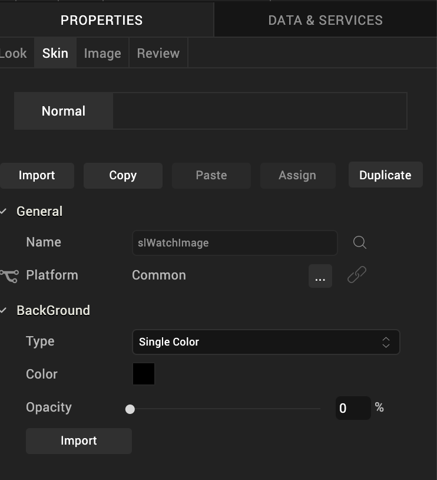
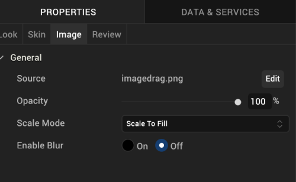

                           

Image2 Widget for Watch
=======================

The Image2 widget is a non-interactive widget that you can use to display a local image file. Volt MX Iris version 9.2 suppcrts PNG, JPEG, and GIF image formats.

To use images in Volt MX Iris, you copy the images to a specific folder in the Workspace and then use the Image2 widget to insert the image in a form. You can see what images are a part of your project on the **Assets** tab of the Project Explorer. You can also specify images for a specific channel and then use them in your application. For more information, see [Adding and Managing Images and Other Media](Adding_and_Managing_Images.md).

Be sure you name your images correctly by following the guidelines in [Image Naming Conventions](#image-naming-conventions).

Click any of the following to learn about the properties found on the tabs of the Image2 widget.

[Look Tab](#look-tab)

[Skin Tab](#skin-tab)

[Image Tab](#image-tab)

[Review Tab](#review-tab)

Image Naming Conventions
------------------------

If an image file has an invalid file name, Volt MX Iris does not list it in the Media folder of the **Assets** tab. You will want to be sure to use the following conventions when naming image files:

*   The file name must contain only lowercase characters.
*   The file name must start with a letter.
*   Numbers are allowed as long as they are not the first character in the file name.
*   Do not use special characters, such as dashes and underscores.
*   Do not use any reserved JavaScript words or keywords ( of JavaScript) as the file name for images.

The following table shows a few examples of valid and invalid file names for images:

  
| Valid File Names | Invalid File Names | Remarks |
| --- | --- | --- |
| myicon.png | Myicon.png | The invalid file name contains an uppercase character. |
| icon2.png | icon\_2.png | The invalid file name contains an underscore. |
| accntsummary.png | accnt&summary.png | The invalid file name contains a special character. |
| accountdetails.png | 2details.png | The invalid file name begins with a number. |
| companylogo.png | company logo.png | The invalid file name contains a space. |
| flightstatus123.png | continue.png | The invalid file name contains a Java keyword. |

Look Tab
--------

On the **Look** tab, you define properties and behaviors related to a Image2 widget's appearance and position. The following sections describe each of its properties.

### ID

Denotes the name of a widget. When a widget is added to a form, a unique name is assigned to the widget. You can rename a widget by entering a new name in the **ID** text box.

> **_Note:_** You can also rename a widget from the Project Explorer by right-clicking a widget, and then clicking **Rename**.

### Visible

Controls whether or not the user of the app can see the widget.

*   To make a widget visible, click **On**.
*   To make a widget invisible, click **Off**.

### Render

Defines whether a widget appears on a specific platform. Currently, the Watch channel supports only the Apple Watch Native and HTML5 SPA platforms. Clicking the Render property's **Edit** button opens the **Render Platforms** dialog box.

Clear the check box of the platforms for which the widget should not be rendered.

**The Difference between Visible and Render**

*   When a Widget is _not_ rendered for a platform, it implies that the widget is hidden from that specific platform.
*   Whereas, when a widget is set as invisible, it implies that the widget is available, but is invisible. This feature is useful when you wanted to display a widget based on certain conditions.

### Widget Align

The Widget Align property specifies how a widget's boundaries are aligned with respect to its parent. The following alignment options are available:

<table style="margin-left: 0;margin-right: auto;"><colgroup><col style="width: 69pt;"> <col style="width: 352pt;"></colgroup><tbody><tr><td></td><td>Aligns the left edge of the widget with the left edge of its parent.</td></tr><tr><td></td><td>Aligns the horizontal center of the widget with the horizontal center of its parent.</td></tr><tr><td></td><td>Aligns the right edge of the widget with the right edge of its parent.</td></tr><tr><td></td><td>Aligns the top edge of the widget with the top edge of its parent.</td></tr><tr><td></td><td>Aligns the vertical center of the widget with the vertical center of its parent.</td></tr><tr><td></td><td>Aligns the bottom edge of the widget with the bottom edge of its parent.</td></tr></tbody></table>

### Width

Width determines the width of the widget as measured along the x-axis.

Following are the options that can be used as units of width:

*   **%.** Specifies the values in percentage relative to the parent dimensions.
*   **Dp.** Specifies the values in terms of device independent pixels.
*   **Preferred.** When this option is specified, the layout uses preferred height of the widget as height and preferred size of the widget is determined by the widget and may varies between platforms.

### Height

Height determines the height of the widget as measured along the y-axis (height of the parent). You can use any of the following options:

*   **%.** Specifies the values in percentage relative to the parent dimensions.
*   **Dp.** Specifies the values in terms of device independent pixels.
*   **Preferred.** When this option is specified, the layout uses preferred height of the widget as height and preferred size of the widget is determined by the widget and may varies between platforms.

Skin Tab
--------

A widget’s appearance is defined by the skin that is applied to it. Every widget has a skin, even if it’s just the Volt MX Iris default skin. Skins give you the ability to establish visual continuity in your app. On the **Skin** tab, you can select to use a specific skin for your widget. In addition, you can configure the widget's background.

In the Mobile, Tablet, and Desktop channels, a widget may have a number of states, such as Normal (when it's not being interacted with), Focus (e.g. when it's been tabbed to), or Pressed. However, the Watch channel has only one state: Normal.

### General

Under the General section of the **Skin** tab, you can change the name of the skin currently applied (if it's not one of the default skins), or you can select from the other available Image2 skins by clicking the magnifying glass icon next to the **Name** text box.

#### Platform

In channels that support multiple platforms, it's possible to fork a skin by clicking the Platform ellipsis button , and then selecting the platforms that you want to fork the widget to. In the case of the Watch channel, currently the only platform available is Watch (Native). For more information, see [Forking](Forking.md).

### Background

Under the Background section of the **Skin** tab, you can set the type of background you want to use, and set the color and its opacity.

#### Type

For the Watch channel, the Group widget is capable of two types of backgrounds:

<table style="width: 100%;mc-table-style: url('Resources/TableStyles/2015DefinitiveBasicTable.css');" class="TableStyle-2015DefinitiveBasicTable" cellspacing="0"><colgroup><col style="width: 136px;" class="TableStyle-2015DefinitiveBasicTable-Column-Column1"> <col class="TableStyle-2015DefinitiveBasicTable-Column-Column1"></colgroup><tbody><tr class="TableStyle-2015DefinitiveBasicTable-Body-Body1"><td class="TableStyle-2015DefinitiveBasicTable-BodyE-Column1-Body1"><b>Background Type</b></td><td class="TableStyle-2015DefinitiveBasicTable-BodyD-Column1-Body1"><b>Description</b></td></tr><tr class="TableStyle-2015DefinitiveBasicTable-Body-Body1"><td class="TableStyle-2015DefinitiveBasicTable-BodyE-Column1-Body1">Single Color</td><td class="TableStyle-2015DefinitiveBasicTable-BodyD-Column1-Body1">Applies a uniform, single color as the background of the skin that you choose.</td></tr><tr class="TableStyle-2015DefinitiveBasicTable-Body-Body1"><td class="TableStyle-2015DefinitiveBasicTable-BodyB-Column1-Body1">Image</td><td class="TableStyle-2015DefinitiveBasicTable-BodyA-Column1-Body1">Applies an image of your choosing as the background of the skin. The image stretches to fill the dimensions of whatever widget the skin is applied to.</td></tr></tbody></table>

#### Color

If you select Single Color as the background type, you can configure the hue you want by clicking the square color icon and dragging the cursor to the color of your choosing.

#### Opacity

Similarly, with Single Color as the background type, you can configure the opacity of the background color. By default, the opacity is set to 100, making the background completely opaque with no transparency. However, if you want the background to have a degree of transparency, you can decrease its opacity. To do so, type a value between 0 and 100 in the Opacity text box, or drag the opacity slider to the degree of opacity that you want.

For more information, see [Understanding Skins and Themes](Customizing_the_Look_and_Feel_with_Skins.md).

Image Tab
---------

On this tab, you configure properties unique to the Image2 widget.

### Source

The Source property specifies the file name of the image to be displayed. When you click the **Edit** button, the Source dialog box lists those images located in the media folder. Different platforms have their own media folder; the folder that's opened is set on the **Skin** tab using the Platform property. By default, the platform is Common; images in the Common media folder are accessible to all platforms. If you select a specific platform, the images listed include those from that platform's media folder, and also from the Common media folder.

### Opacity

The Opacity property sets the degree to which the image is transparent or opaque. By default, the opacity is set to 100, making the image completely opaque with no transparency. However, if you want it to have a degree of transparency, you can decrease its opacity. To do so, type a value between 0 and 100 in the **Opacity** text box, or drag the opacity slider to the degree of opacity that you want.

### Scale Mode

The Scale Mode property determines how the image's width, height, aspect ratio, and alignment are set when the dimensions and aspect ratio of the source image varies from the dimensions of the Image2 widget itself. The available values are as follows:

**Scale to Fit.** Fills the entire area of the Image2 widget with the image without regard for maintaining the aspect ratio.

**Aspect Fit.** Scales the image to fit the width of the Image2 widget while maintaining the image's aspect ratio, resulting in unused space in the widget above and below the image itself.

**Aspect Fill.** Fills the entire area of the Image2 widget while maintaining the image's aspect ratio

**Redraw.** Refreshes the image such that it fills the entire area of the Image2 widget without regard for maintaining the aspect ratio.

**Center.** Displays the center of the image, filling the entire area of the Image2 widget without regard for maintaining the aspect ratio.

**Top.** Displays the center top edge of the image, filling the entire area of the Image2 widget without regard for maintaining the aspect ratio.

**Bottom.** Displays the center bottom edge of the image, filling the entire area of the Image2 widget without regard for maintaining the aspect ratio.

**Left.** Displays the center left edge of the image, filling the entire area of the Image2 widget without regard for maintaining the aspect ratio.

**Right.** Displays the center right edge of the image, filling the entire area of the Image2 widget without regard for maintaining the aspect ratio.

**Top Left.** Displays the top left edge of the image, filling the entire area of the Image2 widget without regard for maintaining the aspect ratio.

**Top Right.** Displays the top right edge of the image, filling the entire area of the Image2 widget without regard for maintaining the aspect ratio.

**Bottom Left.** Displays the bottom left edge of the image, filling the entire area of the Image2 widget without regard for maintaining the aspect ratio.

**Bottom Right.** Displays the bottom right edge of the image, filling the entire area of the Image2 widget without regard for maintaining the aspect ratio.

Review Tab
----------

On this tab, you can add and review notes. With the Review Notes feature, you can capture feedback from users who are evaluating your app design. Such requirements capturing helps ensure that the design of your app successfully meets the requirements of potential users. The Review Notes feature supports rich text formatting such as font type and size, paragraph alignment, numbered and bulleted lists, block quotes, and even tables.

For more information, see [Capture Product Requirements with Review Notes](CapProdReqsWithNotes.md).
