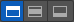
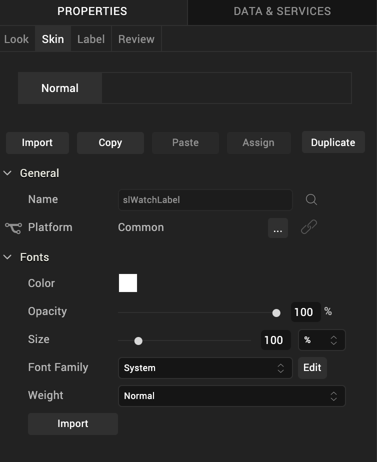
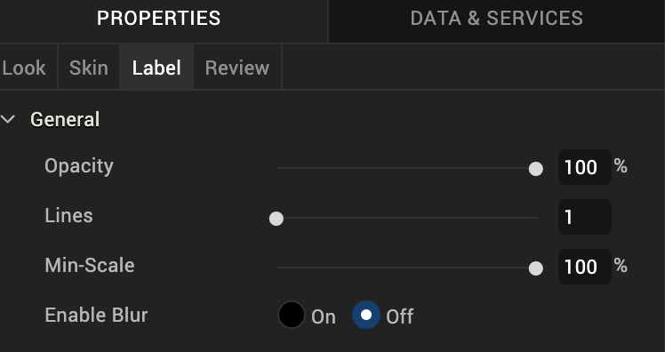

                           

Label Widget for Watch
======================

The Label widget displays non-editable text on a form and is non-interactive. If the text in the Label widget is occupying more space than the allocated height of the widget, the widget is stretched vertically to accommodate the full text (infinite wrapping). It does not stretch horizontally.

Click any of the following to learn about the properties found on the tabs of the Label widget.

[Look Tab](#look)

[Skin Tab](#skin)

[Label Tab](#label-tab)

[Review Tab](#review-tab)

Look
----

On the Look tab, you define properties and behaviors related to a Label widget's appearance and position. The following sections describe each of its properties.

### ID

Denotes the name of a widget. When a widget is added to a form, a unique name is assigned to the widget. You can rename a widget by entering a new name in the **ID** text box.

> **_Note:_** You can also rename a widget from the Project Explorer by right-clicking a widget, and then clicking **Rename**.

### Visible

Controls whether or not the user of the app can see the widget.

*   To make a widget visible, click **On**.
*   To make a widget invisible, click **Off**.

### Render

Defines whether a widget appears on a specific platform. Currently, the Watch channel supports only the Apple Watch Native and HTML5 SPA platforms. Clicking the Render property's **Edit** button opens the **Render Platforms** dialog box.

Clear the check box of the platforms for which the widget should not be rendered.

**The Difference between Visible and Render**

*   When a Widget is _not_ rendered for a platform, it implies that the widget is hidden from that specific platform.
*   Whereas, when a widget is set as invisible, it implies that the widget is available, but is invisible. This feature is useful when you wanted to display a widget based on certain conditions.

### Widget Align

The Widget Align property specifies how a widget's boundaries are aligned with respect to its parent. The following alignment options are available:

**Content Alignment**

<table style="margin-left: 0;margin-right: auto;"><colgroup><col style="width: 69pt;"> <col style="width: 352pt;"></colgroup><tbody><tr><td></td><td>Aligns the left edge of the content with the left edge of the widget.</td></tr><tr><td></td><td>Aligns the horizontal center of the content with the horizontal center of the widget.</td></tr><tr><td></td><td>Aligns the right edge of the content with the right edge of the widget.</td></tr></tbody></table>

**Widget Alignment**

<table style="margin-left: 0;margin-right: auto;"><colgroup><col style="width: 69pt;"> <col style="width: 352pt;"></colgroup><tbody><tr><td></td><td>Aligns the left edge of the widget with the left edge of its parent.</td></tr><tr><td></td><td>Aligns the horizontal center of the widget with the horizontal center of its parent.</td></tr><tr><td></td><td>Aligns the right edge of the widget with the right edge of its parent.</td></tr><tr><td></td><td>Aligns the top edge of the widget with the top edge of its parent.</td></tr><tr><td></td><td>Aligns the vertical center of the widget with the vertical center of its parent.</td></tr><tr><td></td><td>Aligns the bottom edge of the widget with the bottom edge of its parent.</td></tr></tbody></table>

### Width

Width determines the width of the widget as measured along the x-axis.

Following are the options that can be used as units of width:

*   **%.** Specifies the values in percentage relative to the parent dimensions.
*   **Dp.** Specifies the values in terms of device independent pixels.
*   **Preferred.** When this option is specified, the layout uses preferred height of the widget as height and preferred size of the widget is determined by the widget and may varies between platforms.

### Height

Height determines the height of the widget as measured along the y-axis (height of the parent). You can use any of the following options:

*   **%.** Specifies the values in percentage relative to the parent dimensions.
*   **Dp.** Specifies the values in terms of device independent pixels.
*   **Preferred.** When this option is specified, the layout uses preferred height of the widget as height and preferred size of the widget is determined by the widget and may varies between platforms.

Skin
----

A widget’s appearance is defined by the skin that is applied to it. Every widget has a skin, even if it’s just the Volt MX Iris default skin. Skins give you the ability to establish visual continuity in your app. On the **Skin** tab, you can select to use a specific skin for your widget. In addition, you can configure the widget's background and font.

In the Mobile, Tablet, and Desktop channels, a widget may have a number of states, such as Normal (when it's not being interacted with), Focus (e.g. when it's been tabbed to), or Pressed. However, the Watch channel has only one label state: Normal.

### General

Under the General section of the **Skin** tab, you can change the name of the skin currently applied (if it's not one of the default skins), or you can select from the other available label skins by clicking the magnifying glass icon next to the **Name** text box.

#### Platform

In channels that support multiple platforms, it's possible to fork a skin by clicking the Platform ellipsis button , and then selecting the platforms that you want to fork the widget to. In the case of the Watch channel, currently the only platform available is Watch (Native). For more information, see [Forking](Forking.md).

### Fonts

Under the Fonts section of the **Skin** tab, you can set the following properties.

<table style="mc-table-style: url('Resources/TableStyles/2015DefinitiveBasicTable.css');margin-left: 0;margin-right: auto;" class="TableStyle-2015DefinitiveBasicTable" cellspacing="0"><colgroup><col class="TableStyle-2015DefinitiveBasicTable-Column-Column1" style="width: 99px;"> <col class="TableStyle-2015DefinitiveBasicTable-Column-Column1" style="width: 530px;"></colgroup><tbody><tr class="TableStyle-2015DefinitiveBasicTable-Body-Body1"><td class="TableStyle-2015DefinitiveBasicTable-BodyE-Column1-Body1"><b>Property</b></td><td class="TableStyle-2015DefinitiveBasicTable-BodyD-Column1-Body1"><b>Description</b></td></tr><tr class="TableStyle-2015DefinitiveBasicTable-Body-Body1"><td class="TableStyle-2015DefinitiveBasicTable-BodyE-Column1-Body1">Color</td><td class="TableStyle-2015DefinitiveBasicTable-BodyD-Column1-Body1">Sets the color that you want the font to be. You configure the hue you want by clicking the square color icon and dragging the cursor to the color of your choosing</td></tr><tr class="TableStyle-2015DefinitiveBasicTable-Body-Body1"><td class="TableStyle-2015DefinitiveBasicTable-BodyE-Column1-Body1">Opacity</td><td class="TableStyle-2015DefinitiveBasicTable-BodyD-Column1-Body1">Sets the degree to which the background color is transparent or opaque. By default, the opacity is set to 100, making the background completely opaque with no transparency. However, if you want the background to have a degree of transparency, you can decrease its opacity. To do so, type a value between 0 and 100 in the <b>Opacity</b> text box, or drag the opacity slider to the degree of opacity that you want.</td></tr><tr class="TableStyle-2015DefinitiveBasicTable-Body-Body1"><td class="TableStyle-2015DefinitiveBasicTable-BodyE-Column1-Body1">Size</td><td class="TableStyle-2015DefinitiveBasicTable-BodyD-Column1-Body1">You can set the font size by pixels (0 to 600) or as a percentage (0 to 600) of the baseline font size of 28 pixels.</td></tr><tr class="TableStyle-2015DefinitiveBasicTable-Body-Body1"><td class="TableStyle-2015DefinitiveBasicTable-BodyE-Column1-Body1">Font Family</td><td class="TableStyle-2015DefinitiveBasicTable-BodyD-Column1-Body1">Currently, the System font is the only font family supported by VoltMX Iris for the Label widget.</td></tr><tr class="TableStyle-2015DefinitiveBasicTable-Body-Body1"><td class="TableStyle-2015DefinitiveBasicTable-BodyB-Column1-Body1">Weight</td><td class="TableStyle-2015DefinitiveBasicTable-BodyA-Column1-Body1">You can set the weight of the font either to Normal, which is the default, or Bold.</td></tr></tbody></table>

For more information, see [Understanding Skins and Themes](Customizing_the_Look_and_Feel_with_Skins.md).

Label Tab
---------

On this tab, you configure properties unique to the Label widget.

**Opacity.** Sets the degree to which the widget is transparent or opaque. By default, the opacity is set to 100, making the widget completely opaque with no transparency. However, if you want it to have a degree of transparency, you can decrease its opacity. To do so, type a value between 0 and 100 in the **Opacity** text box, or drag the opacity slider to the degree of opacity that you want.

**Lines.** Sets the maximum number of lines allowed for the label text. Text that does not fit on the specified number of lines is truncated.

**Min-Scale.** Sets the amount by which the font may be scaled to accommodate text. Values must be 100% or less. Specifying a value of 0 causes the Apple WatchKit to use the default scaling behavior, which allows the font to be scaled to no less than 80% of the original font size.

Review Tab
----------

On this tab, you can add and review notes. With the Review Notes feature, you can capture feedback from users who are evaluating your app design. Such requirements capturing helps ensure that the design of your app successfully meets the requirements of potential users. The Review Notes feature supports rich text formatting such as font type and size, paragraph alignment, numbered and bulleted lists, block quotes, and even tables.

For more information, see [Capture Product Requirements with Review Notes](CapProdReqsWithNotes.md).
