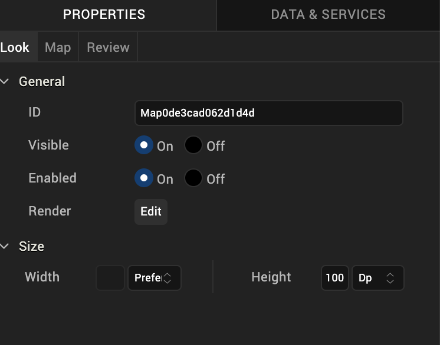
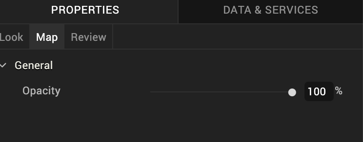

                          

Map Widget for Watch
====================

A Map widget provides you the capability to display pre-defined locations (latitude and longitude) on an onscreen map. The iOS platform (above 3.0) provides a native map widget that can be displayed as part of the application.

The Map widget for Watch renders maps using Google Maps.

Click any of the following to learn about the properties found on the tabs of the Map widget.

[Look Tab](#look-tab)

[Map Tab](#map-tab)

[Review Tab](#review-tab)

Look Tab
--------

On the **Look** tab, you define properties and behaviors related to a Map widget's appearance and position. The following sections describe each of the properties.

### ID

Denotes the name of a widget. When a widget is added to a form, a unique name is assigned to the widget. You can rename a widget by entering a new name in the **ID** box.

> **_Note:_** You can also rename a widget from the Project Explorer by right-clicking a widget, and then clicking **Rename**.

### Visible

Controls whether or not the user of the app can see the widget.

*   To make a widget visible, click **On**.
*   To make a widget invisible, click **Off**.

### Enabled

Controls whether the widget is functional or not. You can programmatically make the widget functional or nonfunctional through an action sequence, triggered by the user.

*   To enable the widget, click **On**.
*   To disable the widget, click **Off**.

### Render

Defines whether a widget appears on a specific platform. Currently, the Watch channel supports only the Apple Watch Native and HTML5 SPA platforms. Clicking the Render property's **Edit** button opens the **Render Platforms** dialog box.

Clear the check box of the platforms for which the widget should not be rendered.

**The Difference between Visible and Render**

*   When a Widget is _not_ rendered for a platform, it implies that the widget is hidden from that specific platform.
*   Whereas, when a widget is set as invisible, it implies that the widget is available, but is invisible. This feature is useful when you wanted to display a widget based on certain conditions.

### Widget Align

The Widget Align property specifies how the edges of the Map widget are aligned with respect to its parent's edges. The following alignment options are available:

<table style="margin-left: 0;margin-right: auto;"><colgroup><col style="width: 69pt;"> <col style="width: 352pt;"></colgroup><tbody><tr><td></td><td>Aligns the left edge of the widget with the left edge of its parent.</td></tr><tr><td></td><td>Aligns the horizontal center of the widget with the horizontal center of its parent.</td></tr><tr><td></td><td>Aligns the right edge of the widget with the right edge of its parent.</td></tr><tr><td></td><td>Aligns the top edge of the widget with the top edge of its parent.</td></tr><tr><td></td><td>Aligns the vertical center of the widget with the vertical center of its parent.</td></tr><tr><td></td><td>Aligns the bottom edge of the widget with the bottom edge of its parent.</td></tr></tbody></table>

### Width

The Width property sets the x-axis dimension of the widget using the numeric quantity and type of unit that you specify.

You can use the following units of measure to set the width of the widget.

**%.**  Specifies the width as a percentage of the parent's dimensions.

**Dp.**  Specifies the width in terms of device independent pixels.

**Preferred Size.**  Specifies an optimal width for the widget given the size of the font and the amount of text that the widget displays. The Preferred Size can vary from one platform to another.

### Height

The Width property sets the y-axis dimension of the widget using the numeric quantity and type of unit that you specify.

You can use the following units of measure to set the height of the widget.

**%.**  Specifies the height as a percentage of the parent's dimensions.

**Dp.**  Specifies the height in terms of device independent pixels.

**Preferred Size.**  Specifies an optimal height for the widget given the size of the font and the amount of text that the widget displays. The Preferred Size can vary from one platform to another.

Map Tab
-------

On this tab, you configure properties unique to the Map widget. Currently, there is only one.

**Opacity.** Sets the degree to which the widget is transparent or opaque. By default, the opacity is set to 100, making the widget completely opaque with no transparency. However, if you want it to have a degree of transparency, you can decrease its opacity. To do so, type a value between 0 and 100 in the **Opacity** text box, or drag the opacity slider to the degree of opacity that you want.

Review Tab
----------

On this tab, you can add and review notes. With the Review Notes feature, you can capture feedback from users who are evaluating your app design. Such requirements capturing helps ensure that the design of your app successfully meets the requirements of potential users. The Review Notes feature supports rich text formatting such as font type and size, paragraph alignment, numbered and bulleted lists, block quotes, and even tables.

For more information, see [Capture Product Requirements with Review Notes](CapProdReqsWithNotes.md).
